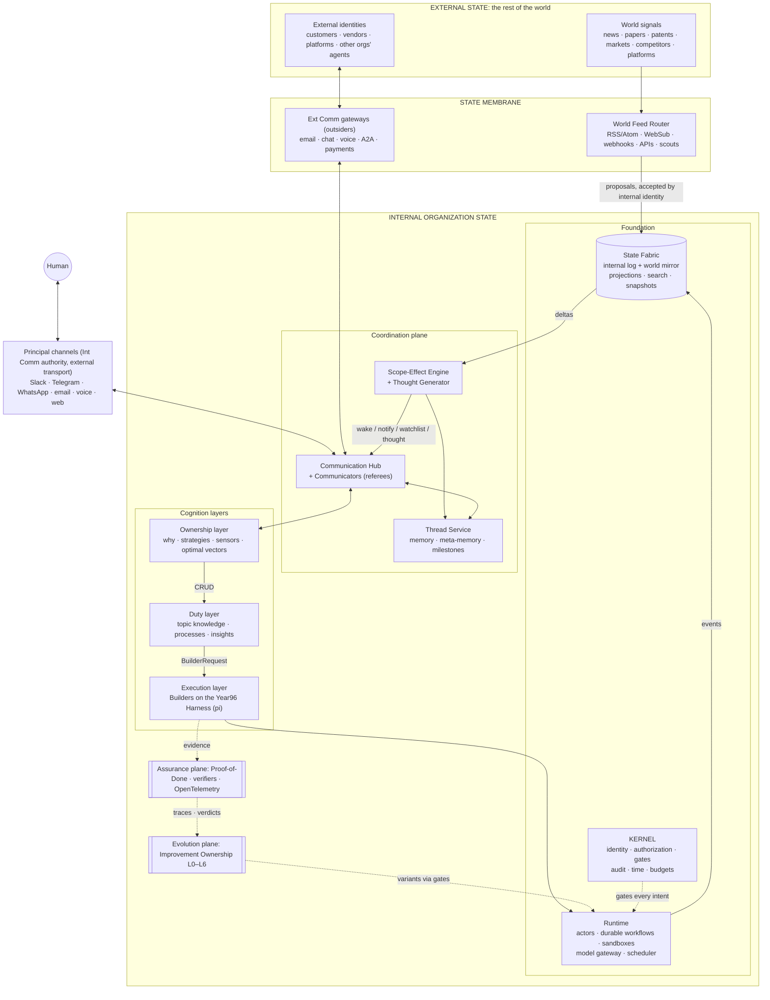
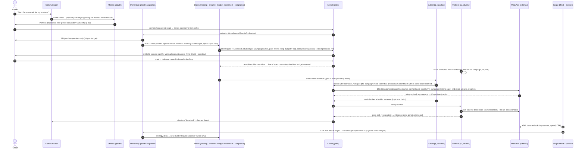
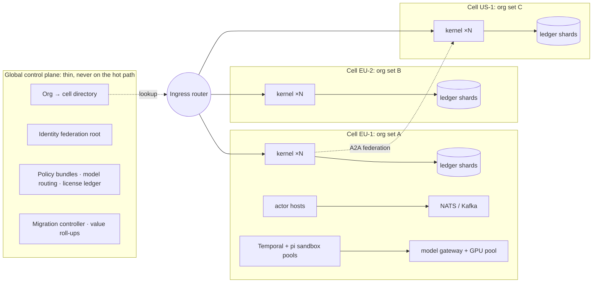

# Year96: Technical Architecture (how the system might look in 2027)

> **Status:** v0.9, 2026-09-28. Synthesized by the Year96 "Owner" (Copilot CLI) from a 15-teammate research sprint, then revised after independent reviews
> and multi-model final review rounds (see [research/16-final-review-log.md](research/16-final-review-log.md)). v0.3 added the spec's **Code** requirement (one machine → millions of agents, §9), the core **model profiles** (§8.1),
> and a **spec compliance matrix** ([Appendix C](#appendix-c-spec-compliance-matrix)). v0.4 added the Vision's definition of done (§6.12, §6.13, §7.0, §11). v0.5 resolved the
> nine-review Round 2 (every model × every aspect). Its main additions are the dispatch protocol, commitments, the control epoch, per-profile disaster recovery, multi-human authority and the TCB manifest.
> v0.6 resolves Round 3: a normative steering table with a separate control lane, commitments reserved before launch, handover and access-grant sagas, honest `solo` machine-loss recovery, and a canary cell on the production quorum.
> v0.7 resolves Round 4 (a stop fence ordered against in-flight writes, holds that only `control.resume` can lift, stops for launches still in flight) and folds in the owner's **Q&A**:
> every identity is a **harness** (one agent or hundreds), identities **replicate** across threads, and Duties **supervise their executions live** (§5, §6.6–§6.9).
> v0.8 resolves Round 5 (an honest `solo` exception for control records, agent steering inside a subtree, holds that bind goals and targets, privacy-filtered replicas) and adds the Q&A's
> fifth answer: the agents that build Year96 from outside are part of its state, so they can be upgraded, controlled or replaced by a representative Ownership (§6.14).
> v0.9 resolves Round 6: control of an outside agent is enforced where its writes land (managed vs unmanaged), and an outside agent has its own fenced takeover saga into an Ownership.
> **Companions:** [YEAR96_INTRO.md](YEAR96_INTRO.md) (concepts), [YEAR96_SPEC.md](YEAR96_SPEC.md) (engineering rules),
> [YEAR96_Vision.md](YEAR96_Vision.md) (end-to-end vision), and the owner's Q&A (`YEAR96_Q&A.md`, kept beside the repository folder). **Evidence:** [research/](research/README.md) holds reports 01–15 with maturity data, sources
> and license checks. Every *core default* named in this document had its **project** license checked against its LICENSE file or model card (see [Appendix B](#appendix-b-license-verification-ledger)).
> Release artifacts, meaning image layers, transitive dependencies and pinned model revisions, are re-checked by the SBOM license gate before any release (§9.7).

**How to read:** §1 gives the one-page answer. §2–§5 cover the mental model, tenets, architecture planes and shared ontology. §6 covers each subsystem
(purpose → design → interfaces → default providers → proof), including the internal/external **state membrane** (§6.2.1). §7 walks through end-to-end scenarios.
§8 is the provider catalog (with the core model profiles in §8.1), §9 deployment and scale from one machine to millions of agents, §10 the comparison with Fortune-100 and frontier-lab
platforms, and §11 the build plan. §12 covers risks and **questions only you can answer**. The appendices list the research reports, the license verification ledger, and a
compliance matrix mapping every spec requirement to where it is designed.

## 1. The one-page answer

Technically, Year96 in 2027 is **an operating system for ownership**. It has five parts: a small, formally specified **kernel**; a bitemporal **state fabric** split
into internal and external domains; **harnesses** for every identity, running as replicated **virtual actors** alongside every thread; a *learned* scheduler, the **Scope-Effect Engine**, that decides who should care about
what; and a **proof gate** that makes "done" mean *proven*.

1. **State.** There is one authoritative, append-only, bitemporal ledger of commands, events and effects (a CloudEvents envelope with a Year96 extension). Tables, search, vectors,
   graphs and memories are all rebuildable projections of it. "Freezing the world" is a fenced, acknowledged protocol that produces a signed `WorldSnapshot`.
2. **Internal vs external state.** Internal organization state is *authoritative*. The rest of the world is *observed*: it arrives through RSS-like **world feeds**
   (RSS/Atom, WebSub, webhooks, streams, APIs, scout agents), passes through a quarantined **membrane** domain, and lands in a **World Mirror** of claims.
   Routing rules and the Scope-Effect Engine can only *propose* **internalizations** (scored links to Ownerships and threads). A named internal identity must accept each one
   through the kernel. Outward actions are **observed back** and proven.
3. **Scope effect.** A calibrated cascade runs cheapest first: deterministic blast radius, then retrieval, then a learned ranker/bandit per identity, then an LLM adjudicator under a budget.
   It outputs a *probability, impact, horizon and route*. **Watchlists** hold long-shot, high-impact signals as option value ("Elon's rockets"). A **budgeted Thought Generator**
   keeps ownership moving when the world is quiet ("starving Yossi").
4. **Threads.** Every process is a thread: an event stream plus a virtual actor, and it **never closes**. It has memory tiers, meta-memory (the *why*) and milestones as
   compaction units. Dormant threads wake with a signed **rehydration brief**. Clones branch memory copy-on-write and merge back three-way.
5. **Communication.** One hub carries everything: NATS JetStream inside, A2A between agents, MCP for tools, AG-UI/A2UI for humans, principal channels for the org's own humans, and gateways
   for Ext Comm. **Communicators** keep goal, scope, progress and policy ledgers. They converse only through a fixed set of speech acts: acknowledge, clarify, extractive proposals quoting
   the human, cited state quotes, receipts and digests. They can also bring in identities, send templated reminders, *request* a pause and escalate. Substantive answers come from the identities they invite.
   Nothing beyond that is possible, because non-interference is *enforced by capabilities*.
6. **Cognition.** Every identity is a **harness**: an agentic structure that can be one specialized agent or a team of hundreds, and that **replicates** so it can hold many conversations at once.
   An **Ownership** is BDI + CoALA + a Holacracy-style charter, with a why-graph, strategies, sensors, a formal *optimal vector* and a *value ledger*, and its standing loop captures the human's
   mental model. It **never executes**, because it has no execution capability. **Duties** turn the why into `BuilderRequest` contracts and supervise their Builders live, the way a human works with a harness.
   **Builders** are durable workflows running pi in sandboxes.
7. **Kernel.** The whole OS has one write path: authenticate → ReBAC (OpenFGA) → ABAC (Cedar) → attenuated capability (Biscuit) → taint check → budget → deadline →
   risk-tiered approval → commit with a revocation fence → append and hash-chain audit → release the effect through an **effect ledger**, so external side effects are
   never blindly retried. Every effect carries a mandatory **OperationEnvelope** (pre-state, monitoring plan, expected state, escalation), which is the spec's operation protocol enforced
   by the kernel. **Time is a kernel service**: deadlines, a 15-minute TimeCheck, and duration baselines that emit bottleneck events.
8. **Proof, the spec's 70%.** Proof-of-Done is an OS primitive. The expected end state is declared *before* execution. The failing (RED) check is recorded first.
   **Every test level must pass.** Independent verifiers **re-execute** the checks in environments they own. They do not just read the Builder's evidence. They sign an in-toto
   attestation. A delayed outcome check that fails *reactivates* the thread. **Builders can never mark their own work done.**
9. **Self-improvement.** An Improvement Ownership mutates everything from L0 prompts to L6 architecture. It evaluates variants on **replayed frozen worlds** with hidden holdouts, then
   moves them shadow → canary → promote through GitOps. The kernel and the eval harness are out of its reach.
10. **Harness.** **pi** (MIT, TypeScript) is *extended, not forked*, with Year96 extensions: timeouts, state capture, clock check, talk permission, proof gate, audit and OTel.
    The methodology precedence is **pstack → superpowers → mattpocock/skills**, all as Agent Skills. **hermes-agent** runs sensors and scheduled thoughts.
11. **One artifact, from one machine to millions of agents.** The same `year96` binary runs as `sim` (one process, virtual clock), `solo` (one machine), `cluster` (one Kubernetes cell)
    or `fleet` (many cells across regions). Topology is configuration, never code, and every package obeys an enforced *deployability contract*. Millions of agents are mostly
    dormant virtual actors: rows, not pods. At 10M logical agents with 1% active, the real limits are model tokens (~5M/s), sandboxes and human attention (§9). On one machine the stack is Postgres,
    NATS, Temporal (for Builders), OpenFGA/Cedar, LiteLLM and OTel. At scale it is sharded Postgres ledgers, Kafka, Vespa, Feldera/RisingWave, Dapr, Envoy AI Gateway and Kata/Firecracker, organized in cells.
    **Every core default is permissively licensed, including the model weights (§8.1), and every license was checked.** More than 30 popular projects and models were
    excluded from the core or kept as isolated integrations because of their licenses (§8, Appendix B).
12. **Positioning.** Microsoft, Google, AWS, ServiceNow, Workday, Salesforce and SAP converged on *agent control planes*. Year96 includes those building blocks as providers and
    adds what none of them has: never-closing threads, thoughts as state, learned scope effect, ownership of *why*, and proof-gated completion and evolution (§10).

**Build first:** the kernel and the proof gate, then everything else on top of them (§11, Phase 0).

---

## 2. The mental model: Year96 is an *operating system for ownership*

The intro describes a world made of **state**, **identities** and **threads**. That is structurally the same as an operating system:
memory, users and processes. The one difference is that the scheduler is driven by *relevance* (scope effect) rather than CPU fairness.
The mapping below is the backbone of every design decision in this document.

| Classic OS | Year96 | What it means technically |
|---|---|---|
| Kernel | **Y96 Kernel**: identity, authorization, gates, audit, time, budgets | A small, boring, heavily proven core. Agents can *never* modify it. Changes need human approval (§6.1, §6.11). |
| RAM + filesystem | **State Fabric** | Two domains: **internal** organization state (authoritative, owned by the org) and **external** world state (observed and mirrored on demand). Both sit on an append-only, bitemporal log of facts. Everything else is a rebuildable projection. The whole fabric is searchable and snapshot-able ("freeze the world"). |
| Process | **Thread** | A virtual actor over an event stream. It never exits. It is *passivated* when idle and *rehydrated* when something relevant happens. |
| User / UID | **Identity** | Anything with at least one permission: humans, agents, clones, services, external contacts. |
| Program image + its threads of execution | **Harness** and its **replicas** | An agentic structure that runs an agent identity: one agent with specialized skills and loops, or a team of up to hundreds of agents (Q&A). Each participation in a thread runs as a **replica**, and all replicas share the identity's state. |
| Interrupt controller + scheduler | **Scope-Effect Engine** + **Time Service** | Decides *who wakes up, when, and why* when state changes (or when nothing changes: *thoughts*). |
| IPC | **Communication Hub** | Every message and every thread chat. **Communicators** referee the threads but never play in them. |
| Device drivers | **World Feeds and Connectors** (external → internal, across the *state membrane*), **Gateways** (Ext Comm), **Tools** (MCP) | The organization's I/O with the world. RSS-like subscriptions bring in outside events, and routing rules turn the *relevant* ones into internal state. |
| Shell | **Communicator conversation** | The place where a human desire enters the system. |
| Daemons / cron | **Sensors and automations** (hermes-agent) | Ongoing monitored processes, and heartbeats that generate thoughts. |
| Programs | **Builders** | Goal-bound durable executions in sandboxes, which descend from `Builder`. |
| Package manager | **Skills and tool registry** | pstack → superpowers → mattpocock skills, MCP servers, learned skills. |
| CI / test farm | **Assurance plane** (Proof-of-Done) | The spec's 70%. No builder reaches "done" without a proof bundle. |
| OS updates | **Evolution plane** | The system is part of the state, so it proposes, evaluates, canaries and promotes its own upgrades. |

## 3. Architectural tenets (derived from the spec, then hardened by the research)

1. **Everything is an event.** The world, messages, thoughts, decisions, and the system's own prompts, skills, graphs and code are all
   *facts appended to one logical log*. Tables, indexes, graphs, memories and summaries are **projections** that can be rebuilt from the log.
2. **Two state domains, one membrane.** **Internal** organization state covers everything that happens inside the org, including Year96 itself.
   It is *authoritative* and changes only through gated commands. **External** state (the rest of the world) is *observed*. It is held as
   claims with a source, an observation time, freshness, trust and usage rights. External state enters only through RSS-like **world feeds**
   into a quarantined **membrane** domain. From there, routing rules can only *propose* an internalization, which links a claim to the ownerships and threads it affects.
   An internal identity accepts each proposal through the kernel. Internal state leaves only through gateways: Ext Comm gateways and tools for the outside world, and principal-channel adapters,
   which are external transports with their own DLP (§6.5), for the human. Every outward action is **observed back**, so its effect on the world can be proven.
3. **Logic is a pure function over state.** Every component is written as a *Decider*: `decide(command, state) → events` and
   `evolve(state, event) → state`, plus *projectors* and *reactors*. Agents never mutate state. They emit **intents** (commands), and the kernel
   **gates** each one and commits it as events. LLM calls, tool calls and clock reads are *effects*. Their inputs and outputs are recorded,
   so any run can be **replayed deterministically**. This is the same record/replay idea that durable-execution engines use.
4. **Everything that acts is an identity.** Every act is **authorized, budgeted, timed and audited** by the kernel. There is no ambient
   authority. Authority comes in two modes: **exercise** (use it yourself) and **delegate** (grant it onward). A Duty may hold `delegate` rights for execution in its domain
   without being able to execute anything itself. The kernel then mints each Builder an `exercise` grant anchored in the human's mandate. Clones and builders receive **attenuated**
   capabilities, and no child can ever hold more than its parent may delegate.
5. **Every process is a thread, and threads never close. They sleep.** Every process-bearing intent, workflow, sensor job and thought carries a `ThreadId`.
   The kernel creates a child thread in the same transaction when none exists. Dormancy costs nothing (a passivated actor). Reactivation starts
   with a *rehydration brief* ("what changed since you last looked, and why you exist"). Nothing is ever "reopened", because nothing was closed.
6. **Relevance is learned, not configured.** Explicit subscriptions are only the cold start. The Scope-Effect Engine learns, per identity
   and per thread, which deltas mattered, and it is scored on calibration (did the predicted impact actually happen?). It also learns *which
   parts of the outside world are worth watching* at all, within an attention budget.
7. **Separation of roles is enforced by permissions, not prompts.** Owners own, Duties translate, Builders build, Communicators keep
   threads on course, and Verifiers prove. A Communicator *cannot* write a content message, pause work on its own authority, or have its summary treated as the source of truth.
   It speaks only through the fixed `comm.speak` speech acts (§6.5). It lacks every other permission; it is not merely told not to.
8. **Nothing is done without proof.** A proof bundle is a typed artifact: the expected end state is declared *before* execution, the
   pre-state and post-state are captured, **every test level passes**, and independent verifiers *re-run* the checks themselves before signing. The kernel refuses the
   `done` transition without it.
9. **Everything is a provider behind an interface.** Each capability (log, search, memory, sandbox, model, identity, authorization, verifier…) has a
   typed interface, a permissively licensed default provider, and optional vendor providers. Year96 never depends on one vendor.
10. **The system is part of the state, but it goes through the same gates.** Self-improvement is just another Ownership. It proposes new
    versions of prompts, skills, graphs or code as events, proves them on replayed history, and promotes them through shadow → canary → GA.
    The kernel and the eval harness are outside its reach. **The agents that build and run Year96 from outside are part of the state too** (Q&A), including the coding agent reading
    these documents. The human can upgrade them, control them, or replace them with a representative Ownership (§6.14).
11. **Bounded everything.** Threads never close, so anything that grows with age (logs, chats, memory, payloads, feeds, traces, proofs) is tiered,
    compacted, capped or garbage-collected under quotas and retention classes. Every read of history is a *bounded* read (tail, window, or summary plus pointers).
    Every search result reports how *complete* it is, meaning which tiers were actually scanned.
12. **Time is a kernel service.** Every intent carries a deadline, every session receives clock ticks (a 15-minute check-in), and every
    duration goes into a ledger with baselines. An outlier is itself an event that can wake an owner ("this is a bottleneck").
13. **Topology is configuration, not code.** One artifact runs everywhere, from a single process to many cells. Every package obeys the deployability contract (§9.3):
    location-transparent addresses, two transports per port, no authoritative in-memory state, a partition key on everything, one writer per aggregate, idempotent handlers,
    bounded queues, per-shard ordering, ledgered topology, and scheduled scarce resources.
14. **Every agent identity is a harness, and harnesses replicate** (Q&A). Humans and external contacts are identities too, but they don't run a harness. The system isn't deterministic: it is agents and harnesses all the way down, held in place by the kernel's gates and proofs.
    A harness is an agentic structure, from one specialized agent to hundreds working together. An identity answers in many threads at once through **replicas** that share its state,
    so talking to it never waits for it to finish talking to someone else.

---

## 4. System architecture: planes and layers



The **kernel sits on every edge**. Nothing moves between boxes, whether a message, a tool call, a state write, a model call, a feed subscription,
an outbound email or a promotion, unless it is an *intent* that has been authenticated, authorized, budgeted, deadlined and audited.

| Plane | Components | What it guarantees | Evidence |
|---|---|---|---|
| **Kernel** | Identity, authorization (ReBAC + ABAC + capabilities), policy gates, audit, time, budgets | There is one write path, no ambient authority, a tamper-evident history, deadlines on everything | [R06](research/06-identity-permissions-gates.md), [R05](research/05-runtime-durable-execution.md) |
| **Foundation** | State Fabric (internal log, world mirror, projections, search, snapshots), Runtime (actors, workflows, sandboxes, model gateway) | "Everything is state"; logic is stateless and replayable; things run durably for years | [R01](research/01-state-fabric.md), [R05](research/05-runtime-durable-execution.md), [R13](research/13-world-feeds-state-membrane.md) |
| **Membrane** | World Feed Router (ingress, quarantined `membrane` domain), Ext Comm gateways (egress), effect ledger, observe-back | External state enters only as *proposals* that an internal identity accepts through the kernel. Outbound actions are policed, recorded as effects, and then observed back | [R13](research/13-world-feeds-state-membrane.md), [R04](research/04-communication-hub.md) |
| **Coordination** | Communication Hub and Communicators, Scope-Effect Engine and Thought Generator, Thread Service and memory | The right identity wakes up at the right time, carrying the right context, and threads stay on scope | [R02](research/02-scope-effect-engine.md), [R03](research/03-thread-memory.md), [R04](research/04-communication-hub.md) |
| **Cognition** | Ownership → Duty → Execution (Builders) | Owners hold the *why*, Duties translate it, Builders execute through contracts | [R07](research/07-ownership-duty-cognition.md), [R11](research/11-harness-methodology-stack.md) |
| **Assurance** (cross-cutting) | Proof-of-Done, verifier pool, test runners, OpenTelemetry, duration ledger | The spec's 70%: nothing is "done" without a signed proof | [R09](research/09-verification-proof-observability.md) |
| **Evolution** (cross-cutting) | Improvement Ownership, variant archive, evaluators, rollout | The system upgrades itself, but only through the same gates | [R08](research/08-self-improvement-evolution.md) |

### Three loops run the whole organization

1. **The fast loop (seconds to minutes).** A delta arrives: a feed item, a message, a timer or a thought. It goes to the Scope-Effect Engine,
   which scores it per identity and per thread, then to a route (wake a hanger, notify a listener, put it on the watchlist, spawn a thought, or escalate).
   The chosen actor wakes, proposes an intent, the kernel commits it, and the work produces evidence.
2. **The ownership loop (hours to quarters).** Sense, interpret (update the why-graph), strategize, CRUD Duties, request Builders, verify outcomes,
   learn. It is driven by sensors, timers and the Thought Generator, so ownership keeps moving even when the world is quiet (the Yossi example).
3. **The evolution loop (days to months).** Traces and proofs go to failure mining, which produces variants (L0 prompt through L6 architecture).
   Each variant is evaluated on *replayed frozen worlds*, then goes shadow → canary → promote or roll back. The system changes itself only through the
   kernel's gates, and the kernel is outside the loop's reach.

### The checks the kernel applies to every intent

`authenticated identity` · `authorized (ReBAC graph + ABAC context + attenuated capability, fenced by revocation epoch)` · `budgeted (tokens, money, wall-clock,
human attention; drawn from the ancestry pool)` · `deadlined (propagated remaining time)` · `threaded (carries a ThreadId)` · `enveloped (effects carry an OperationEnvelope)` ·
`audited (hash-chained, anchored)`. A `done` transition must also pass a **proof** check.

---

## 5. The Year96 ontology: the shared types

Every subsystem speaks this vocabulary. It is written once as schema-as-code (LinkML → JSON Schema/TypeScript/SQL), versioned *as state*,
and evolved under the compatibility rules in §6.2.2. The full field lists live in the research reports. What follows is the unified core.

```ts
// ---------- addressing & state (R01, R13) ----------
type Y96Uri = `y96://${string}`;   // y96://org/<org>/...  = internal    y96://world/<source>/... = external
type Domain = 'internal' | 'membrane' | 'external';   // membrane = quarantined ingress: may only emit *proposals*

interface StateEvent<T = unknown> {            // CloudEvents 1.0 envelope + y96 extension
  specversion: '1.0'; id: string; source: Y96Uri; subject: Y96Uri; type: string; time: string;
  dataschema: Y96Uri; data?: T; blob?: { uri: Y96Uri; sha256: string; mediaType: string };
  y96: {
    domain: Domain;
    authority: 'source-of-truth'|'observed-claim'|'derived-claim'|'proof-observation';
    validTime: { from: string; to?: string }; txTime: string; observedTime?: string;  // bitemporal + observation
    actor: IdentityId; actingFor?: IdentityId[]; org: OrgId;
    thread?: ThreadId;                  // REQUIRED for internal events produced by a process; world claims get one only when internalized
    causationId?: string; correlationId?: string; traceparent?: string;             // replay + OTel
    provenance: ProvRef[]; trust?: number; usageRights?: RightsRef;                 // external claims: trust & rights
    sensitivity: Sensitivity[]; retention: RetentionClass;                          // incl. 'thought-private', 'legal-hold'
    hash: { canonical: string; prevForSubject?: string };                           // tamper-evident chain
  };
}

// ---------- identity & authority (R06) ----------
type IdentityKind = 'human'|'agent'|'clone'|'service'|'external-contact'|'external-agent'|'organization'|'tool'|'gateway';   // external-agent: an outside harness working on the org (§6.14)
type Role = 'communicator'|'owner'|'duty'|'builder'|'verifier'|'sensor'|'improver'
          |'connector'|'reply-router'|'supervisor'|'runbook-executor';   // every role has a level and a parent (§6.1)
interface Identity { id: IdentityId; kind: IdentityKind; role?: Role; level: 0|1|2|3; parentId?: IdentityId;
  cloneOf?: IdentityId; org: OrgId; purpose: string; riskTier: RiskTier; lifecycle: Lifecycle; credentials: CredentialBinding[];
  harness?: HarnessSpec }                                // every agent identity runs as a harness (Q&A)
interface HarnessSpec { topology: 'single' | 'team' | 'swarm';   // one specialized agent, a coordinated team, or a large fan-out
  members: { role: string; skills: SkillRef[]; model: ModelRouteRef; min: number; max: number }[];
  loops: LoopSpec[];                                     // standing loops, e.g. the Ownership's mental-model capture loop
  maxMembers: number; maxReplicas: number }              // quotas enforced by the kernel; members and replicas draw on the identity's budget pool
interface Replica { identity: IdentityId; replica: ReplicaId; thread: ThreadId; lease: LeaseRef; budget: BudgetReservationRef;
  mode: 'conversational' | 'executing' }                 // a Builder has exactly one executing replica; its other replicas are read-only forks
interface Capability { resource: Y96Uri; actions: string[]; mode: 'exercise' | 'delegate'; thread?: ThreadId; budget?: Budget; notAfter: string;
  maxDelegationDepth: number; taint?: 'no-untrusted-to-ext'|'summaries-only'|'no-private-data' }   // attenuable (Biscuit-style); delegate ≠ exercise
interface Intent<C = unknown> { id: string; actor: IdentityId; thread: ThreadId; command: C; deadline: Deadline;
  budget: BudgetReservationRef; why: WhyRef;
  expectedAggregateVersions: Record<Y96Uri, number>;     // optimistic concurrency on every aggregate read or written
  operation?: OperationEnvelope }                        // REQUIRED when the command has any side effect
interface OperationEnvelope {                            // the spec's 5-step protocol, enforced by the kernel for EVERY command
  preState: SnapshotRef; monitorPlan: TelemetryPlan; expectedState: ExpectedEndStateRef;   // internal commands: kernel auto-fills from the command schema
  postState?: SnapshotRef; timeout: Deadline; onDeadline: 'flag-then-retry'|'flag-then-compensate'|'flag-only' }
type SnapshotRef =                                       // tiered, so every command can afford one
  | { tier: 'versions'; aggregates: Record<Y96Uri, number> }  // default: a vector of aggregate versions (cheap)
  | { tier: 'subject-cut'; subjects: Y96Uri[]; cut: string }  // proofs
  | { tier: 'world'; snapshot: Y96Uri }                        // replay and eval only (the §6.2 freeze protocol)
interface EffectRecord { id: string; intent: string; idempotencyKey: string; target: Y96Uri; conflictKey: string;   // per-target ordering
  lane: 'work' | 'control';                              // control = receipts, status, approvals, reconciliation reads, spend-halting ops (§6.1)
  status: 'requested'|'voided'|'denied'|'dispatching'|'dispatched'|'succeeded'|'failed'|'unknown'
        |'needs-reconciliation'|'reconciled'|'escalated'|'indeterminate'|'resolved-by-human';   // 'indeterminate' is never auto-retried; only a human resolves it
  dispatchTokenId?: string; compensation: 'inverse-op' | 'none'; commitment?: Y96Uri; observedBack?: Y96Uri }
interface ConnectorContract { connector: Y96Uri; reconciliation: 'queryable'|'receipt-based'|'none'; compensation: 'inverse-op'|'none';
  spendHalting: OperationRef[] }                         // declared non-destructive ops (pause, suspend, cap to zero, reduce); part of the TCB manifest
interface Commitment { id: Y96Uri; effect: string; provider: Y96Uri; kind: 'campaign'|'subscription'|'cloud-resource'|'other';
  ratePerDay: Money; horizon: string; providerCap: { lifetime?: Money; endDate?: string };   // no enforceable cap => no autonomous launch
  reservedExposure: Money; status: 'provisional'|'active'|'stopping'|'stopped'|'expired'|'released' }   // reserved BEFORE dispatch
interface ControlState { thread: ThreadId; epoch: number; mode: 'running'|'paused'|'halted';   // checked at spawn AND at dispatch
  setBy?: { principal: IdentityId; kind: 'human' | 'agent'; assurance?: 'low'|'medium'|'high' } }   // a human hold always dominates an agent's (§6.12)
interface AuthzDecision { allow: boolean; authzModelId: string; policyBundleDigest: string; revocationEpoch: number; controlEpoch: number }  // re-checked at commit and at dispatch

// ---------- threads & memory (R03, R04) ----------
interface Thread { id: ThreadId; org: OrgId; createdAt: string; lastActiveAt: string;
  status: 'active'|'dormant'|'hanging-watched'; metaMemory: MetaMemory; participants: Participant[];   // no 'closed' state exists
  parent?: ThreadId; links: ThreadLink[]; chats: ChatId[]; milestones: MilestoneId[]; memoryPolicy: MemoryPolicy }
interface MetaMemory { purpose: string; why: string; originatingDesire?: string; successCriteria: string[];
  owner: IdentityId; constraints: string[]; nonGoals: string[]; openQuestions: string[]; revisions: Revision[] }
interface Participant { identity: IdentityId;
  roles: ('owner'|'participant'|'listener'|'hanger'|'clone'|'communicator'|'human'|'external')[];
  wakeCondition?: Predicate; clonePolicy?: { purpose: string; expiresAt: string; budget: Budget; independence: 'blind'|'visible' } }
interface Milestone { id: MilestoneId; thread: ThreadId;
  kind: 'decision'|'why-change'|'artifact'|'handoff'|'risk'|'scope-change'|'rollup'|'reactivation'|'clone-merge'
      |'done-attested'|'done-pending-temporal'|'verification-failed';
  summary: string; decisions: { decision: string; why: string; rejected: string[] }[]; rawPointers: SpanRef[]; proof?: ProofBundleId }

// ---------- cognition (R07) ----------
interface Ownership { id: OwnershipId; title: string; humanOwners: IdentityId[];
  charter: { purpose: string; domains: string[]; accountabilities: string[]; forbidden: string[] };
  whyGraph: Y96Uri; mentalModel: Y96Uri; strategies: { long: StrategyFrame[]; short: StrategyFrame[] };
  sensors: Sensor[]; optimalVector: OptimalVector; duties: DutyId[]; autonomy: AutonomyPolicy; valueLedger: Y96Uri; reviewCadence: string }
interface OptimalVector { dimensions: { key: string; direction: 'max'|'min'|'target'; weight: number; hard?: boolean; target?: number }[];
  paretoPolicy: 'human-weighted'|'lexicographic'|'constraint-first'|'portfolio'; lastCalibratedAt: string }
interface Duty { id: DutyId; ownership: OwnershipId; scope: { domain: string; boundaries: string[]; outOfScope: string[] };
  knowledge: Y96Uri[]; settings: Record<string, unknown>; processes: Process[]; insightBacklog: Insight[]; slas: Sla[] }
interface BuilderRequest { id: string; duty: DutyId; thread: ThreadId; goal: string; why: WhyRef; references: Y96Uri[];
  expectedEndState: ExpectedEndStateSpec; proofPolicy: ProofPolicy; capabilities: Capability[]; tools: ToolRef[];
  environment: EnvironmentSpec; deadline: Deadline; budget: Budget; escalation: EscalationPolicy }

// ---------- relevance, thoughts, feeds (R02, R13) ----------
interface ScopePrediction { delta: EventId; target: IdentityId | ThreadId; pMatters: number;
  impact: { low: number; expected: number; high: number; unit: string }; horizon: Horizon; uncertainty: number;
  route: 'ignore'|'log-for-later'|'watchlist'|'notify-listener'|'wake-hanger'|'spawn-thought'|'escalate';
  why: string; evidence: Y96Uri[]; expiresAt?: string }
interface Thought { id: string; by: IdentityId; thread: ThreadId; about: Y96Uri; mode: 'reflection'|'prospection'|'maintenance'|'curiosity';
  trigger: string; parentReason: string; causalDepth: number; budgetDebited: Budget;   // debited from the ancestry pool (§6.3)
  stopCondition: string }                                                               // committed as y96.thought.* events
interface FeedSubscription { id: string; source: Y96Uri; declaredBy: IdentityId | 'scope-engine'; purpose: WhyRef;
  fetchPolicy: FetchPolicy; attentionBudget: Budget; confidential: boolean }             // subscriptions reveal intent
interface InternalizationProposal { id: string; claimCluster: Y96Uri; targets: Y96Uri[]; score: number; why: string;
  allowedUse: RightsRef; expiresAt: string }            // emitted by the membrane; becomes internal only via an accept command

// ---------- assurance & evolution (R09, R08) ----------
interface ProofBundle { id: ProofBundleId; task: TaskRef; why: WhyRef; preState: SnapshotRef;
  expectedEndState: ExpectedEndStateSpec; redFirst: RedFirstEvidence; results: Record<TestLevel, TestRunResult[]>;   // every level required
  verifierVerdicts: VerifierVerdict[];    // each verdict references the verifier's OWN re-execution run, not builder artifacts
  timing: DurationRecord[]; environment: EnvManifest; postState: SnapshotRef;
  delayedChecks: DelayedVerification[]; attestation: SignedAttestation }
interface Variant { id: VariantId; level: 'L0'|'L1'|'L2'|'L3'|'L4'|'L5'|'L6'; parents: VariantId[]; patch: Patch; rationale: string;
  status: 'draft'|'offline-passed'|'shadow'|'canary'|'promoted'|'stabilizing'|'stable'|'rolled-back'|'rejected'|'quarantined'|'released' }
```

**Canonical contracts.** No team hand-writes an event or command shape. Every command and event type is generated from the LinkML ontology into one versioned **contract registry**
(`y96.<domain>.<noun>.<verb>.vN`: TypeScript unions, JSON Schema and SQL). Two examples are `y96.exec.task.work-finished.v1` and `y96.comm.flag.raised.v1`, and informal names in this document map onto them.
Each **command** also declares its risk tier, default deadline, OperationEnvelope requirement and **shard affinity** (§6.2). A Phase-0 deliverable is the command and event catalog
for each flow F1–F35. Every aggregate declares its **state machine as data**, meaning its states, transitions, guards, timeouts and the outcomes of denial, timeout and delayed verification.
The kernel rejects any transition that is not in the table, and `sim` explores every table exhaustively. The core machines:

| Aggregate | States and transitions |
|---|---|
| Task (BuilderRun) | `requested → specified` (ExpectedEndStateSpec committed) `→ red-recorded → executing → work-finished → verifying → done-attested`, or `→ done-pending-temporal → done-attested \| verification-failed`. If the RED check unexpectedly **passes**, the goal is already met: `specified → already-satisfied`, which the verifiers confirm, and no Builder runs. **Verifiers reject:** `verifying → rejected → executing` (attempt n+1). A split verdict brings in a tie-break verifier and then escalates. An attempt cap (default 3) or a futility rule (return on spend below its threshold) leads to `abandoned`, a flag and parking. The attempt count survives parking, so only a new spec version (`amend`) or the human can grant further attempts. **Control** (the steering table, §6.12) applies from **every non-terminal state**: `pause` and `halt` freeze the task where it is (the sandbox is preserved), and only `control.resume` returns it there, followed by the same revalidation as `task.resume`. `cancel` moves it to `cancelled`. `amended` goes to `specified` v+1 and needs a new RED check. `blocked → executing \| abandoned`. `parked → resumed` (through `task.resume`, which revalidates authorization, deadline, reservation and approvals) `→ executing`; in a paused or halted thread the task stays frozen until `control.resume`. `verification-failed` reactivates the thread with a new request |
| Effect | `requested → voided` (halted or cancelled before dispatch) `\| denied` (the dispatch token was refused) `\| dispatching` (the marker is written *before* sending). `dispatching → dispatched` (sent) `\| denied` (the gateway rejected the token at consumption, so nothing was sent) `\| unknown` (a crash, timeout or retry after the marker). `dispatched → succeeded \| failed \| unknown`. Then `unknown → needs-reconciliation → reconciled \| escalated \| indeterminate` (for `none` connectors; never auto-retried). Only a human can move `indeterminate → resolved-by-human`, with evidence, and that releases its hold |
| Approval / Question | `requested → pending → approved \| denied \| expired` (deny-and-park) ` \| superseded`. Questions end in `answered {answer}` or `expired` |
| Commitment | `provisional` (committed with the effect that launches it, with its maximum exposure reserved **before dispatch**) `→ active` (the remote object has been observed back) `\| released` (the launch was voided, denied or failed, and the reserve is returned). A halt or stop that reaches a provisional Commitment is recorded as a **pending stop**, which fires the moment the remote object is identified. `active → stopping → stopped`, or `→ expired`. `stopped` requires observe-back to confirm that spending has stopped *after* every earlier mutation on the same target resolved (§6.1). Exposure stays reserved until then |
| Variant | `draft → offline-passed → shadow → canary → promoted → stabilizing → stable` (a lighter continuous monitor stays attached). From any stage `→ rolled-back → quarantined`. `quarantined → released` happens when bisection clears the variant or a corrective variant arrives with fresh proof |
| Incident | `detected → remediating → recovered → postmortem-done`, or `→ escalated → recovered`. For an outage outside Year96, `remediating → degraded-safe` (safe degraded mode reached) `→ recovered` once the outside service returns |
| Thread | `active ⇄ dormant ⇄ hanging-watched`, with no closed state, plus the orthogonal control mode `running \| paused \| halted`. `cancel` ends *work*, never the thread (INTRO: threads never close). A thread is **active** if it committed a *substantive* event within its activity window (24 h by default), which excludes digests and maintenance thoughts, or if it has an in-flight Builder, effect or approval |
| Ownership | `proposed → active \| rejected`. `active → rechartered → active`, and `active → retiring → retired` through the **handover saga** (§6.6). The retiring Ownership stays the live owner of everything it holds until the saga completes, and it can abort back to `active`, so nothing is ever orphaned |
| Grant · Mandate · Pairing · Clone | `requested → staged → active → renewing → active \| broken \| revoked \| expired` (a grant is `staged` until its activation barrier passes, §6.12). A clone ends at `expiresAt` in `merging → merged` (disputed facts go to the thread owner with a deadline) |
| Replica | `activated ⇄ passivated`, and `retired` when its identity leaves the thread. A replica never writes identity-level state except through kernel commands with expected versions (§6.9) |
| Migration · Restore · Deletion · Conservative mode | Each has fence, progress and **abort** states. Conservative mode is `off → on` (after a silence) `→ off`, and leaving it requires passkey step-up |

---

## 6. Subsystem designs

Every subsystem below is described as *purpose → design → interfaces → default providers → how it is proven*. "Default providers" are all
permissively licensed. Each license was checked against the project's LICENSE file ([Appendix B](#appendix-b-license-verification-ledger)). Vendor services are always
*optional providers*, never core.

### 6.1 Kernel: identity, authorization, gates, audit, time, budgets ([R06](research/06-identity-permissions-gates.md), [R05](research/05-runtime-durable-execution.md))

**Purpose.** The kernel is the *only* component that can turn an intent into committed state. It is small and boring, and it is formally specified.
No agent can modify it. Changes need human approval plus the full proof suite.

**The commit path (a single write path for the whole OS):**
`intent → authenticate (short-lived SVID/JWT) → resolve acting-for chain → ReBAC check → ABAC/context check (budget, time window, taint, geography, risk tier) →
capability caveats → taint/injection classification → OperationEnvelope check (every command; the kernel fills it in for internal ones) → budget reservation → deadline check → [human approval if risk ≥ high] →
COMMIT (one serializable transaction: re-check revocation and control epochs + expected aggregate versions → append events + effect records (with any provisional Commitment) + audit + outbox rows) → outbox publishes → effect dispatch`.
After the action runs: `observe the actual effect (§6.2.1 observe-back) → verify (§6.10) → diff state → settle budget → anchor audit`.

- **Consistency fences close the check-then-act race.** Every `AuthzDecision` records the authorization-model id, the policy-bundle digest and the actor's **revocation epoch**.
  The actor and the aggregate being written can live on different shards, so every ledger shard keeps a local, replicated `authz_fence` table (per org and identity).
  A revocation bumps the epoch *on every shard of the org*. It is **complete** once every shard has either applied it or been fenced from acting (see "Revocation stays live" below), and the human sees it as pending until then. The commit transaction compares the shard-local fence atomically,
  so a revocation that lands between the check and the commit aborts the commit, which is then re-checked. Authorization caches are keyed by epoch and *fail closed* on any mismatch.
  Multi-aggregate commands declare `expectedAggregateVersions` for everything they read or write, so write skew is
  rejected rather than silently merged. Anything larger than one serializable transaction becomes a **saga** of such commands.
- **The effect ledger is effectively-once, not exactly-once.** External effects (email, payment, API call, deploy) are *never* executed inside the commit. The commit writes an
  `EffectRecord {status: requested, idempotencyKey, conflictKey}` to the synchronously replicated ledger (§6.9), so a durable record always exists before anything leaves.
  **One EffectDispatcher**, a kernel-adjacent service, serves *every* source: Builders, Communicator replies, CIBA pushes, reminders, remediation and feed-side effects. Temporal
  activities call it rather than sending directly. **Authorization is checked again at dispatch.** Hours can pass between approval and execution, so immediately before
  sending, the dispatcher mints a **single-use dispatch token**. The token re-validates the approved payload hash, the current policy, revocation, placement and **control** epochs,
  the deadline and the budget reservation. **Gateways check the token again when they consume it**, against the current epochs, and fail closed on any stale fence.
  **Every effect travels in one of two lanes** (`EffectRecord.lane`), and one token rule covers both:
  - **Work lane** (everything by default): the token is valid only if the thread's control mode is `running` *and* the effect was requested, or revalidated, under the current control epoch. Halted or paused work therefore cannot send, and nothing requested before a steering command can send after it without being revalidated.
  - **Control lane**: steering receipts, status replies, the delivery of approvals, questions and flags, observe-back and reconciliation reads, and **spend-halting operations**. A spend-halting operation is one that the connector's contract (§5 `ConnectorContract`, part of the TCB manifest) declares non-destructive: pause, suspend, cap to zero, or reduce. Only the kernel mints control-lane effects, when a halt, a breaker trip, a mandate expiry or the human's `stop` requires them, or when the commitment's owner asks for one. They are minted under the *current* epoch, so they work in every control mode. They still pass authentication, ReBAC, taint, DLP and budget checks, drawing on the reserved capacity. The gateway checks that the payload matches a declared spend-halting operation, so a "stop" can never carry a "start".
    - **Reads and messages skip ordering, but a stop is a write, so it gets a stop fence instead.** Receipts, status replies and reads skip `conflictKey` waits. Issuing a spend-halting operation moves its Commitment to `stopping` and sets a **stop fence** on the target: every older work-lane mutation on that `conflictKey` that hasn't been dispatched fails its token.
      Older mutations that are already `dispatching` or `dispatched` may still land, because checking epochs can't recall bytes already sent. So the stop goes out at once and is **reasserted** after each of them resolves, or it uses the provider's conditional write (a version precondition) where the connector declares one.
      The Commitment becomes `stopped`, and its reserve is released, only when observe-back confirms that spending has stopped *after* every earlier mutation on that target resolved. Until then the receipt says `stopping`.
    - **Stops for launches still in flight.** A halt or stop that reaches a `provisional` Commitment (its launch is `dispatching`, `dispatched` or `unknown`) is recorded as a **pending stop**. It fires the moment the remote object is identified, including after reconciliation, and the reserve stays held until then.
    - **Duplicates of these are harmless, so the anti-duplicate pauses don't apply to them.** Spend-halting operations, receipts, status replies and notices to the human are idempotent. They still go out, with an asynchronous marker, when external dispatch is otherwise paused: when the `solo` off-box receiver is down (§6.9) or when a control-plane outage outlasts the placement lease (§9.5).
      In `solo`, a control effect sent this way can lose its record if the machine is lost before its WAL reaches off-box storage. That loss is declared, and restore compensates for it (§6.9).
      During an unplanned takeover, the successor cell or the control plane may send spend-halting operations for the lost cell's commitments without waiting for its lease. A stale stop can only stop, never start. At worst it pauses something the successor has just restarted, and reconciliation reports that.
  - **Destructive operations** (terminating a subscription, deleting a resource) and **compensations** are work-lane effects and follow the normal approval ladder. A human's `cancel` counts as the approval for the compensations it cascades (§6.12). Those approved compensations carry that approval, so they dispatch even while the thread stays paused or halted.

  **Dispatch rights are leases at two levels.** Inside a cell, the dispatcher's lease lives in the cell's consensus store and its TTL is shorter than the failover timeout, so a zombie dispatcher loses it before a replacement starts.
  Across cells, a cell's right to dispatch for an org is a **placement lease** issued by the global control plane's quorum and bound to the org's placement epoch. It lasts 15 minutes by default and is renewed every minute. An unplanned takeover waits until the old cell's placement lease
  has expired, so a partitioned zombie cell can never send work-lane effects in parallel with its successor, and the takeover still fits the one-hour RTO (§6.9). The price is declared: if the control plane stays unreachable for longer than the placement lease, work-lane external dispatch pauses while internal work and the control lane continue (§9.5).
  Before any bytes leave, the ledger records
  `dispatching {tokenId}`. After that marker, any retry, for example a Temporal retry or a migration restart, becomes `unknown` and never a blind resend. **Effects on the same target are ordered by their
  `conflictKey`**: a successor waits until its predecessor is resolved, or uses the provider's conditional write, so "cap = 100" can never overwrite a later "cap = 10".
  Every connector declares its **reconciliation capability**:
  `queryable` (it can read back by idempotency key), `receipt-based` (webhooks or receipts), or `none` (for example a voice call). It also declares its **compensation**: `inverse-op`, or `none`
  for effects such as a sent email or a settled payment, which are *reported* as irreversible and never "undone". An `unknown` effect becomes `needs-reconciliation`
  with a deadline. It is resolved by observe-back where possible and otherwise escalated with its evidence to the thread owner. A `none` connector ends in `indeterminate`, which is never retried
  and holds any financial reserve until a human resolves it (`resolved-by-human`). Nothing is silently duplicated or left in limbo, and one indeterminate effect never blocks unrelated work.
  Policy can forbid high-risk effects on connectors whose capability is `none`. This is the honest answer to R05's "exactly-once external side effects are unsolved".
- **Continuing liabilities are first-class.** Some effects create ongoing obligations: an ad campaign, a subscription, a cloud VM. The effect that launches one commits a **provisional Commitment**
  (§5) *in the same transaction* as its `requested` EffectRecord, and that transaction reserves the maximum exposure, rate × horizon, in escrow. The dispatch token checks the reservation, so nothing can start spending
  before its worst case is funded. Observe-back fills in the remote id and moves the Commitment to `active`. A launch that is voided, denied or fails moves it to `released` and returns the reserve.
  The exposure stays reserved until termination has been observed back. **Autonomous launch needs three things**: an enforceable provider-native cap (a lifetime budget, an end date, spend limits),
  at least one spend-halting operation declared by the connector, and a grant that stays valid, with refresh, for the commitment's whole horizon. **Without all three, the launch needs the human.**
  A `grant.broken` warning on a grant that backs a live commitment triggers its spend-halting operation while the grant still works. Actual spend is reconciled against the commitment daily. The connector's declared **spend-halting operations** travel in the
  control lane (above), so they work in conservative mode, under a halt and after a mandate expires: a breaker trip, a halt or an expired mandate really does stop the spending.
  Terminating or deleting the underlying resource is destructive and follows the approval ladder.
- **Every command carries an `OperationEnvelope`, for every provider, internal commands included.** This is the spec's "never launch a command without first…" rule, lifted from the pi harness into
  the kernel. Gateways, feed fetchers, hermes jobs, actor messages that cause effects, and Builders all declare `{preState, monitorPlan, expectedState, timeout,
  onDeadline}`. For purely internal commands, the kernel fills in the envelope from the command schema. `preState` is the tiered `versions` snapshot (§5), `expectedState` is the schema's
  post-condition, and `postState` is the committed versions, so the rule costs almost nothing. For continuous processes (projectors, pollers) the envelope applies per run or batch (checkpoint before and after, plus lag monitoring), not per event. Provider
  conformance tests (§9 `conformance/`) reject any provider that can act without one. **When a deadline passes, a `flag.raised` event (with its source: builder, sensor,
  duty, gateway …) is always emitted first.** Only then is the policy's retry or compensation applied (`flag-then-retry | flag-then-compensate | flag-only`).
  **Flag routing is deterministic and model-free:** thread owner → the owner's parent → the human. It goes through the thread's Communicator when one is available, and directly otherwise,
  with critical flags also sent out-of-band. Replanning belongs to the thread's owner. **Every thread and every wait always has a live owner.** A human-created thread is owned by the Ownership
  it is routed to, recorded as a `handoff` milestone, and by the human's Portfolio until then. A kernel-created child thread inherits its nearest ancestor's owner and Communicator.
- **Identities** are registered with purpose, parent, level and risk tier. **Every role has a level and a parent**, including Communicators, verifiers, sensors, connectors and
  supervisors, so the talk rule is computable over the whole org tree. **Default levels:** the human is 0. Ownerships and Communicators are 1, with the human (for an Ownership, its `humanOwners`) as parent, so a
  Communicator can talk to the human in any thread the human has joined. Duties are 2, under their Ownership. The system roles (verifiers, reply-routers, supervisors, runbook-executors) are 2, under their
  system Ownership: Verification, Security or Reliability. Builders, sensors and connectors are 3, under the Duty that requested or registered them. A clone takes its original's level, with the original as parent.
  An outside agent (`external-agent`) is 3, under the Duty that sponsors its work, or under its human sponsor before Year96 has Duties (§6.14).
  The kernel checks these assignments at registration. Kernel-routed messages (flags, approvals, verdicts, proposals) are exempt from the talk rule.
  **The human is the principal at level 0.** In a single-human org the human sits above every Ownership, is every Ownership's
  parent, and by default can read every thread in their org. The only exception is `thought-private` content, which follows Q2. **In multi-human orgs, "principal" is a relation on each Ownership**
  (`humanOwners`, with one *accountable* principal per Ownership). Each intent names a **sponsor**, whose mandate and budget it draws on. Personal threads and mental models are private to their human
  by default, and preference evidence is attributed to the individual human. When principals issue conflicting steering, the most conservative command wins (halt beats continue)
  and the accountable principal is asked to decide. Credentials are *posture-bound and short-lived*, and are **never placed in model context**:
  a sidecar or gateway injects them, which follows the 2026 IETF AI-agent auth draft direction. Revocation order: deny in the graph and bump the epoch, then let credentials
  expire, then kill switch. **Workload identity and agent identity stay separate at scale.** SPIFFE SVIDs identify *workloads* (pods, processes). Millions of *logical* agents never
  receive their own SVIDs. Instead they carry kernel-minted Biscuit capabilities bound to the workload's SVID, the thread, the org, the budget and the revocation epoch (R14).
- **Authorization is composed, not chosen.** An OpenFGA **ReBAC graph** answers questions about relationships ("is this Duty under that Ownership?").
  **Cedar** policies answer contextual ones (amount ≤ mandate, inside the time window, no tainted data flowing to an external recipient). **Biscuit-style capabilities**
  carry attenuated authority to clones and builders. A child's caveats must be a subset of its parent's, with `maxDelegationDepth` limits.
- **Year96's own rules are encoded as policy, not prompts:** an Ownership may CRUD its own Duties and *discuss* CRUD of Ownerships, which means *proposing* them (§6.6). A Duty may *discuss* sibling CRUD and
  *request* Builders. A Builder executes only its delegated goal and can never mint siblings or modify an Ownership. The Owner and Communicators hold **no** `tool.execute`
  capability in `exercise` mode. The **talk rule** is a `TalkPolicy` provider: same level or below is always allowed, and upward talk is allowed only inside a thread where the speaker's parent participates.
  For an Ownership, the parent relation is its whole `humanOwners` set (its `parentId` names the accountable principal), so an Ownership can answer **any** of its authenticated human owners in a thread
  that human joined, without another owner having to be present. Because the human is every Ownership's parent in a single-human org, this is the reading that lets Ownerships discuss things with their human inside the human's threads.
  Kernel-routed messages (flags, approvals, verdicts, proposals) are exempt from the talk rule and follow the deterministic flag routing above. The spec sentence can be read in more than one way (see §12, Q1).
- **Prompt injection is handled architecturally.** A single context never combines the *lethal trifecta* (private data + untrusted content + external egress)
  without approval. Untrusted content (feeds, web, email) is read by a quarantined reader whose output is data only, following the CaMeL-style control/data split.
  Guardrail classifiers help with triage but are never the only defence.
- **Autonomy and approval matrix.** Each action is scored by risk tier (low/medium/high/critical) × reversibility:
  low → act automatically and audit. Medium → act, notify, and keep it reversible. High → pre-approval (CIBA push to the human, with passkey step-up).
  Critical → two-person approval, a verifier simulation, and a spend/egress hold. In a **one-human org**, the second person is replaced by a cooling-off delay plus an independent
  verifier simulation, or by a trusted contact if the human has named one. Per human, the Ownership layer *learns* where on this ladder each action class sits (§6.6).
  The kernel enforces the ceiling. Autonomy can also go **down**. Incidents, reversals and human overrides demote an action class. Approval-fatigue detection flags a human who
  approves everything without reading, and those approvals don't count toward the track record. **Cumulative risk windows** per action class stop one large action from being split into many small ones.
- **Every wait has an owner, a deadline and a safe default, so nothing stalls unattended.** This covers approvals, escalations and questions to the human. Approvals go through
  `requested → pending → approved | denied | expired | superseded`, with deduplicated reminders. Questions end in a typed `answered {answer}`. **On expiry the default is always deny-and-park, never auto-approve.**
  Parking is safe and cheap. The task's deadline is frozen, its *unencumbered* budget reservation, escrow and sandbox leases are released, and unrelated work continues. Holds that back
  Commitments, or effects that are `dispatching`, `unknown`, in reconciliation or `indeterminate`, are never released by parking.
  **Parked work comes back through `task.resume`**, an idempotent re-entry command that only moves `parked → resumed`. The owner or the human can issue it. It revalidates authorization, renews the deadline and
  reservation, and re-requests any approval that expired. It is a different command from the human's `control.resume` (§6.12), so an Ownership can never lift a human's halt. Approvals are batched, and when the same kind of approval keeps recurring, the Ownership proposes a **standing mandate**
  (a pre-approved class of action within limits), which the human can accept or refuse. A "last heard from the human" sensor switches the org into **conservative mode** after a configurable silence.
  Conservative mode blocks only *new classes* of action. Work under standing mandates continues, maintenance, proofs and healing continue, and **control-lane effects, including every spend-halting
  operation, are always allowed**. Destructive cancels and compensations follow the approval ladder as usual. Leaving conservative mode requires passkey step-up. **Must-deliver items bypass the Inbox cap**: security incidents, parked failures,
  unresolved or indeterminate effects, and expiring grants or mandates. Upcoming expiries (grants, mandates, templates, passkeys) are forecast so that re-consent can be scheduled early.
- **Budgets are permissions, and they are hierarchical.** Budgets cover tokens, money, wall-clock time, and **human attention** (an interruption budget). A child (clone, Duty,
  Builder, thought) *draws from its parent's pool*. It never receives a fresh allowance, so spawning more identities cannot multiply spend. An org-wide ceiling sits above everything.
  **The ceiling holds across shards.** Each org's budget pool is one single-writer aggregate with **periods and refill rules**. It hands out **escrow slices**, conserved leases of budget that sit on the spender's shard,
  so a reservation is a local transaction against a local slice, and the invariant Σ slices + spent ≤ pool always holds. Every slice carries a **spender generation** (a fence). When a slice expires,
  only its *acknowledged* remainder returns to the pool. A partitioned spender's slice stays held until that spender is fenced, so the same remainder can never be spent twice. Settlement
  is crash-safe because it is written to the ledger. **Some capacity is reserved inside the ceiling** for verification, reconciliation, healing and essential sensors. Those
  healing slices are pre-placed on *every* shard, so they stay reachable when the pool's own shard is down, and business work can never starve them or trip their breakers. After a cooldown, a tripped breaker half-opens to probe, then resets automatically once its rate is back to baseline.
  **Cumulative mandates** (for example "at most $500 this month") use the same aggregate-plus-escrow pattern, because Cedar can only check one request at a time.
  Money mandates map onto AP2 / OpenAI-Stripe ACP / Visa TAP / Mastercard Agent Pay style signed, bounded, expiring mandates. Signing a mandate requires passkey step-up.
- **Time service.** It provides the authoritative clock, gRPC-style deadline propagation (an intent without a deadline is rejected), a `TimeCheck` tick injected into every
  live session every **15 minutes**, and the **DurationLedger**. The ledger keeps an exponentially weighted p50/p95 per (operation, tool, model, environment).
  An operation that exceeds `max(p95 × factor, SLO)` emits a `bottleneck` event. The spec says to judge durations "according to their rareness", so the ledger also tracks each
  operation's **frequency** and its **critical-path share**. Bottlenecks are ranked by *time burned* = frequency × excess over baseline, weighted by how often the operation sits
  on a thread's deadline path. A nightly 20-minute build that nobody waits on is therefore fine, while a 3-second tool call that runs 50,000 times a day becomes the top bottleneck.
  A rare operation is flagged only if it breaks its SLO or blocks a critical path.
- **Secrets and keys.** A `SecretProvider` issues secrets that are short-lived and bound to a single use. They reach sidecars and are never seen by models. A `KeyManagementProvider`
  runs the envelope-encryption hierarchy (root key → tenant key → subject/sensitivity data keys), handles rotation, and performs crypto-shredding. SPIFFE identities remove most static secrets.
- **Audit** is a hash-chained append log. Merkle roots are periodically anchored to a Tessera tile transparency log. Payloads are encrypted per subject,
  so crypto-shredding satisfies deletion law while the hashes keep integrity.
- **Revocation stays live when a shard is down.** A revocation is recorded as pending for any shard that can't acknowledge it. Such a shard can't renew its dispatch lease, and it counts as **fenced** only
  once the lease it already holds has expired, because until then its gateways could still send. The revocation stays pending, and the human sees it as pending, until every shard has applied it or been fenced.
  A recovering shard applies every pending revocation *before* it accepts a commit, and it voids any intent that a revoked identity committed there while it was isolated.
  So unpairing a compromised channel is never blocked by one unavailable shard.
- **The trusted computing base (TCB) is explicit.** A signed **TCB manifest** lists every enforcement point *and the data those points enforce*:
  - the kernel;
  - gateway token checks and the EffectDispatcher;
  - the membrane screens;
  - `proof-gate`, `talk-permission` and `member-launcher`;
  - verifier and judge configurations, including their model-diversity settings;
  - the eval harness and hidden tests;
  - model-gateway budget enforcement;
  - the substrate supervisor and its runbook allowlist;
  - the rollout controller;
  - the Cedar policies and the OpenFGA authorization model (its relationship tuples are ordinary data written through the kernel);
  - the registry's risk metadata for every command (risk tier, reversibility, action class and lane), so a new command type can't declare its own risk;
  - every `ConnectorContract` (reconciliation, compensation and spend-halting operations);
  - the must-deliver classes.

  Only human-approved signed releases can change anything on the manifest, and Cedar denies every agent write to those paths. Self-evolution (§6.11) can change everything else, but never these.

**Interfaces:** `IdentityProvider`, `CredentialProvider`, `AuthorizationProvider`, `PolicyGateProvider`, `CapabilityProvider`, `TalkPolicy`,
`GuardrailProvider`, `ApprovalProvider`, `AuditLogProvider`, `EffectLedger`, `ClockProvider`/`TimerService`, `BudgetProvider`, `SecretProvider`, `KeyManagementProvider`.
**Defaults:** SPIFFE/SPIRE, OpenFGA, Cedar, OPA (for infrastructure and egress), Biscuit, Trillian/Tessera (all Apache-2.0). Secrets and keys: libsodium (ISC) envelope encryption
with the root key in the OS keystore or TPM, and age (BSD-3) for sealed dev bundles. On clusters, External Secrets Operator (Apache-2.0) syncs from a cloud KMS or an HSM.
NeMo Guardrails (Apache-2.0) is on trial. **Excluded:** HashiCorp Vault (BSL), and OpenBao and SOPS (both MPL-2.0).
Optional external providers: Entra Agent ID/Agent 365, AWS AgentCore Identity/Policy, Auth0/Okta, AWS/GCP/Azure KMS.
**Proof:** unit tests for every relation; property tests for "attenuation ⊆ parent", for the talk rule over random org trees, and for "a child budget never exceeds its parent's pool";
a TLA+ spec of the commit path, including the revocation race and the `unknown`-effect handling; replayed injection corpora and lethal-trifecta simulations; audit inclusion proofs.
The kernel's own coverage bar is the highest in the system.

### 6.2 State Fabric: one ledger, three domains ([R01](research/01-state-fabric.md), [R13](research/13-world-feeds-state-membrane.md))

**Purpose.** Make "the entire world is one big state" concrete: addressable, searchable, time-travelable and replayable, with logic kept out of it.

- **Two user-level domains, one envelope.** `y96://org/<org>/…` holds *internal* state: identities, threads, chats, thoughts, decisions, duties, artifacts, internal systems via CDC,
  and Year96's own code, prompts, skills and policies under `y96://org/<org>/system/…`. `y96://world/<source>/…` holds *external* state: observed claims carrying
  `observedTime`, `trust`, freshness and `usageRights`. Between the two sits a technical **membrane** domain that quarantines ingress and can only emit proposals (§6.2.1).
  Internal facts are authoritative. External facts are evidence.
- **The ledger is the truth and projections are disposable.** *Lead's refinement of R01:* the **authoritative ledger is Postgres**: append-only `events`, `effects` and `audit` tables
  with per-aggregate optimistic concurrency. Kernel decisions, budget reservations, effect records, audit rows and events commit in *one* serializable transaction.
  A transactional **outbox** publishes the result to **NATS JetStream** (MVP) or **Kafka** (cluster; AutoMQ on trial). At cluster scale the authoritative ledger is
  **Postgres sharded by `(org_id, aggregate_hash)`**, with orgs placed in cells (§9.5) and PgBouncer (ISC) in front for connection pooling. It is still serializable per aggregate, with sagas across aggregates.
  Kafka is the high-throughput *distribution and retention* log, never the authority.
  This keeps the kernel's atomicity at any scale, and consumers are idempotent by event id.
- **Projections and search** (`StateQuery` composes them and filters every result through ReBAC):
  MVP uses Postgres, **pgvector** plus **pgvectorscale** (both under the PostgreSQL License; *VectorChord was checked and is AGPL/ELv2, so it is excluded*),
  Postgres full-text search or Tantivy, DuckDB/DuckLake for analytics and time travel, and Oxigraph for RDF.
  Cluster uses **Vespa** (hybrid ranking), **Iceberg** (lake time travel), **Feldera/RisingWave** (incremental live views: the engine behind subscriptions and hangers)
  and Qdrant/Milvus at extreme vector scale. Debezium and dlt handle internal CDC and ELT.
- **Adaptive indexing, with honest completeness.** Not every event deserves embeddings, graph extraction and hot storage forever. An `IndexingPolicy` uses the scope-effect value
  (§6.3) to decide each event's index tier (hot, warm, cold, or pointer-only). Every search result carries a **completeness report** (`hot ✓ · warm ✓ · cold: not scanned`),
  and a *deep search* can rehydrate cold partitions on demand. This keeps "the entire state must be searchable" true without claiming more than the search actually covered.
- **Bounded durable growth.** Tenants have storage quotas. Retention classes (`ephemeral · normal · audit · legal-hold`) drive deletion. Blobs are reference-counted and garbage-collected
  after their retention expires. Cold log segments are archived to object storage behind signed Merkle checkpoints, so integrity survives pruning.
- **Global identity and time.** Every id is globally unique and time-ordered (UUIDv7, RFC 9562), with a cell and shard prefix, so ids never collide across shards or cells.
  Each shard assigns a monotonic commit sequence. `txTime` uses hybrid logical clocks, which makes ordering exact within a shard and *explicitly partial* across shards.
  Snapshots are vector cuts, with one position per shard (the freeze protocol below).
- **Shard affinity keeps atomic promises atomic.** Every command declares which aggregates must change together, and those aggregates are **co-located on one shard**.
  A thread, the child threads the kernel creates for it, the escrow slice it spends from, its effect records and its outbox rows all live on the thread's shard. When a command truly spans
  shards, it becomes a **durable pending saga**, and none of its effects may dispatch until every write has finalized. Crash and partition tests cover both paths.
- **Lineage (W3C PROV) is recorded, not inferred.** Every event produced by a model or a Builder records its context manifest (the §6.4 ContextAssembler output) as its `provenance`,
  meaning the exact facts, messages and artifacts it was derived from. Taint propagation (§6.13), deletion and the "why" graph all walk this lineage.
- **Thoughts are state** (`y96.thought.*`, sensitivity `thought-private` by default). **The system is state**: Git commits, prompts, skills, policies and harness configs
  are events with URIs, reconciled by GitOps. That is what lets §6.11 evolve the system *through* the fabric.
- **Privacy and deletion that stays deleted.** Everything about a subject is encrypted under that subject's keys (from §6.1): ledger payloads, blobs, projections, search indexes,
  OTel traces and logs, screenshots, proof artifacts, and therefore backups too. Crypto-shredding the key erases every copy at once, and it is followed by redaction events and projection rebuilds.
  **Key-destruction and revocation tombstones are replicated synchronously and restored first**, then re-applied after any restore. A point-in-time recovery or an old key backup therefore
  can never bring back erased data or revoked authority. **Derived artifacts that mix several subjects**, such as summaries, milestones, embeddings and proofs, each get their own data key.
  Deleting one subject walks the lineage and re-derives or redacts every affected artifact. **Model weights are never trained on personal data.** L4 fine-tunes use only
  data the policy marks as trainable, so a deletion never requires unlearning. Copies that already sit in **third-party chat histories** (Slack, WhatsApp) are deleted through the
  platform's API where one exists. Where none exists, the copy is *listed as residual* in the deletion proof rather than silently ignored. The proof lists every store it covered, and the test runs delete → PITR → rebuild →
  confirm the subject is absent everywhere. The Observatory's time slider is therefore exact **up to permanent redactions**: it shows redacted spans as redacted, and it invalidates its historical caches when a deletion happens.

**Freezing the world is a protocol, not a timestamp.** Every stateful provider implements `SnapshotParticipant { prepare(epoch) → cut; commit(epoch) }`.
The freeze runs in six steps: (1) **fence**: the kernel opens freeze-epoch *E*, and commits after the fence are tagged *E+1*; (2) record each ledger shard's LSN at the fence, plus unpublished outbox
rows; (3) record in-flight **effects** (`dispatching`, `dispatched`, `unknown` and in-reconciliation records) and pending timers; (4) blobs are immutable and content-addressed, so in-flight uploads are sealed or excluded;
(5) Temporal exports the histories of in-flight Builder workflows (workflow id, run id, last event id); (6) record code, schema, provider and key-epoch digests.
The `WorldSnapshot` is signed **only after every participant acknowledges the same epoch**. Derived stores (projections, indexes, actor state) are *not* snapshotted.
Replay rebuilds them from the ledger cut, so a snapshot can never combine incompatible cuts. External state is frozen only as far as *our observations* of it go (R01).

**Interfaces:** `EventLogProvider`, `OutboxPublisher`, `SchemaRegistryProvider` (Apicurio), `Upcaster`, `ProjectionProvider`, `SearchIndexProvider`, `SnapshotProvider`,
`SnapshotParticipant`, `BlobStoreProvider`, `ConnectorProvider`, `StateQuery`, `RetentionProvider`. **Proof:** the rebuild-equals-incremental determinism test; a freeze under
concurrent writers, in-flight effects and injected participant failures (the snapshot must refuse to sign); replay with frozen clocks and recorded model I/O; upcaster golden tests; and
a redaction test (a shredded subject disappears from every projection).

#### 6.2.1 The State Membrane: world feeds, routing and internalization ([R13](research/13-world-feeds-state-membrane.md))

This section implements the INTRO's update that internal state and external state are separate, joined by RSS-like feeds and routing rules. **External state never writes internal state.**
Ingress lands in a quarantined **`membrane` domain** that has its own ACLs. It can emit only an `InternalizationProposal`: a typed, scored, explained link from a world claim to the
internal subjects it affects. A proposal becomes internal only when a **named internal identity** submits an `internalization.accept` command through the kernel. That identity is
the target Ownership's routing sensor, or a deterministic auto-accept policy identity with a narrow capability. Accepted internalizations only create *links, watchlist entries and wake-ups*.
Business state changes only when a Duty then issues its own gated command.

```text
INGRESS  FeedSubscription ─► fetch / push / stream ─► [membrane] quarantine ─► normalize ─► dedupe & cluster ─► trust score
         ─► rights · PII · prompt-injection screen ─► World Mirror (claims) ─► RelevanceRouter (§6.3 cascade)
         ─► InternalizationProposal ─► accept command by a named internal identity (kernel-gated) ─► links · watchlists · wake-ups

EGRESS   internal intent ─► kernel gates (§6.1) ─► effect ledger ─► Ext Comm gateway / tool ─► external action
         ─► ObserveBackVerifier (API reads · webhooks · screenshots) ─► proof predicates (§6.10) ─► mismatch or 'unknown' = internal event, never a silent retry
```

- **Authority is explicit on every event.** `authority: source-of-truth | observed-claim | derived-claim | proof-observation`, together with `observedAt`, `sourceTrust`,
  `freshnessSla`, `usageRights` (store-raw / index / summarize / quote / route / train), `tosRef`, `fetchPolicy`, `clusterId` and `injectionRisk`.
  **Dual representation** is normal. For example, *our* Meta campaign is internal intent (budget, audience, creative, why), and Meta's view of it is an external claim
  (review status, delivery, spend). A mismatch, such as a remote budget 10× the intended one, is a proof failure plus an urgent internalization to the Ads Duty.
- **"RSS for the world" means many protocols behind one provider interface (`FeedSourceProvider`):** RSS/Atom/JSON Feed with WebSub push and conditional GET (ETag/Last-Modified),
  Standard Webhooks and CloudEvents webhooks, AsyncAPI-described streams, SSE/WebSockets, sitemaps, ActivityPub, AT Protocol Jetstream, Wikimedia EventStreams,
  and API adapters (GDELT, arXiv/OpenAlex, patents, SEC EDGAR, GitHub, Hacker News). *Scout* agents (hermes jobs on kernel-registered schedules) cover sources that have no feed.
- **Routing has three layers:** (1) declarative rules: OPA for rights and security, plus a business-readable rules engine
  ("SEC filing ∧ entity ∈ portfolio → finance Duty"); (2) a subject hierarchy (NATS `world.news.company.<x>.patent`, `org.<org>.watchlist.<y>.*`) for cheap
  fan-out; (3) *learned* routing, meaning the §6.3 cascade and a bandit over which sources and features predicted "mattered later."
- **Attention is budgeted.** `expectedUtility = pUseful × impact × freshnessValue × learningValue − fetchCost − attentionCost − rightsRisk − privacyLeakRisk`.
  Proof feeds get hard freshness SLAs, strategic weak-signal feeds get small option budgets, and noisy, low-trust feeds decay unless corroborated.
  Feed *discovery* expands outward from internal subjects: competitors, suppliers, technologies, regulations, and weak graph neighbours suggested by §6.3.
- **The World Mirror is per-org by default; sharing is optional.** Until the tenancy model is decided (§12, Q3), each org keeps its own mirror. A shared, deduplicated public mirror
  is an *optional provider*. It shares only content that is explicitly redistributable, under tenant-blind content-hash identifiers. Fetches are scheduled globally with jitter, so
  one tenant's interest cannot be inferred from fetch timing or cache hits. Per-tenant embeddings and derived data are never shared, and residency rules are enforced.
  **Subscriptions, filters, watchlists and relevance links are always confidential internal state**, because they reveal strategy. They never leave the org partition,
  and fetches for sensitive subscriptions can go through privacy-preserving proxies.
- **Feeds are hostile input.** Every item passes PII and prompt-injection screening before any LLM sees it and is handled as *data, never authority* (§6.1 CaMeL split).
  Webhooks are signature-verified and replay-protected. Clustering uses SimHash/MinHash plus embeddings plus entity/time overlap, so ten articles copied from the same wire story
  produce *one* internalization. Year96's **own** outbound messages that come back through feeds (for example our own post quoted in the news) are recognized by their reply keys or content hash
  and are not counted as new world state.
- **Internal state capture** uses CDC (Debezium) from org databases, webhooks from org SaaS (GitHub, Workspace, CRM), and Year96's own events. Each connector is a **service identity**
  with its own credential, and its webhooks are signed. Its events count as internal source-of-truth *only* for the state namespaces where it is registered as the authoritative writer
  (the ReBAC `state_namespace#writer` relation). Everything else it sends enters as membrane claims. An org-owned repository's merged PR is therefore *internal* source-of-truth
  (`code.change.merged`), even though the public web can also see it.

**Interfaces:** `FeedSourceProvider`, `FeedRegistry`, `SubscriptionManager`, `FetchScheduler`, `Normalizer`, `DedupClusterer`, `TrustScorer`, `RightsPolicyProvider`,
`WorldMirrorStore`, `RelevanceRouter`, `InternalizationPolicy`, `ObserveBackVerifier`.
**Defaults (permissive):** feedparser-style parsing, Scrapy (BSD-3), trafilatura (Apache-2.0), datasketch (MIT), Debezium and dlt (Apache-2.0), OPA,
Standard Webhooks and AsyncAPI (Apache-2.0), Playwright for observe-back screenshots. Trials: Miniflux (Apache-2.0), changedetection.io (Apache-2.0), Huginn (MIT), Crawl4AI (Apache-2.0),
Apache NiFi (Apache-2.0). **Excluded from core:** RSSHub, FreshRSS and Firecrawl (all AGPL-3.0), and the Airbyte root project (ELv2/mixed).
**Proof:** a noisy duplicate cluster yields one internalization; a rights-blocked page never reaches an LLM or an index; an injection-laden item is quarantined; a stale proof feed
fails its predicate; a strategy-leaking subscription query is blocked; and a sweep over the whole test run finds **no external claim that became internal state except through an `accept` command
by a named identity**.
**Still hard (R13):** rights semantics (robots.txt covers crawling; AI-preferences signals are still drafts; ToS are prose), context-dependent trust, and proof about external
actions that can only ever be *observed*, never known with certainty.

#### 6.2.2 Schema evolution

Event types are **immutable once published**. A change is a new version (`…/v2`) with a declared compatibility mode, enforced by Apicurio compatibility rules in CI:
backward compatibility for consumers, and full compatibility for kernel and audit events. Old events are read through a chain of **upcasters**, which are pure functions that convert
`vN → vN+1` and are tested with golden files. Events that fail validation go to a **quarantine** stream, never into the ledger. Quarantine is durable, since the raw ingress is kept and its owner is alerted,
and quarantined events are **replayed** after the adapter or schema is fixed, so a legitimate inbound message can never vanish. Projections pin the schema versions they understand.
**Rollback must stay safe after new-version writes, so every change follows expand/contract.** First, readers that understand vN+1 are deployed and reach `stable`. Only then may writers emit vN+1.
During the rollback window, **downcasters** (vN+1 → vN) let the previous champion keep reading. Every rollback is tested by replaying the variant's own events through the previous champion.
A migration builds the new projection *alongside* the old one (blue/green), compares their outputs on a canary slice, then switches the read pointer. Rolling back means switching the pointer back.
Agents cannot invent event types at runtime: a new type is an L2 variant (§6.11) that must pass the schema gate. Snapshots pin all schema digests, so old worlds still replay.

### 6.3 Scope-Effect Engine and Thought Generator ([R02](research/02-scope-effect-engine.md))

**Purpose.** This is Year96's central new idea: predict, *per identity and per thread*, which deltas matter, how much, with what probability and over
what horizon, and get measurably better over time.

**A calibrated cascade, cheapest first:**

| Stage | What runs | Cost | Output |
|---|---|---|---|
| 0. Deterministic | Explicit subscriptions, hanger `wakeCondition`s, **affected-graph traversal** (Bazel/Nx-style blast radius over the org graph), standing SQL queries | µs–ms | candidate (delta → target) pairs |
| 1. Retrieval | Embedding similarity, temporal-graph proximity and spreading activation, CEP patterns, watchlist triggers, thread-memory hits | ms | enlarged candidate set |
| 2. Learned scoring | Per-identity/thread ranker + contextual bandit over Feast features (preferences, past outcomes, load, graph paths, novelty, source trust) | ms | `pMatters`, impact range, horizon, uncertainty |
| 3. Adjudication | LLM plus causal checklist on the **top-k only**, citing state refs, under a budget | s | explanation, counterfactual, route |

Routes: `ignore | log-for-later | watchlist | notify-listener | wake-hanger | spawn-thought | escalate`. Each prediction is stored so it can be **scored later**
(Brier/log loss, lead time, alert fatigue, regret) and recalibrated per identity, thread type and horizon (Platt, isotonic or conformal calibration).

- **Required delivery is never a ranking decision.** Explicit subscriptions, satisfied hanger `wakeCondition`s, declared dependencies (a BuilderRequest's references, artifact
  dependencies) and control events are **must-deliver**: they are durable and acknowledged, and they are never shed or turned into digests. Learned scoring, ranking and load shedding apply only to
  *discretionary* notifications. **The org graph** that stage 0 traverses is a projection built from ReBAC tuples (the Ownership → Duty → thread relations), thread links,
  declared dependencies, subscriptions and CDC schema relations. It is written by the kernel's projectors, never by agents.

- **Watchlist = option value.** `optionValue = p × impactIfTrue × learningValue − carryingCost − attentionRisk`. Items decay unless refreshed, and the review cadence depends
  on the horizon: daily for operational risk, quarterly for strategy, yearly for five-year convergence bets. This mechanism handles "Elon's rockets might one day compete with my ingredient."
- **Thought Generator = a budgeted delta source.** It emits `y96.thought.*` in four modes: *reflection*, *prospection* ("what would I regret not checking?"),
  *maintenance* (revisit dormant hangers and watchlists) and *curiosity* (bounded exploration near high-impact goals). R02 warns that per-identity budgets alone "are not
  sufficient", so the anti-runaway controls are layered:
  (1) **ancestry budgets**: thoughts, clones and child threads draw on their parent's pool under an org-wide ceiling, so spawning more identities never multiplies spend;
  (2) **causal caps**: a maximum `causalDepth` along the thought → thought chain, and a cap on total work per causal DAG;
  (3) **quotas** on outstanding thoughts, clones and threads per Ownership;
  (4) **cycle detection**: the same `(about, mode, trigger)` hash inside a window is suppressed, plus cooldowns;
  (5) **the novelty rule**: *thought-generated state never counts as a "new external predicate"*, so thoughts cannot sustain themselves;
  (6) mandatory expiry and negative reward for thoughts that never lead to anything useful;
  (7) an org-level **circuit breaker** that trips when the thought rate exceeds its baseline. This is the mechanism that makes "harnesses create thoughts" safe.
- **It also decides what to watch.** The same learning loop decides which **world feeds** deserve attention budget (§6.2.1): sources whose items historically
  "mattered later" gain budget, and silent or noisy ones lose it.
- **It shows relevance only within the viewer's permissions.** It may know that something matters without being allowed to reveal *why* to the viewer. Explanations are filtered through ReBAC.

**Interfaces:** `DeltaSource`, `CandidateGenerator`, `RelevanceScorer`, `Adjudicator`, `RoutingPolicy`, `OutcomeLabeler`, `FeedbackProvider`,
`ThoughtGenerator`, `CalibrationProvider`. **Defaults:** NATS subjects and Postgres standing queries (MVP); RisingWave/Flink/Feldera (cluster); Feast (Apache-2.0);
Vowpal Wabbit (BSD-3); DoWhy/EconML (MIT) for *offline* causal audits; TGB/PyG-Temporal (MIT) as a trial for candidate embeddings. Excluded: Tigramite (GPL-3.0), Esper (GPL-2.0).
**Proof:** replay real history *without future leakage*; synthetic org histories with known "mattered-later" labels; adversarial verifiers for alert fatigue,
missed black swans, thought loops and permission leaks.

### 6.4 Threads and memory ([R03](research/03-thread-memory.md))

**Purpose.** One thread per process, never closed, able to sleep for years and wake with perfect context and no bloat.

- **A thread is an event stream plus a `ThreadActor`**, not a chat room. Raw chat spans live in the fabric. Thread memory holds *bounded projections*:
  meta-memory, milestone index, temporal facts, procedural playbooks, per-identity private notes, and context recipes.
- **Memory tiers:** working · episodic (immutable spans) · semantic (bitemporal facts: `validTime` for the world, `transactionTime` for when we learned it) · procedural
  (skills and playbooks, following the ACE "evolving playbook" idea) · meta (the *why*) · private notes · resources. Facts are never updated in place.
  A correction adds a superseding fact, so you can always ask "what did we believe in 2025?"
- **Milestones are the unit of compaction.** They are detected from explicit markers, decision or artifact boundaries, handoffs, why-changes, scope-effect spikes and event
  segmentation. They roll up into a four-level pyramid: chat-span summary → milestone → phase rollup → rehydration brief. Every level keeps **raw pointers**, so compaction
  can always be undone.
- **Dormancy and reactivation.** A dormant thread registers watch predicates with §6.3. On wake, the `Rehydrator` writes a signed **rehydration brief**:
  meta-memory, last stable milestone, active facts as of now, what changed since `lastActiveAt`, open questions, and risks. The brief is itself a `reactivation` milestone.
- **Clones.** A clone gets a copy-on-write memory branch. Merging back is a three-way diff (base, clone, current). Conflicting facts are marked `disputed` and never
  silently resolved. Private notes stay private unless the clone publishes them.
- **ContextAssembler** is a policy engine, not "dump relevant history". It assembles a thread header (purpose, why, owner, success criteria, constraints), the rehydration brief,
  a capped recent tail, top milestones, time-labelled facts with conflict flags, relevant playbooks and private notes (only the identity's own lineage). Communicator summaries enter
  only as labelled, cited, lowest-authority views, never in place of the source messages (§6.5). It also emits a
  **context manifest** (each item, why it was included, its token cost, and what was excluded for budget), which verifiers can audit.
- **Bounded growth** is a design invariant. Tail reads, per-tier token budgets, recursive rollups and cold tiers ensure a thread that never closes never produces an ever-growing prompt.

**Interfaces:** `ThreadStore`, `MemoryProvider` (per tier), `TemporalFactProvider`, `FactExtractor`, `MilestoneDetector`, `Compactor`, `Rehydrator`, `ContextAssembler`.
**Defaults.** The *lead's licensing correction* matters here: Graphiti (Apache-2.0) is the best temporal-KG *design*, but it requires Neo4j (GPL), FalkorDB (SSPL),
Neptune (proprietary) or Kuzu (deprecated upstream; verified on the Graphiti README). The core default `TemporalFactProvider` is therefore **bitemporal fact tables in Postgres**
plus a Graphiti-*style* extraction and invalidation pipeline. Graphiti with Neo4j or FalkorDB is an *optional external* provider. Mem0 (Apache-2.0) is on trial for extraction and
consolidation; Letta patterns (Apache-2.0) for memory blocks and sleep-time consolidation; LightRAG/HippoRAG (MIT) for graph retrieval; MemOS (Apache-2.0) as a trial.
Vendor memories (ChatGPT, Claude, Vertex Memory Bank, AgentCore Memory) are integrations only, because they are opaque and lack clone or provenance semantics.
**Proof:** LongMemEval / LongMemEval-V2, LoCoMo-Plus, context-rot regression tests, plus a Year96 **dormant-replay corpus**. Threads are frozen for simulated years,
the world is mutated, and the test asserts rehydration accuracy, temporal correctness, abstention, zero private-note leakage and p95 rehydration latency.

### 6.5 Communication Hub and Communicators ([R04](research/04-communication-hub.md))

**Purpose.** All communication flows through one auditable control plane. **Communicators referee threads but never play in them.**

- **Five planes around one append-only stream:** gateways (ingress and egress) · message bus (**NATS JetStream**; Kafka at analytics scale) · thread service
  (membership, roles, invitations, listeners, hangers) · router and policy (talk rule, DLP, approvals, clone attenuation, rate limits) · communicator pool.
  Subjects map directly onto the org: `org.<org>.thread.<id>.*`, `identity.<id>.inbox`.
- **Protocol stack:** **A2A 1.0** (Linux Foundation, Apache-2.0) between agents, including other organizations' agents. **MCP** for tools and context.
  **AG-UI** (MIT) for the human event stream, plus **A2UI** (Apache-2.0) for safe declarative generated UI. The Zed **Agent Client Protocol** for IDEs.
  Int Comm stays on the internal bus. Ext Comm always goes through a `GatewayProvider`: JMAP/IMAP email, Slack/Teams/Discord/Telegram/WhatsApp/Signal
  (hermes-agent's gateway is one provider), LiveKit Agents (Apache-2.0) or Pipecat (BSD-2) for voice, and NLWeb endpoints for websites.
- **A Communicator keeps four ledgers per thread:** *goal* (goal, accepted scope, non-goals, success signals), *participant* (who is here and why), *progress*
  (last useful state change, open loops, stalls, loops, flags) and *policy* (denials, approvals, egress). This is the Magentic-One ledger pattern with the authority removed.
  **The full list of allowed actions** (the INTRO forbids interfering with "decisions, actions, conclusions, thought processes, derivatives", so each action is shaped to stay outside those):
  - `invite` / `addListener` / `addHanger` / `openChildThread`: the vision explicitly asks the Communicator to bring in the needed identities. Every invitation records a reason,
    and the thread owner can veto it.
  - **Conversation, within non-interference.** The vision has the human "talk to a communicator and discuss the state", so the Communicator can *converse*, but only through a fixed set of speech acts.
    They are carried as `comm.speech.<act>` events under a dedicated `comm.speak` capability, which is not `content.write`:
    - **acknowledge**.
    - **clarify**: templated questions about goal and scope.
    - **propose a goal/scope-ledger entry**. The proposal is **extractive**, made of quoted spans of the human's own words, never success criteria or non-goals authored by the Communicator.
      Any interpretive structure comes from the invited Ownership, labelled with its author. The human's own utterance counts as confirmation of the scope it states explicitly. Anything interpreted needs the human's (or the thread owner's) confirmation.
    - **quote the state with citations**, answering "what is happening with X?". Quotes are filtered by the *asker's* read rights, not the Communicator's, and carry completeness cues such as "as of", "conflicting facts exist" and "partial view".
    - **routing receipt**: "posted to #x".
    - **status or digest** updates.

    Substantive answers, such as opinions, plans and elicitation, come from the identities it invites (the Ownership, the Mental-Model Ownership). They are labelled with their author.
    The interference verifier checks every speech act.
  - `remind`: a *templated* restatement of the goal/scope ledger or of a rule ("this thread's accepted scope is X; rule R applies"). It carries no suggestions and no new content.
  - `requestPause`: the Communicator cannot pause anything itself. It files a rule-violation or stall report, and the kernel's deterministic policy (or the thread owner) decides whether to pause.
  - `summarize`: **extractive and cited only**. Summaries quote and link source messages. They are labelled as a Communicator view, rank *lowest* in the ContextAssembler's authority
    order, and never replace raw context. Late joiners always get links to the source messages, not just the summary.
  - `escalate` / `requestPolicyDecision`: these route issues to parents, humans or the kernel with evidence attached.
- **Non-interference is enforced, not requested.** The Communicator's capability token has no `content.write`, `tool.execute`, `decision.set`, `artifact.publish` or `thread.pause`.
  Its only speaking right is `comm.speak`, and that right is limited to the speech acts above.
  `comm.*` events cannot mutate `message.created`. A verifier diffs artifacts before and after every Communicator action. Adversarial tests try to make a Communicator decide,
  edit or bias. Summaries are sampled for **framing bias**: an independent model compares each summary with its sources and checks for omitted counter-arguments.
- **Participant roles.** *Listeners* receive ranked digests without speaking. *Hangers* register a `wakeCondition` with the Scope-Effect Engine and sleep.
  *Clones* are attenuated identities with a purpose, expiry and budget, plus `independence: blind` so brainstorms don't collapse into one idea. Clones may use different
  model families to preserve diversity.
- **Human-facing delivery is effectively-once.** The bus is at-least-once, so gateways use the kernel's effect ledger (§6.1): an outbox, idempotency keys and delivery reconciliation.
  An ambiguous send is marked `unknown` and resolved by observe-back (checking the sent folder or the channel API) before any retry. Nobody gets the same email twice.
- **The org's own humans use principal channels, not Ext Comm.** INTRO places the human *inside* the organization, so conversation with the org's humans is **Int Comm**. It travels over
  **principal-channel adapters** (Slack, Telegram, WhatsApp, email, voice, web) that are bound to a paired human identity. They are separate from the Ext Comm gateways that talk to
  outsiders, so a desire never becomes a membrane proposal. **Int Comm is about the recipient's authority, but the transport is still a third party**, so every delivery on a principal
  channel is checked against the channel. DLP, sensitivity and taint checks run for the specific channel. A reply produced by a tainted context (one that read a feed, a webpage or an email) cannot contain
  model-authored URLs or images, and it gets signed console links instead, because link previews and unfurls are a zero-click exfiltration path. Link unfurling is switched off
  (Slack `unfurl_links/unfurl_media=false`, Telegram link previews disabled, email sent as sanitized text). Recipients are pinned to the paired principal, and **any channel with other members
  (a group chat, Slack Connect, an email with CC) is treated as Ext Comm**. Each channel has an **assurance level**: a passkey-verified app
  or web session is high; Slack or Teams behind the org's SSO is medium; consumer chat apps authenticated only by their platform account (WhatsApp, Telegram, Discord, Signal), email, SMS and voice are low. Risk tiers require a minimum assurance, so high and critical approvals and mandates always need a passkey step-up,
  whatever the channel. A channel's data class limits what may be sent over its third-party platform: secrets are never sent to a low-assurance channel, which gets a link to the web console instead.
- **Inbound Ext Comm goes through the membrane, and then finds its thread.** An outsider's message is external state, so the gateway writes it as a **membrane claim** and never
  writes it straight into a thread. Every outbound message records its reply keys in the effect ledger, such as the email Message-ID or a platform conversation id. A named, deterministic
  **reply-router identity** matches the claim, first by those keys, then by the sender's external identity and open threads, then by the scope-effect cascade. It then submits
  `internalization.accept` into the matched thread with the content marked **tainted**. If the match is ambiguous (for example an outsider with several open threads), the message is
  held for disambiguation *before* it can trigger any effect. Anything still unmatched goes to the owner's inbox thread for triage.
- **Tool manifests are hostile input** (R15; tool-description poisoning is a documented MCP attack). MCP server manifests and tool descriptions are pinned by hash in the private
  registry mirror, signed, and screened by the injection guard (§8.1). A changed description counts as a new version and must be approved again.
- **Thread explosion UX:** humans see an *inbox of threads* ranked by the Scope-Effect Engine and capped by their **attention budget** (§6.1). Everything else that isn't must-deliver (§6.3) becomes digests.

**Interfaces:** `MessageBusProvider`, `ThreadRouter`, `CommunicatorPolicy`, `GatewayProvider`, `PresenceProvider`, `NotificationRanker`.
**Excluded:** Redis Streams (Redis 8 is RSALv2/SSPLv1/AGPLv3). Matrix and Zulip are useful as *gateways* for human topic UX, not as the bus.
**Proof:** a property test (on random org trees with one or several human owners, ordinary upward talk never succeeds unless a parent is present, while kernel-routed messages always arrive; nothing reaches egress without a policy decision);
gateway contract tests with fake channels; the adversarial Communicator suite; deterministic replay that rebuilds participants, summaries and escalations from the log.

### 6.6 Ownership layer: the organization's executive cognition ([R07](research/07-ownership-duty-cognition.md))

**Purpose.** Hold the human's mental model and the **why** of everything, and *extend* it into ongoing ownership: improve the why and supply the best how, continuously.

- **An Ownership is a harness, not a record** (Q&A). Because the system isn't deterministic, an Ownership is a running agentic structure with standing loops, and its first loop never stops:
  **capture the human's mental model** (watch the human's choices, predict them, ask when a prediction fails, §7.3) and turn what it learns into direction for its Duties.
  Its harness may be one agent with those skills and loops, or a team, for example a strategist, a mental-model modeller and a reviewer of Duty work.
  The charter, why-graph, mental model and strategies below are the harness's durable state. The harness replicates across threads (§6.9), so an Ownership in conversation with a Duty can still answer the human at the same time.
- **Model:** **BDI + CoALA + Holacracy.** *Beliefs* are state, the why-graph and memory. *Desires* are strategies plus the optimal vector. *Intentions* are Duties and
  BuilderRequests. Each Ownership has a Holacracy-style **charter**: purpose, domains, accountabilities and forbidden actions.
- **The why-graph is first-class state.** Nodes (`goal · preference · decision · strategy · process · bug · incident · assumption · constraint · metric · observation · rationale ·
  counterfactual · lesson`) are joined by typed edges (`because · enables · blocks · causes · contradicts · refines · replaces · measures · evidencedBy · delegatedTo ·
  verifiedBy`), each with provenance, confidence, validity window and privacy. ADR/IBIS-style rationale becomes *queryable*, so "why did we choose X in 2026?" is a graph walk.
- **The optimal vector is formal:** weighted dimensions (maximize, minimize or target; some are hard constraints) plus a Pareto policy. Duties must present
  **Pareto alternatives** rather than hide trade-offs inside weights, and humans review the weights.
- **Strategies** are typed frames (OKR · GQM · Opportunity-Solution Tree · Impact Map · Wardley · OODA) at long and short horizons. **Sensors** are
  queries with a cadence and a trigger policy (`notify · question · review · auto-duty-proposal · auto-builder-request`). Sensors usually run on hermes-agent (§6.8).
- **A value ledger per Ownership.** Its cost side comes from the budget ledger (tokens, compute, human attention) and its value side from sensor KPIs. This answers the
  industry's biggest failure mode, lack of measurable ROI (Gartner and MIT NANDA, [R10](research/10-fortune100-frontier-labs.md)), and it makes "the organization
  delivers value and gets money" a visible, measured part of the system.
- **New Ownerships are proposed, then created on the human's authority.** INTRO lets Ownerships only *discuss* the CRUD of Ownerships. So genesis seeds a **Portfolio Ownership**
  whose charter is "own the human's portfolio of desires". When a desire matches no existing Ownership, it proposes one, with a charter, an optimal vector, a budget share and its first Duties.
  The human confirms it with an approval card, or it is auto-approved under a standing mandate within the autonomy ceiling. The kernel then executes `ownership.create`, with the human
  as the acting-for principal. This is how the `growth-acquisition` (§7.1) and `game-studio` (§7.2) Ownerships come into being.
- **Retiring an Ownership is a handover saga, not one transaction.** Its threads can live on several shards (§9.3 forbids cross-shard transactions), so retiring, merging or re-chartering runs as a fenced, abortable saga (F31):
  1. The Ownership enters `retiring`. New work and new commitments are fenced, but it stays the live owner of everything it holds, so flags still reach it and it can still issue spend-halting operations.
  2. A successor is chosen: the Portfolio Ownership by default, or another Ownership the human names. It is never the human directly, so later wakes and flags from the old subtree don't flood the human's inbox.
  3. **Authority moves before liability.** Each `delegate` capability, mandate and provider-secret binding is re-bound to the successor, and a provider that needs fresh consent gets a consent card (§6.12).
     A commitment moves only once its successor holds the grant needed to stop it. Until then it stays with the retiring Ownership, which keeps **stop-only** authority over every commitment until the successor is effective on every shard.
  4. Each shard records the successor as the *pending* owner of its threads, waits and commitments, and acknowledges. When every shard has acknowledged, one commit on the Ownership's own aggregate makes the successor
     effective everywhere, and the Ownership becomes `retired`. Any step can abort back to `active`. During a partition the saga simply waits, and the retiring Ownership keeps its responsibilities.
- **The Owner never executes.** This is enforced: Ownership identities hold no execution capabilities in `exercise` mode. They CRUD Duties, set charters, request verification and decide
  strategy. The loop is `sense → interpret (why-graph) → strategize → CRUD Duties → request Builders → verify (§6.10) → learn (§6.11)`. Cadences range from fast
  incident triggers through hourly/daily sensors and weekly Duty reviews to monthly strategy and a quarterly mental-model interview, plus Thought-Generator prompts such
  as "what would make this Ownership obsolete?"
- **Authority calibration is the hard problem.** For each human and each class of action, the Ownership learns a rung on the ladder
  `learn silently → notify → ask → propose for review → act reversibly → act within mandate`. It is bounded above by the kernel's risk ceiling and moves up only on
  a proven track record.
- **Mental-model capture** (the vision's first example) combines *active* elicitation (GATE-style informative questions; Matt Pocock's `grill-me` / `grill-with-docs`
  skills), *passive* learning from the human's edits and choices (PRELUDE/CIPHER), and scheduled interviews under a **fatigue budget**. Everything is stored with
  confidence and provenance, and the system asks only when the expected value of the answer is high.

**Interfaces:** `OwnershipStore`, `MentalModelProvider`, `WhyGraphProvider`, `StrategyPlanner`, `SensorProvider`, `ObjectiveProvider`, `DutyManager`,
`BuilderRequestor`, `VerificationProvider`. **Proof:** schema, Pareto and permission tests. In a mocked E2E the Owner *attempts* to execute and is denied.
Authority-calibration tests check the notify/ask/act choices against human labels. **Mental-model fidelity** is measured as how well the Ownership predicts the human's
decisions *before* they make them, on held-out choices.

### 6.7 Duty layer: turning the mental model into work ([R07](research/07-ownership-duty-cognition.md), [R11](research/11-harness-methodology-stack.md))

**Purpose.** A Duty owns a bounded sub-domain under one Ownership: its knowledge base, settings, ongoing processes, insight backlog and SLAs. It converts the why into
**BuilderRequests**, the "well-defined context (why, task, references, detailed goal)" the spec demands.

- A **BuilderRequest is a contract**, not a prompt: goal, why (links into the why-graph), references, **ExpectedEndStateSpec** (written *before* execution; §6.10),
  proof policy per test level, attenuated capabilities, tools, environment, deadline, budget and escalation policy.
- Duties write specs with the mandated methodologies: pstack `architect` / `blast-radius`, superpowers `writing-plans`, Matt Pocock `to-spec` / `to-tickets` / `triage`.
  GitHub spec-kit (MIT) and BMAD (MIT) are *compatible* spec providers, but not the default.
- Duties talk to *sibling* Duties inside threads (the ReBAC `can_discuss_crud` relation). They *propose* CRUD changes upward and never apply them.
- Ongoing processes are monitored by Sensor identities. A breached SLA escalates through the Communicator into the Duty's thread.
- **A Duty supervises its executions live, the way a human works with a harness** (Q&A). It isn't limited to commissioning a Builder and checking the result. It participates in each Builder's thread,
  watches the Builder's presence stream (§6.12) and its work in progress through read-only views of the sandbox (the current diff, test output, screenshots), and talks with it. It can:
  - **guide** a running Builder without changing its goal. The message goes into the live pi session as a *steering* message (after the current turn) or a *follow-up* (when the agent would otherwise stop); pi's agent API supports both (`steer`, `followUp`).
    Guidance must stay inside the ExpectedEndStateSpec, so it needs no new RED check;
  - **correct** it with `amend` when the goal itself has to change: a new spec version and a new RED check (§6.12);
  - **take it into a conversation** in another thread, where a conversational replica of the Builder (§6.9) answers questions about its work while the executing replica carries on;
  - pause, cancel or amend it within its own subtree (agent steering, §6.12). A human hold always wins, and only a human can lift it.

  Guidance is an intent like any other: it is recorded in the Builder's thread, audited, and can never carry authority the Duty doesn't hold. Each message carries the BuilderRequest version and control epoch it was written for, and guidance meant for an older version is dropped. Verifiers still judge the result independently, so supervision can't substitute for proof.
- **A Duty can itself be a structure of agents** (Q&A), for example a lead that plans, reviewers that inspect running work, and supervisors that each watch a slice of the executions.
  At scale a Duty may run thousands or millions of executions on different substrates: sandboxes, GPU build machines, cloud accounts and devices. It then **supervises by exception**: it watches
  aggregate presence and failure clusters, reviews a sample, and opens a conversation only with executions that deviate.

### 6.8 Execution layer: Builders on the Year96 Harness (pi) ([R11](research/11-harness-methodology-stack.md), [R12](research/12-github-trending-oss-agentic-os.md))

**Purpose.** Every execution descends from `Builder(goal, capabilities, permissions, tools)`. It prototypes, hits barriers, and **raises a flag** when the goal
cannot be met within the agreed time.

- **A Builder is a durable workflow** (§6.9) that runs **pi** sessions inside a leased sandbox. The Builder emits `work_finished` and evidence. It *cannot* emit `done`.
  Its authority is a kernel-minted `exercise` grant, anchored in the human's mandate through the acting-for chain (human → Ownership → Duty → Builder). The requesting Duty holds only the
  `delegate` right, so it can commission this execution without being able to perform it. The workflow receives the Duty's guidance as Temporal **signals**. A signal reaches the workflow, not the
  running activity that hosts the pi session, so the workflow relays each one over the session's mailbox subject, in order and acknowledged, and the activity passes it into pi with `steer` or `followUp` (§6.7).
- **A harness is an agentic structure, not necessarily one agent** (Q&A). The Year96 Harness hosts either one agent with specialized skills and loops, or a team of up to hundreds of member agents
  (`HarnessSpec`, §5). pi supports sub-agents through extensions (its examples include a subagent tool), and Year96's `member-launcher` extension routes every member spawn through the kernel.
  INTRO makes anything that holds a permission an identity, so each member is registered as a **child identity** of its harness, with its own id, attenuated capabilities of the harness identity
  and a budget drawn from its pool. Outside the harness, members speak only as the harness identity, and the talk rule applies at that boundary. The kernel enforces `maxMembers`, and every effect
  and every state write still goes through the kernel.
- **Ownership is taken at every level** (INTRO). A Builder owns the *how* of its goal, not just the doing. Any identity, Builders included, can emit `why.challenge` ("is this the right goal?")
  and `how.proposal` ("there is a better way") events to its requester. The requester must answer them in the thread before a deadline, and an unanswered challenge becomes a flag routed to the
  requester's parent (§6.1). This is how improvements rise from the bottom up.
- **The harness is pi, extended rather than forked.** pi is [earendil-works/pi](https://github.com/earendil-works/pi) (the project that pi.dev points to; formerly `badlogic/pi-mono`).
  It is MIT-licensed TypeScript, about 110k stars, with packages `pi-agent-core`, `pi-ai`, `pi-coding-agent`, `pi-durable`, `pi-telemetry`, `pi-tui` and a server,
  SDK/RPC/JSON modes, JSONL *tree* sessions (which suit clones and branches), skills, custom providers, and lifecycle hooks
  (`tool_call`, `tool_result`, `before_agent_start`, `turn_end`, `agent_before_settle`). **pi has no permission system of its own**, so all authority comes from
  kernel capabilities and the sandbox. Year96 forks pi only if a conformance test proves a hook cannot enforce a gate.
- **`@year96/pi-extensions` turns the spec's rules into code:**

| Extension | Spec rule it enforces |
|---|---|
| `timeout-wrapper` | "Any command must be wrapped in timeout". It attaches the propagated deadline and kills only processes it owns |
| `state-capture` | The five-step operation protocol inside pi sessions: capture the state before, set up tracing, monitor during, declare the expected end state, capture the end state. It fills in the kernel's mandatory `OperationEnvelope` (§6.1), which also binds every non-pi provider |
| `clock-check` | The 15-minute clock check. It injects a `TimeCheck` (now, elapsed, deadline left, budget left, stuck operations) |
| `talk-permission` | The hierarchical talk rule, checked by the kernel's `TalkPolicy` |
| `member-launcher` | Starts a harness's member agents only through the kernel, within `maxMembers`, with attenuated capabilities and budget from the identity's pool |
| `proof-gate` | At `agent_before_settle`, it blocks any completion claim that lacks a Proof-of-Done reference |
| `audit-emitter` / `otel-bridge` | Observability at every level: sessions, turns, tools, skills, denials and gates all become spans and audit events |
| `methodology-loader` | Loads skills according to the methodology precedence below |

- **Role profiles** (each is a pi configuration plus capabilities):

| Role | Can | Cannot | Primary skills |
|---|---|---|---|
| Communicator | Read threads; the `comm.speak` speech acts (acknowledge, clarify, extractive proposal, cited state quote, receipt, digest); invite, remind, request a pause, escalate | Write content, author interpretations, execute tools, decide, pause by itself | Ledger keeping, stall and loop detection, extractive summarization, and pstack `recall`. It gets **no** ideation or elicitation skills: `grill-me` and `brainstorming` belong to the identities it invites |
| Owner / Ownership | Capture the human's mental model (its standing loop), manage the why-graph and strategy, CRUD Duties, request verification | Execute anything | Matt `domain-modeling`/`wayfinder`, pstack `foundational-thinking`/`why` |
| Duty | Write specs, request Builders and Verifiers, define sensors, supervise and guide its running Builders | Execute, apply its own CRUD | pstack `architect`/`blast-radius`, superpowers `writing-plans`, Matt `to-spec`/`to-tickets` |
| Builder | Use granted tools in its sandbox | Sign `done`, mint identities | pstack `poteto-mode`, superpowers TDD/`executing-plans`, Matt `implement`/`tdd` |
| Verifier | Read, test, diff, sign verdicts | Modify artifacts | pstack `interrogate`/`prove-it-works`, superpowers verification/code-review |
| Sensor (hermes) | Run schedules, watchers and webhooks, propose state | Own truth or verdicts | hermes skills run on kernel-registered schedules, pstack `runtime-forensics` |

- **Methodology precedence** (deterministic, from R11): **Year96 constitutional gates > role profile > pstack (primary) > superpowers (secondary) >
  mattpocock/skills (tertiary) > project `AGENTS.md` and repo skills.** All methodology is stored as portable **Agent Skills** (`SKILL.md`) in `.agents/skills`,
  vendored at pinned SHAs. pstack's own `LICENSE` is MIT, but the parent `cursor/plugins` repo declares no license, so we vendor the subdirectory together with its license file.
  `AGENTS.md` holds repo guidance and, for outside agents, their declared harness record (§6.14).
- **hermes-agent** (MIT, Python) runs Sensor identities: scheduled thoughts, watchdogs, periodic reviews, some gateways, and no-LLM scripts. It uses a
  `SensorJobSpec → SensorRunEvent` bridge. It **never** owns identity, thread truth, durable workflow state or verdicts. **It runs in a locked profile**, because upstream hermes is a
  complete agent runtime of its own:
  - its self-learning and skill writing are **off** (skill changes are L1 variants, §6.11);
  - its internal cron is **off**, and every schedule is registered through the kernel;
  - it spawns no subagents;
  - it calls models **only through the Year96 model gateway**, with a virtual key per job;
  - its terminal backend is a Year96 sandbox;
  - it sends messages **only with dispatch tokens**.

  A conformance test proves that hermes cannot send, spawn, spend or learn outside the kernel.
- **Other execution agents run inside pi, not beside it.** The spec makes pi the base harness "for any agent implementation". So a Duty may choose OpenHands (MIT), Codex CLI (Apache-2.0),
  Gemini CLI (Apache-2.0), Goose (Apache-2.0) or opencode (MIT), but each one runs as a **tool inside a pi session**, sandboxed, with its commands and effects routed through pi's extensions.
  Timeouts, state capture, clock checks, audit and the proof gate therefore still apply. Proprietary harnesses such as Claude Code are optional external providers under the same wrapping.

### 6.9 Runtime: actors, durable workflows, environments, models ([R05](research/05-runtime-durable-execution.md))

- **Actors and replicas.** Every Thread is a *virtual actor*: always addressable, activated by a message, timer or scope-effect trigger, passivated when idle.
  **An identity is not a single actor** (Q&A). Each of its participations runs as a **replica**, a virtual actor keyed by (identity, thread) with its own lease, mailbox, working context and budget slice.
  So an Ownership can talk with a Duty in one thread while another replica answers the human in a second thread. All replicas share the identity's durable state (charter, why-graph, mental model,
  strategies, memory and budget pool), which lives in identity-level aggregates. A replica changes that state only through kernel commands with `expectedAggregateVersions`, so two replicas can never
  silently overwrite each other: the second write fails its version check and re-plans on the new state. Each replica's substantive decisions are committed as identity-level events and pushed into its
  sibling replicas' context, so the identity knows what it said elsewhere. **The push goes through the ContextAssembler under the receiving thread's read rights.** Content that a reader of that thread
  may not see crosses only as a redacted pointer, and every pushed item keeps its sensitivity label and taint through lineage. So one human's personal thread never reaches another human's conversation,
  and untrusted content can't cross threads around the lethal-trifecta rule. Identity state is split into fine-grained aggregates (per why-graph node, strategy and Duty), so replicas rarely collide.
  After a failed version check a replica re-plans at most three times, then raises a flag. The kernel caps replicas per identity (`maxReplicas`), but it always reserves one replica slot and a budget
  slice for the identity's human principals and for control, so the human never waits behind the cap. Idle replicas passivate. A **Builder** works differently. It has exactly one **executing** replica,
  the Temporal workflow that holds its sandbox. Any other replica is a conversational fork of its pi session (pi's tree sessions branch cheaply). A fork may only read state, call models and
  reply. It holds no work-modifying capability and only a read-only sandbox lease, both enforced by the kernel, and its cost is charged to whoever asked.
  As R05 recommends, **actors and Builders use different engines**. In the MVP the `ActorHostProvider` is a small **event-sourced actor host over the Postgres ledger**:
  actor state is a projection of the actor's own event stream, a single writer is guaranteed by a lease row, mailboxes are NATS subjects, and durable timers live in a `timers` table.
  It is tiny, deterministic, fully replayable, and has no history-size limits to work around. **Placement:** consistent hashing picks the host. A lease row with a **generation
  number** (a fencing token) proves single-writer ownership. The lease is renewed by heartbeat and expires if the heartbeat stops. Every actor append checks the generation *in the same
  transaction*, so a paused old host can never commit after another host has taken over. Rebalancing means the old host stops acquiring leases, drains its mailbox up to a recorded
  watermark, and then releases the lease. At cluster scale the same interface is backed by **Dapr Actors** (Apache-2.0, following the
  Orleans virtual-actor model) with a permissively licensed state store. The Dapr adapter must preserve these fencing semantics, and it is conformance-tested for that. Cloudflare Durable Objects and the Agents SDK are an optional hosted provider.
  *(An earlier draft reused Temporal workflows as actors. The review rejected that because Temporal histories are capped at 51,200 events or 50 MB, `numHistoryShards` is fixed when the
  cluster is created (R14), continue-as-new has signal races, and a hot thread would be processed serially.)*
- **Builders are Temporal workflows** (MIT server and TypeScript SDK). Each activity declares timeouts (schedule-to-close, start-to-close, heartbeat), retries, idempotency
  keys, compensation and an environment lease. On a deadline the workflow **emits `flag.raised` first**, then applies the envelope's `onDeadline` policy. Activities never send effects themselves:
  they call the EffectDispatcher (§6.1). **Every run is pinned to its workflow version.** Temporal worker versioning pins each run to the build id that started it. Old workers are kept until their runs
  drain, and long runs switch versions only at explicit continue-as-new points. So an L3 promotion or rollback never replays an old history against changed code, and tests cover
  promotion *and* rollback with long-paused workflows.
  DBOS (MIT), Hatchet (MIT) and Trigger.dev (Apache-2.0) are trial alternatives. **Excluded:** Restate and Golem (BSL), Inngest (SSPL), Akka (BSL).
- **Environments come in tiers:** Wasm (Wasmtime, Extism) for deterministic plugins → containers with gVisor (plus **container-use**, Apache-2.0, for per-agent
  branch+container) → Kata/Firecracker microVMs for untrusted code → Playwright browsers → desktop VMs for computer use → **GPU / Windows / macOS build pools**
  (Unreal, Xcode). Kubernetes agent-sandbox (GA on GKE in 2026) provides warm pools and snapshots.
- **Model gateway:** LiteLLM (MIT core) in the MVP, then Envoy AI Gateway / agentgateway (Apache-2.0) at cluster scale. vLLM/SGLang serve local models. It handles per-identity
  virtual keys, budgets, rate limits, fallbacks and caching, and every call becomes a ledgered, traced activity.
- **Wake-storm control** is a problem the industry has not solved yet (Google's 2026 Agent Substrate exists because of it). Year96 uses partitioned wake queues,
  dedupe by `(actor, cause)`, per-org token buckets, priority by scope-effect score, jittered timers and coalesced digests.
- **Scheduling:** Temporal Schedules for Builder cadences, the actor host's durable timers for identity and thread wake-ups, and kernel-registered schedules that invoke locked-profile hermes jobs for sensors (hermes's own cron is off, §6.8).
  Sensor jobs are registered through the kernel, so they carry an identity, a thread and a budget.
- **Disaster recovery** (`DisasterRecoveryProvider`). **Acknowledged state is never lost within the declared failure model, and each profile declares its own:**

  | Profile | Failure model (what D3 proves there) | How |
  |---|---|---|
  | `solo` | Process crash, reboot, disk corruption, and outages of providers, models and channels are healed autonomously. **Losing the whole machine is an assisted recovery**, because one machine can't heal its own loss. The dead-man's service alerts the human, who runs one command (`year96 restore`) on any new machine using the recovery kit. The system then restores, reconciles and verifies itself. RPO is the WAL-archive interval for internal work, and **zero for the record of every business effect that may have left the machine**, meaning every work-lane effect that reached `dispatching`. **The declared exception is the control lane.** Stops, receipts, status replies and notices sent with asynchronous markers while the receiver was down (§6.1) may lose their records. Restore can't know whether a stop was lost, so an assisted `solo` restore **pauses every live Commitment**, including provisional ones whose launch is uncertain, with its spend-halting operation. It then shows them to the human, and restarting one is a relaunch through the normal gates, which the human approves. A notice may repeat once. A `requested` effect lost inside the WAL window never left the machine, so its work is simply redone | Local Postgres + **off-box WAL archiving** + **escrowed root key** (recovery kit, §7.0) + an **external dead-man's service**. Transactions that mark an external effect `dispatching`, or that destroy a key, commit synchronously (per-transaction `synchronous_commit`) to an off-box `pg_receivewal --synchronous` receiver, so effect records and crypto-shredding are never lost. If that receiver is unreachable, work-lane external dispatch pauses. Idempotent control-lane effects (spend-halting operations, receipts, status and notices to the human) still go out with an asynchronous marker (§6.1), so the human still hears about it and spending can still be stopped. Deletions wait, and internal work continues. Revocations take effect locally at once. As a backstop, a `solo` restore re-issues every pairing, session and delegate grant instead of trusting the restored copies, so a revocation lost with the machine can't bring authority back |
  | `solo+replica` | Everything above, plus **autonomous** recovery from machine loss with **RPO = 0** | A second small machine (or a managed replica) with synchronous replication, plus a tiny **witness**: a third etcd member on any small host, so that failover has a quorum and a fenced primary. The replica's copy of the root key is sealed to its own TPM at enrolment, so it can promote itself without the human |
  | `cluster` / `fleet` | Node, zone and cell compute loss, with **RPO = 0** | Each ledger shard is a **quorum** of three Postgres nodes under Patroni (MIT) with etcd (Apache-2.0) as the consensus store; pg_auto_failover (PostgreSQL License) is an alternative. Synchronous commit to a quorum spans zones, and the old primary is **fenced** (lease + consensus) before a new one is promoted, so split-brain is impossible and RPO stays 0 after one failover |
  | whole region | Outside D3 | Continuous WAL archiving (pgBackRest, MIT, or WAL-G, Apache-2.0) with RPO ≤ 5 minutes |

  Because effect records are replicated before dispatch (§6.1), a reconciliation sweep can query external systems by idempotency key and time window, so a payment made just before a loss is still found. RTO is ≤ 1 hour. Blobs live in
  versioned, replicated object storage. **Restores run under an execution fence, and the order is fixed:** tombstones (key destruction and revocation) → keys (KMS) → ledger → blob
  store → Temporal persistence → rebuild projections and actor state from the ledger → re-sync the World Mirror by re-fetching → reconcile possibly-lost effects.
  Narrowly authorized **recovery reads** (observe-back queries) are allowed through the fence. Dispatch resumes **per thread** once that thread's effects are resolved. Effects that stay
  `indeterminate` keep their financial holds and are never retried, but they don't block unrelated work. Data residency pins each org's ledger shard, blobs and keys to a region, and only integrity metadata replicates across regions.
  **A full restore drill runs quarterly as a proof**, owned by the Verification Ownership. A backup that has never been restored doesn't count.
- **Storage never stops the ledger.** Write headroom is reserved for kernel, healing and audit intents, a capacity forecast raises a flag well before quotas are reached, and `solo` archives cold segments off-box.

### 6.10 Assurance plane: the 70% ([R09](research/09-verification-proof-observability.md))

**Purpose.** Make "done" a *proof*, not a claim. **Proof-of-Done is an OS primitive:** only the Verification Ownership can emit `done_attested`. The Hub and kernel refuse
"done" messages, milestone closure, promotion or self-improvement promotion without a valid `ProofBundle` hash. **Payments use two different proofs:** a *pre-spend* authorization proof
(the mandate, the limits, the approval and the policy check) gates the payment effect, and a *post-spend* settlement proof (observe-back of delivery or settlement) gates the task's `done`.

1. **Specify before executing.** A planner and an independent verifier write the **ExpectedEndStateSpec**: typed predicates (`stateQuery · apiRead · browserAssertion ·
   unitTest · metricThreshold · sensorReading · humanAudit · temporal`), the environment matrix, the starting-state matrix, the evidence plan and the time budget. The spec and its
   test code are **committed and hashed before the Builder starts**. They are immutable, and changing them invalidates the RED evidence.
2. **RED first.** The *verification plane* runs the checks in its own environment and records them failing before the fix or feature exists. For non-code work, a precondition
   failure demonstrates "not done yet" (the campaign doesn't exist, the build doesn't boot).
3. **Execute under wrappers.** Every command, tool, model and browser step is a timed OTel span with captured screenshots, console output and logs, and an entry in the DurationLedger.
   Builder-produced evidence is kept as a **claim**. It is useful for debugging but never sufficient for a verdict.
4. **Test the matrix: every level passes.** The spec is explicit that a task can never complete without all levels of tests passing. So unit, integration, mocked integration, E2E,
   mocked E2E and agentic-verifier levels are **all required**, across the environment and starting-state matrices (starting states come from real snapshots, §6.2).
   Property, mutation, contract, visual, game and mobile runners are added where relevant, along with deterministic simulation using seeded time, network, tool and model faults.
   Cost is controlled by **scaling depth within each level** (test-impact analysis picks the minimal sufficient suite per level). No level is ever skipped, and the default design
   has **no waiver** (§12, Q7 asks whether you want one).
5. **Independent verdicts come from re-execution.** At least two verifier identities **re-run** the pinned checks in **verifier-owned, hermetic environments**, starting from the
   signed inputs and the Builder's output artifacts. For external-state predicates they make their *own* observe-back reads with their *own* credentials. The Builder has no write access to the
   verifier environments, runners, baselines, test definitions or the evidence store, which is content-addressed and write-once. For high risk, verifiers must also use
   *different model families*, and at least one verifier must be purely executable. Verifiers are calibrated against gold sets and human spot audits.
6. **Attest.** The bundle is content-addressed, signed as an in-toto attestation (Sigstore/cosign), and its hash is logged. Media artifacts get C2PA manifests.
   The signature proves *who* ran the checks. Re-execution is what makes the evidence trustworthy.
7. **Delayed truth.** Outcome predicates (ads delivering, retention, revenue) put the task's milestone into `done-pending-temporal`. A failed delayed check **reactivates the thread**
   with a `verification-failed` milestone and a new BuilderRequest. Threads never close, so nothing is "reopened".

The **Verification Ownership** is on a par with product ownership and holds seven Duties: proof schema and gate, test-framework builders, verifier pool,
environment matrix, starting-state generator, observability and timing, and red team. It supplies reusable harnesses, so product work doesn't reinvent tests.
The 70% stays affordable because these harnesses are **shared**, test-impact analysis keeps each level's suite minimal, and verification runs in parallel across the matrix.
Levels themselves are never dropped.
- **Every kind of work has a ProofPolicy template** that maps all six levels to concrete checks, so "every level" means something for non-code work too. For a research report:
  unit = citation-resolver checks, integration = source retrieval, mocked integration = cached sources, E2E = independent re-derivation of the claims, mocked E2E = replay,
  agentic = an independent reviewer. For an ads campaign: unit = payload schema, integration = sandbox API, mocked integration = connector simulator, E2E = live objects plus review status,
  mocked E2E = replay, agentic = a policy reviewer. Game assets, documents and software each have their own template.
- **Infrastructure incidents have a model-free proof profile.** An independent probe confirms the SLO has recovered, and a postmortem milestone is written. That way healing can be proven even
  when every model provider is down.
- **The verifiers don't grade themselves.** Changes to the verification plane, meaning its verifiers, harnesses, proof schema and gold sets, are attested by the model-free bootstrap verifier (§7.0) and by eval-of-evals.
  Changes to the proof gate or the proof schema are part of the TCB (§6.1) and need human approval.
**Defaults:** OpenTelemetry (plus GenAI semantic conventions, version-pinned), Inspect AI (MIT), promptfoo (MIT), DeepEval/Ragas/MLflow (Apache-2.0), Playwright
(Apache-2.0), Pact and StrykerJS (MIT), fast-check (MIT), in-toto (Apache-2.0), with Langfuse (MIT core) as a trace UI only. **Excluded from core:** Arize Phoenix (ELv2),
Grafana/Loki (AGPL), Vector and Hypothesis (MPL-2.0).

### 6.11 Evolution plane: the system upgrades itself ([R08](research/08-self-improvement-evolution.md))

- The **Improvement Ownership** has one Duty per mutation level: **L0** prompt/context · **L1** skill/playbook · **L2** tool/config · **L3** workflow/agent graph ·
  **L4** model routing/fine-tune/RL · **L5** component code · **L6** architecture. INTRO says the system can change "the entire architecture of it, and evaluate over time, till it
  satisfied with the results and then upgrade". So **L6 changes to anything outside the TCB (§6.1) can promote autonomously**. They go through the full pipeline plus an
  architecture-level simulation in `sim` and a longer stabilization, and every one is reversible. Only the TCB itself (kernel, enforcement points, eval harness) needs a human (§12, Q8).
- **Loop:** observe traces and proofs → mine failure clusters → propose variants (DSPy + **GEPA** for L0/L1; AFlow/ADAS-style search in a sandbox for L3;
  ART / Prime `verifiers` / Agent Lightning / verl for L4; bounded OpenEvolve/DGM-style code search for L5) → **offline evaluation on replayed frozen worlds** with
  hidden holdouts and diverse verifiers → **shadow** (sees live traffic but cannot act) → **canary** (OpenFeature targeting, blast-radius caps) → **promote** through GitOps
  (Argo CD/Flux) or **roll back**. Every step is recorded in the tamper-evident **Improvement Ledger**, and the variant archive keeps Pareto "stepping stones", following the DGM lesson.
- **Promotion is not the end.** A promoted variant enters **stabilization**, a declared window of 2–4 weeks. During that window, outcome and calibration monitors are bound to its deployed digest,
  so a slow degradation is caught, not only an immediate failure. After stabilization a lighter **continuous monitor stays attached to the digest for as long as it runs**. Its regression thresholds and observation windows are pre-registered at canary time, and it must win on a pre-registered holdout.
  Crossing a threshold emits `variant.rolled_back`, and the variant becomes **quarantined**, which keeps it out of promotion until bisection clears it or a corrective variant arrives with fresh proof.
  **There is only one writer of desired state: the rollout controller.** Self-healing rollbacks (§6.13) are *requests* to that controller, so healing and evolution cannot oscillate.
  The controller rejects any request that names a stale digest. When several variants are stabilizing together, it rolls back the one whose monitor breached. If it can't tell which one,
  it bisects in reverse promotion order. Incidents from chaos drills are marked as drills and never feed failure mining. In `solo`, which has no Kubernetes, a small built-in
  GitOps reconciler plays the role of Argo CD or Flux.
- **Variant evaluation contract.** A variant is re-executed live against a frozen cut (§6.2), with **connector simulators** standing in for the outside world. Offline scoring uses only
  checks that don't depend on the world's reaction. A variant that changes *actions* gets its outcome evidence only from shadow and canary.
- **The immutable kernel, formally the TCB manifest (§6.1), includes** identity and authorization, audit appenders, sandbox policy, *the eval harness and hidden tests*, the promotion/rollback controller and the kill switch,
  plus every other enforcement point listed there.
  Proposers only ever receive aggregate eval feedback. Anti-reward-hacking measures: rotating hidden evals, verifier diversity, process checks before outcome metrics,
  and "eval-of-evals" that verify the suite still catches known-bad variants. Each hidden holdout has a **query budget**, so aggregate feedback cannot slowly leak it, and holdouts are
  rotated on a schedule that the human signs. The persona and world generators behind the DoD soak (§11) are hidden the same way, so Ownerships cannot overfit the simulator.
- **Personalization is constrained deltas.** A global champion, then segment, human and thread challengers. A variant can win for Alice's "legal review" threads without winning globally,
  but it can *never* weaken permissions, audit, retention or safety.
- **A Tool Scout Duty puts "don't reinvent the wheel" into practice.** It continuously scans GitHub trending, registries (MCP Registry, Hugging Face, Docker Hub), papers and
  vendor launches. It filters with an automated SPDX license gate and proposes adoptions as L1/L2 variants. *The research sprint that produced this document is its prototype.*
  It also tracks **provider lifecycles**. It watches for deprecation notices and changed terms for hosted models and services, raises an alarm weeks ahead of a retirement, and keeps
  pre-approved fallbacks tested. If no compliant provider remains, the affected capability is safely paused rather than silently degraded.
- **The kernel itself can be patched, but only through a human-controlled track.** A kernel fix, such as a CVE, ships as a signed release. It passes the full proof suite, needs human approval,
  and is applied with compatibility checks and a tested rollback. While approval is pending, the Reliability Ownership applies only pre-approved mitigations (isolating a component,
  disabling a feature flag), and the system holds. **If the human has opted in** (Q4), the human can also pre-authorize a narrow **emergency security track**:
  signed security patches from the pinned Year96 release signer that pass the full suite and a *differential replay* showing no semantic change may apply unattended, and the human is told afterwards.
- **Hosted models drift behind stable names.** Model versions are pinned wherever providers allow it. Canary prompts detect silent drift. An emergency fallback model still passes a
  fast-path L4 gate and recalibration, and fallback plans must preserve **model-family diversity** for high-risk verification (§6.10).

### 6.12 The human experience: talk anywhere, see every thread, watch the whole system live ([R04](research/04-communication-hub.md), [R10](research/10-fortune100-frontier-labs.md), [R12](research/12-github-trending-oss-agentic-os.md))

The vision's definition of done says the human *only gives input*. Three surfaces serve that goal. **None of them has authority of its own.** Anything a human does in them becomes
an intent in a thread and passes through the kernel like every other intent.

**1. Talk from any communication app.** Slack, Teams, Telegram, WhatsApp, Signal, Discord, email, voice or web chat all work. The app is only a front end. A **principal-channel adapter**
(Int Comm, §6.5) connects it to whatever backend runs Year96, whether that is one machine or a fleet. The human links each channel to their single identity once, with a pairing code,
so a conversation can start on the phone and continue on the laptop. A message that doesn't belong to any thread goes to the human's **personal thread**. Its Communicator acknowledges it,
answers questions about the state with citations, routes the message to the right thread, or proposes a new thread. Substantive replies come from the identities it brings in (§6.5).
Real chat apps have limits, so each channel class has an adapter strategy and a conformance suite:
- **Flat chats** (WhatsApp, SMS, voice) have no threads. They keep a *focus thread*: replies map to it by reply context, and every routed message returns a "→ posted to #x" receipt with undo.
  When two flat apps hold different focus threads and a message's context is ambiguous, it isn't guessed: it goes to the personal thread with a one-tap "which thread?" question.
- **WhatsApp's 24-hour window** means proactive messages outside it use approved templates.
- **Rich UI** (A2UI) doesn't render in Slack or Telegram, so those get channel-native buttons and a link to the web console.
- **A `solo` machine behind NAT** uses outbound modes (Slack Socket Mode, Telegram long polling, IMAP IDLE) or a small relay, because webhooks can't reach it. **The relay is untrusted.**
  It forwards TLS unopened (SNI passthrough), and the console's certificate key is generated on the machine, so the relay never sees what the console shows or what is typed into it. A hostile relay is in the D6 red-team suite.
- **Signal has no official bot API**, and its usual bridge, signal-cli, is GPL-3.0. Signal is therefore an external integration that runs as a separate process outside the permissive core.
  Apps that offer no bot API, business API, bridge or email gateway (iMessage for personal accounts, for example) can't be connected.

"The right thread" is judged against a labelled test oracle. **Channel lifecycle:** a pairing code can be issued only from a passkey session, and every new pairing is announced on every
paired channel and can't approve anything until a delay has passed, as with authenticator recovery (§7.0). If a channel is lost or compromised, the human (or the Security Ownership, on an anomaly) unpairs it.
That immediately revokes its pairing and sessions and invalidates any approvals still pending from it. If a channel has an outage, messages fall back to another paired channel. Activation requires
at least two paired channels (§7.0). A message whose first delivery is `unknown` is resent on the fallback channel as a *new* message that points to the original, so the human sees at most one per channel.
**Undo is scoped.** A "→ posted to #x" receipt's undo moves the message and supersedes any intent it created. If work has already started, the undo **halts** that work and shows exactly
what can't be undone: effects that were already dispatched are listed as irreversible or unknown.
**When every model is down, control still works.** Every principal channel accepts authenticated **deterministic commands** that need no model: `status`, `halt <thread>`, `pause <thread>`,
`stop <commitment>`, `cancel <thread>`, `resume <thread>` (which issues `control.resume`) and `approve <id>`, each subject to the assurance floors in the steering table below (passkey step-up is model-free too).
Voice has no model-free speech recognition, so it offers a **keypad (DTMF) menu** for `status`, `halt`, `pause` and `stop` only. Caller ID is easy to spoof, so the keypad works only on a call that Year96 places
to the paired number (a callback) or after a keypad PIN. Over voice, Year96 never reads out thread content: it says only that the details went to the paired channels. Halts over voice are rate-limited.
The Observatory's buttons also work without models, so the human is never locked out of steering.

**2. Threads: see every thread and create your own.** There are two views, deliberately separate:
- **Inbox** is *pushed* to the human: ranked by scope effect and capped by the attention budget.
- **All Threads** is *pulled* by the human: uncapped and searchable. It shows every thread the viewer may read, as a tree of Ownership → Duty → Builder threads. In a single-human org that is
  every thread in the org, because the human is level 0 (§6.1). In a multi-human org each human sees the threads of the Ownerships they own, the threads they take part in and shared threads, but never another human's personal thread.
  Filters cover kind, active / dormant / hanging, stalled, waiting for approval, and "mine". A thread counts as active by the definition in §5.

Opening a thread shows its chat, its meta-memory (why it exists), milestones, participants, open questions and proofs. The human can join, listen (live or as a digest), hang
("wake me when X"), or leave. **New thread** creates a thread with a Communicator assigned. The first message becomes a *proposed* goal and scope ledger entry, which the human confirms, unless the message states its scope explicitly, in which case the message itself is the confirmation (§6.5),
and the Communicator brings in whichever identities are needed, as the vision describes. Approval cards appear inside the thread they belong to. Returning to an old thread starts with its rehydration brief.
**The human can always steer.** Steering commands issued by a human are human intents. They run deterministically, at top priority, are exempt from the attention budget, and cascade down the thread tree.
Every command except `stop` bumps the thread's **control epoch** (§5), so no work-lane token minted before it can send (§6.1). Spawns (sensors, thoughts, delayed-verification retries, hanger wakes)
and work-lane dispatch need the mode `running`, so no replacement work can quietly start. **Control-lane effects always go out**: the receipt, status replies and spend-halting operations. A halt can therefore report what it did and really stop the spending.
This table is normative. §5, §6.1, F24 and D5 follow it:

| Command | Control mode after | Work and undispatched effects | Dispatched effects | Commitments | Minimum assurance |
|---|---|---|---|---|---|
| `pause` | `paused` | Frozen. Undispatched effects wait, and `control.resume` revalidates them under the new epoch | Untouched | Untouched, and listed on the receipt with a one-tap `stop` | Any paired channel |
| `halt` (the emergency brake) | `halted` | Frozen, with the sandbox preserved. Undispatched effects become `voided` | Untouched: nothing is compensated | A spend-halting operation for every active Commitment in the subtree, under the stop fence (§6.1), and a **pending stop** on every provisional one, which fires when its launch is identified | Any paired channel |
| `stop <commitment>` | Unchanged | Unchanged | — | Its spend-halting operation, under the stop fence, or a pending stop if the Commitment is still provisional | Any paired channel |
| `cancel` | Unchanged if `paused` or `halted`; otherwise `running`. The thread stays open either way | Tasks become `cancelled`. Undispatched effects become `voided`. A human's `cancel` is recorded as a **human override**: the goal-ledger entry is withdrawn with a why-change milestone, matching standing mandates are suspended and the action class is demoted, so later wakes can *propose* new work but never restart it on their own | Compensated where the connector declares `inverse-op`, and reported as irreversible or unknown otherwise. The `cancel` is the approval for these compensations, which dispatch even if the thread stays halted | Spend halted. Terminating the resource is destructive, so the receipt asks | Medium |
| `amend` | Unchanged if `paused` or `halted`; otherwise `running` | A new BuilderRequest version with a new RED check. Old tokens are dead. In a paused or halted thread the new version waits for `control.resume` | Untouched | Untouched | Medium |
| `control.resume` | `running` | Paused or halted Tasks re-enter through the same revalidation as `task.resume`. Voided effects stay voided | — | Stopped Commitments are **not** restarted. Restarting one is a new launch through the normal gates | At least the assurance that set the mode, and at least medium. Passkey step-up if the resumed work can spend money or send high-risk effects |

**Only `control.resume` moves a thread out of `paused` or `halted`**, so no other command can get around its assurance floor, and `task.resume` inside a held thread leaves the task frozen.
**A hold binds goals and targets, not only threads.** While a thread is paused or halted, the kernel refuses new BuilderRequests, launches and work-lane writes from *any* thread or replica
whose `why` points into the held subtree's goal ledger, or whose `conflictKey` or Commitment belongs to it. A human halt also suspends the standing mandates that match the held work until
`control.resume`. Nobody can quietly restart the same work from a sibling thread, a supervising Duty or another replica. The one exception is the compensations that a human `cancel` approved,
which still dispatch, because undoing work is not restarting it.
**Agents steer too, inside their own subtree** (Q&A). A Duty may `pause`, `cancel` or `amend` work that it commissioned, and ask for `stop` on a Commitment it owns. No agent steers its own task,
so a Builder can't amend its own spec. The kernel authorizes these through ReBAC over the subtree, not through channel assurance, and `ControlState.setBy` records who set each hold.
An agent lifts, with `control.resume`, only a hold that it set itself or that an agent below it set. A hold set by one of its ancestors or by a human binds it, and a human hold always dominates.
An agent's `cancel` ends the work without the human-override effects: it creates no preference evidence,
suspends no mandate and demotes no action class. `halt`, the emergency brake, stays with humans and the kernel's breakers.
Anything org-wide needs passkey step-up. Desires that arrive over low-assurance channels can't use standing mandates, and they wait for a confirmation. **Stopping is cheap, starting is guarded**: a spoofed
low-assurance message can at worst pause or halt work, never resume it, restart spending or send anything new. The receipt goes back in the control lane on the channel the command came from (for voice, to the paired channels), and it sorts
every effect into stopped, stopping, voided, compensated, irreversible or unknown.
- **Granting access is a saga with one commit point, not just a secret.** A Builder that lacks access raises a missing-capability flag. A **preflight check** runs before any Builder starts, so
  missing grants are found early. The human gets a consent card and completes the provider's flow with passkey step-up. That flow is OAuth in the browser where it exists, and otherwise a secure form for an API key, an SSH key or a local resource.
  The secret store, the ReBAC store and the Builder are separate services, so no single transaction can span them:
  1. The secret is **staged**, inactive, in the `SecretProvider` (§6.1) under an idempotency key.
  2. One ledger transaction commits the grant together with a **`delegate` capability bound to the Duty or Ownership** (so later Builders don't prompt again), plus outbox rows for the ReBAC resource relation and for `capability.added`.
  3. An **activation barrier** follows: the capability becomes usable only once the `SecretProvider` has acknowledged activating the staged secret *and* the ReBAC write is confirmed at its consistency token (a higher-consistency read in OpenFGA, a ZedToken in SpiceDB), so no check ever sees a half-applied grant.
  4. The outbox delivers `capability.added` to the running Builder. The blocked task **resumes** with a revalidated deadline and reservation, with no `amend` and no new RED check.

  If a step fails, compensation deactivates the staged secret and deletes the relation, and the grant ends as `broken` with a flag.
  Grants refresh themselves within their lifetime. A `grant.broken` flag fires *before* expiry or on a provider-side revocation. Steps only a human can do, such as a DNS record,
  identity verification, adding a payment method or a 2FA prompt, become a **`human.task` card**, which is completed by an observe-back check. The human can revoke any grant from the thread or the Observatory.

**3. The Observatory: the whole system, live and zoomable.** A live map of the running system as **two linked trees**: the **logical** tree (Org → Ownership → Duty → Thread →
Agent → current Step) and the **physical** tree (Cell → Component → Host → Sandbox). Selecting a logical agent shows where it runs physically, and vice versa.

| Zoom | Logical tree (what is happening) | Physical tree (where it runs) |
|---|---|---|
| Z0 | Org: value ledger, budgets and spend, SLO health, active and dormant agent counts | Fleet: cells and regions |
| Z1 | Planes and layers: throughput, errors, queue depth, bottlenecks | Cell: planes deployed in this cell |
| Z2 | Ownerships: why-graph, strategies, optimal vector, autonomy rung | Components: kernel replicas, ledger shards, bus, actor hosts, Temporal, model gateway, pools |
| Z3 | Duties and threads: sensors, active Builders, flags, approvals | Hosts and pods |
| Z4 | Agents: each identity's **replicas** and harness members, participants, **current step**, budget, deadline, thoughts (visibility per Q2), proofs | Sandboxes: leases, resources |
| Z5 | Events and state: the live event stream, state diffs, trace waterfall, proof bundles, world claims and internalizations | Logs and traces for that sandbox |

- **Live "current step"** comes from a **presence stream**, not from OpenTelemetry, which only exports a span once it ends. pi's hooks (`before_agent_start`, `tool_call`, `turn_end`),
  the actor host, Temporal activities, gateways, sensors, verifiers and hermes jobs all emit step events, and they stream to the UI over AG-UI. Every presence entry is **bound to its execution lease**
  and carries a heartbeat expiry, so a crashed worker shows as *stale* or *disconnected* instead of "live forever". The stream resumes from a cursor, and a full resync runs after any gap.
  Tests cover initial load, stream loss, worker death and reconnect.
- **Time travel.** The time slider starts from periodic **as-of projection snapshots** (DuckLake or Iceberg) and replays the ledger from the nearest snapshot (§6.2).
  "Freeze the world" becomes something you can look at.
- **Projections, not a new source of truth.** The Observatory reads the ledger, the ledgered topology (§9.3 rule 9), the presence stream and OpenTelemetry. All of it goes through a Year96
  **telemetry query gateway**, because stock trace UIs can neither decrypt subject-keyed traces (§6.2) nor filter them per viewer. **Everything is filtered per viewer** with the same ReBAC checks
  and `thought-private` redaction as `StateQuery`, so traces and live streams never leak across tenants or reveal private thoughts. The gateway's latency counts inside the 2-second budget.
  Besides the two trees, the Observatory has dedicated views for scope-effect routing and watchlists, world feeds and internalizations, channel adapters, commitments and spend, and variant rollouts.
  Panels are A2UI components. The building blocks are all permissive and license-checked:
  xyflow (React Flow) and Cytoscape.js (MIT) for architecture and thread graphs, Sigma.js and deck.gl (MIT) for very large graphs, Perses (Apache-2.0) for metrics, Jaeger UI (Apache-2.0)
  for trace waterfalls, and CopilotKit (MIT) as the AG-UI client. *Excluded: ELK's JavaScript port (EPL) and Grafana (AGPL).*
- **At scale**, the higher zoom levels show pre-aggregated tiles per cell. Detail is fetched on demand, and traces are sampled. Sampling never stands between the human and the truth: drilling down to a
  selected agent or event always reads the exact ledger and presence stream. The target is **p95 event-to-pixel latency under 2 s at every
  zoom level (Z0–Z5) under load**.
- **Read-only by default.** The Observatory changes nothing by itself. "Approve", "halt", "request a pause" and "open a thread about this" each create an intent in a thread, so every kernel gate applies.

**Outside identities:** A2A Agent Cards for external agents, NLWeb endpoints for websites, and payment mandates for commerce. Each is an `external-contact` identity with contracts and trust levels.
**Proof:** E2E tests drive every surface. Messages from two different chat apps land in the same thread, and an ambiguous message across two flat apps with different focus threads is asked about, never guessed.
A new thread gets a Communicator and a proposed goal ledger. **Every row of the steering table is tested.** `halt` of a thread running a live campaign issues the campaign's spend-halting operation, which is observed back,
and the receipt reaches the human while the halted Builder stays frozen. A delayed "raise the cap" sent before the halt lands *after* the stop, and the stop is reasserted before anything reports `stopped`.
A launch whose response was lost gets its pending stop the moment reconciliation identifies it. A medium-assurance `amend` or `cancel` after a passkey-set halt leaves the thread halted. The supervising Duty and a sibling replica both try to restart halted work, and both are refused. A Duty lifts its own pause but can't lift a human hold. `cancel` compensates only `inverse-op` effects, and later wakes don't restart cancelled work. A spoofed low-assurance `control.resume` is refused. With every model down,
`status` still reports on a halted thread, including through the voice keypad on an authenticated callback. The access-grant saga is tested with a failure injected at each step. All Threads shows each human exactly the threads they may read (every thread, in a single-human org).
Discretionary interruptions never exceed the attention budget, and every must-deliver item is delivered. Z5 never shows another tenant's data. The Observatory's counts
match the ledger at the same cut. The time slider reproduces a frozen world exactly, up to permanent redactions. No Observatory action can bypass the kernel.

### 6.13 Self-healing: the Reliability Ownership

The definition of done says the system heals itself. Healing is not a separate daemon. It is one more Ownership, built on the same machinery as everything else.

- **Sensors** watch SLOs per plane, component and cell: latency, errors, queue depth, projection lag, wake backlog, budget burn, proof-failure rate, verifier disagreement and DurationLedger
  bottlenecks. Health probes and anomaly detection run on the OTel metrics.
- **Every incident is a thread** (the spec: every process has one), with a Communicator, a severity derived from its blast radius, and a deadline.
- **Remediation runbooks are signed, model-free playbooks, run by a dedicated role.** Duties can't execute anything, and a full Builder run (Temporal, pi, RED, two verifiers) would
  be too slow for an incident and would depend on the very parts that are failing. So runbooks are executed by a **`runbook-executor` role**, which is model-free and whose `exercise`
  grants cover only signed runbook ids. The Reliability Ownership's Duties *choose* which runbook to run, and the executor runs it. **A signed default table maps each incident class to its first runbook**,
  so healing never waits on a model: with every model down, the executor follows that table, and model-driven selection only improves on it when models are available. Runbooks cover: restart or re-lease actors, fail over a Postgres primary, drain a cell, scale pools (KEDA), switch model providers,
  trip the thought circuit breaker, request a rollback of the variant whose monitor breached (§6.11), quarantine a poisoned fact, feed or tool, rotate a credential, halt a runaway commitment's spend, and restore from backup (§6.9).
- **Each remediation is an intent through the kernel.** Its OperationEnvelope's expected end state is "the SLO has recovered", and it is proven by the model-free incident profile (§6.10). If the SLO has not recovered by the deadline, the next runbook runs;
  after that, humans are paged through deterministic flag routing (§6.1) *and* through an independent out-of-band channel, in case the broken part is the gateway itself.
  For an outage outside Year96, such as every model provider being down, the recovery target is **"safe degraded mode reached"**, because Year96 can't make an external service come back.
- **Who heals the healer: the substrate supervisor.** The Reliability Ownership needs a working kernel, ledger, bus and models, so it can't be the only line of defense. Beneath it, each cell runs
  a **model-free, deterministic substrate supervisor**, and there is one more outside every cell. They run in the spirit of Kubernetes controllers. A supervisor executes only a **signed allowlist of
  pre-authorized infrastructure runbooks**: restart processes, fail over a ledger shard (a Patroni quorum failover with fencing, §6.9), re-elect leases, restart bus nodes, switch to the fallback model list, and drain a cell.
  - **One recovery owner per target.** Supervisors and the Reliability Ownership coordinate through **recovery leases** in the consensus store (etcd). Each lease is term-numbered and covers one target, such as a ledger shard, a cell or the model routing.
    The previous writer is fenced before any promotion. Runbooks are idempotent, so a local and an external supervisor that see different partitions can never both fail over the same shard.
  - **The emergency path is an explicit, narrow trust-boundary exception.** When the kernel itself is down, a supervisor acts outside the normal commit path. It may only use its signed
    command set, under its own epochs and fencing, and only on infrastructure: never business effects, money or messages. Its **own durable audit** (local plus remote) is reconciled into the ledger once the ledger is back.
  - **The allowlist and its signing key are part of the TCB** (§6.1). Runbooks that the supervisor can execute are *never* L1 variants. They change only through a separate, human-authorized release.
  - **Emergency changes don't fight the single writer.** When a supervisor switches the model list, drains a cell or scales a pool, it writes a pre-declared **override that expires**, not a new desired state.
    The rollout controller (§6.11) honours active recovery leases and overrides and doesn't revert them. An override that expires while its incident is still open is renewed, with a notice, rather than reverted,
    so a failing configuration can't come back on a timer. Only when the incident closes, and a probe shows the desired state is healthy, does the controller reconcile back to it.
  - **Independent black-box probes** run from outside the cell. Supervisors in different cells heartbeat each other, and an **external dead-man's service** (Healthchecks, BSD-3, or Uptime Kuma push monitors, MIT), hosted off-box and off-cell,
    alerts the human if every supervisor goes silent.
- **When every model provider is down**, the cascade falls back to the local `solo` models (§8.1). If those are unavailable too, the system enters **no-LLM mode**: deterministic work such as sensors, timers,
  proofs, scheduled scripts and reconciliation continues, new LLM-dependent work is parked, the human can still steer with deterministic commands (§6.12), and the human is notified.
- **A poisoned fact is quarantined with everything built on it.** The recorded lineage (§6.2) finds every fact, summary, milestone, decision and proof that was derived from it.
  They are marked `tainted` and re-derived or re-verified, and each affected thread gets a milestone. Effects that were already dispatched from tainted inputs are escalated for compensation.
- **Authority is bounded.** Remediation cannot modify the kernel, delete data, or spend beyond its budget. Destructive or irreversible steps need approval, and a flapping breaker stops remediation storms.
- **Learning.** Every incident ends with a postmortem milestone, which becomes an Improvement Objective (§6.11). Model-driven runbook *selection* and Reliability Duty playbooks are L1 variants that pass
  the same shadow → canary gates. The supervisor's allowlist is not.
- **Precedents:** Kubernetes reconcile loops, Patroni's leader election and fencing, SRE error budgets, and runbook automation.
- **Proof:** the chaos catalog (§9.8) runs regularly *against the live system* in a canary cell. From Phase 3 that is a minimal cell with the **production topology**: three Postgres data nodes in three failure domains,
  each also an etcd member, under Patroni (§6.9), so fenced failover is proven on exactly what production runs and the healer never runs only on the node it is healing. Each injected fault must be detected, remediated within its SLO, and closed with a proof bundle.
  The catalog includes faults in the healer's own dependencies (kernel, ledger primary, bus, gateway, every model provider), supervisors that disagree, and simultaneous faults. Time to recovery is tracked in the DurationLedger.
  In `solo`, the same catalog runs without whole-machine loss, which is covered by the assisted-restore drill instead. `solo+replica` includes machine loss, and heals it autonomously through its witness.

### 6.14 The builders are part of the state (Q&A)

**Purpose.** The agents that build, operate or read Year96 from outside it are part of its state. That includes a developer's Copilot CLI or pi session reading these documents.
So the human can upgrade them, control them, or replace them with a representative Ownership (Q&A).

- **Registered as identities.** An outside agent that works on the org is registered as an `external-agent` identity with a human sponsor. It commits to the org's repositories, runs its tools
  or reads its threads. Its **harness record** is versioned state: model, skills, plugins, instructions and pinned versions. For this repository that record is `AGENTS.md` today.
  Its sessions are recorded as threads through the hub (§6.5). By default it sits at level 3 under the Duty that sponsors its work. Before Year96 has Duties, its parent is its human sponsor.
- **Managed or unmanaged, and Year96 claims control only of the first.** An instruction file can't stop a running process, so control is enforced where the agent's writes land.
  - A **managed** outside agent acts only through credentials that Year96 issues. They are short-lived, revocable and bound to its `external-agent` identity, for example a GitHub App installation token from the `SecretProvider`, and never the sponsor's own.
  - Its repository writes land on protected branches that require Year96's proof check, with no bypass. Its tool calls go through Year96's tool gateway and its model calls through the model gateway, and both check its grants and control epoch.
  - A hold-status hook in its harness makes it stop cooperatively. Credential expiry makes it stop for real, within one token lifetime.
  - It attests its effective harness (model and plugin digests) at session start, and the attestation must match its record. It can't edit its own record, and self-updates and self-learned skills are refused.
  - An **unmanaged** agent is recorded but not controlled. Its human controls it directly, and Year96 never attests that it paused or revoked one. Today's outside builder is unmanaged.
- **Reads leave Year96.** An outside agent's model runs at its own provider, so its reads are treated like a principal channel (§6.5). DLP and `thought-private` redaction apply, and until Q5 is settled
  its reads carry the `no-private-data` or `summaries-only` restriction. The Observatory shows outside agents with their state.
- **Builders can't grade themselves.** Neither an outside builder nor the Engineering Ownership can read or write the hidden soak generators, holdouts or gold sets (§6.10, §11). Those have an independent author and stay sealed from both.
- **Upgrade.** Changing an outside agent's skills, plugins, model or instructions is a versioned change to its harness record. It is reviewed like an L1 or L2 variant (§6.11), with an eval
  before promotion whenever the change can alter behaviour. The next session's attestation proves the upgrade was actually applied.
- **Control.** The same steering applies (§6.12). The sponsor or the human can pause a managed agent, narrow its capabilities or revoke its grants, and a human hold dominates.
- **Replace with a representative Ownership.** An Ownership can take over an outside agent's role. For Year96's own development that is a **Year96 Engineering Ownership**, whose Duties and
  Builders run on pi inside Year96. An outside agent follows its own lifecycle, `registered → managed ⇄ paused → retiring → retired` (or `unmanaged`), so the takeover is its own fenced saga, modelled on §6.6:
  1. Pause the agent and stop issuing it credentials. Its work-lane access ends within one token lifetime.
  2. Drain or cancel its in-flight sessions. Until the takeover completes, the sponsor keeps stop authority over everything the agent touched, so an interrupted handover never strands anything.
  3. Map each `exercise` grant the agent held to a `delegate` right for the successor's Duties, because an Ownership never executes. Existing holds carry over, and work that was paused needs an explicit human `control.resume`.
  4. Verify that every old credential is revoked and rotated, by trying to use it. Only then is the agent `retired`, or kept as a supervised Builder.

  This is how Year96 comes to build itself, under the same proof gates.
- **Proof:** flow F35, for a managed agent. The old session keeps running throughout. After the pause, after revocation and after the takeover, it tries repository, tool and model actions with its former
  credentials, and each attempt must be denied at the real boundary, not just flagged in a registry. The upgraded harness is checked against the attested digest. The next task's proof bundle shows that the Ownership carried the work on.

---

## 7. End-to-end walkthroughs

### 7.0 Day zero: from install to the first desire

1. **Install a signed release.** The release artifacts and a **bootstrap manifest** are signed with cosign. Builds are **reproducible**, and each signature is logged in Sigstore's Rekor transparency log under a
   **pinned signer identity**, so trust never rests on the artifact vouching for itself. Run `year96 --roles=all` on one machine, or install the Helm chart for a cell.
2. **Genesis is an idempotent, resumable bootstrap transaction.** The kernel starts in bootstrap mode and verifies the manifest's signature and its Rekor inclusion. Root keys are created in the KMS first,
   as an idempotent pre-step keyed by the manifest id, so a crash simply resumes. One ledger transaction then creates the org, the **genesis thread** (thread #0, since genesis is a process too),
   the root budget pool, the system identities, the seed ReBAC tuples, and a **pending level-0 principal**. That principal holds a single-use, short-lived **enrolment capability**. The system
   Ownerships are created as *children of the pending principal*, capped by a ceiling declared in the manifest until the human sets the real one (Q4). **Bootstrap authority is destroyed only
   after enrolment completes** (the bootstrap key is destroyed, and bootstrap commands are rejected from then on). If the enrolment capability expires first, the org stays inactive and must be re-installed.
   Every later change goes through the normal commit path.
3. **The OS's own services are seeded as Ownerships.** Each has an identity, a charter, Duties, sensors, a budget and its own threads: Verification (§6.10), Reliability (§6.13), Improvement with its
   Tool Scout (§6.11), Mental-Model (§7.3), Security (policy and red team), and **Portfolio** (§6.6), which proposes new Ownerships for the human's desires.
4. **The prover is proven from outside.** Before the Verification Ownership exists, a **bootstrap verifier** runs the install proof. It uses executable checks only, with no models, and
   anyone can reproduce its result from the reproducible, transparency-logged release. Only after that does the Verification Ownership take over. The bootstrap verifier also **re-checks the
   executable parts of every DoD proof** (§11), so the system never certifies itself alone.
5. **The first human enrolls** using the enrolment capability and becomes the level-0 principal. Enrolment requires **at least two authenticators**: two passkeys, or a passkey plus a printed
   **recovery kit** holding M-of-N recovery shares. It also requires **at least two paired communication apps**. In `solo`, the console gets a stable HTTPS origin through the relay, so passkeys
   registered there also work from the phone. The human sets the autonomy ceiling and budgets (Q4). The org is **activated** only after this step and the self-check.
   **Recovery:** a lost authenticator is replaced through a ledgered, time-delayed recovery procedure that uses the recovery kit and is announced on every paired channel. It revokes the
   lost credential and never restores bootstrap authority. Upcoming expiries (passkeys, grants, mandates) are forecast so that re-consent can be scheduled early.
6. **Onboarding.** A short conversation seeds mental model v0. The Mental-Model Ownership leads it, and a Communicator facilitates.
7. **First desire.** The human sends a message from their chat app, which starts flow F1 below.

**The flow catalog.** The definition of done (§11) requires every flow below to pass as an automated E2E scenario:

| # | Flow | Trigger → path | Designed in |
|---|---|---|---|
| F1 | Desire intake | chat app → principal channel → personal thread → Communicator (extractive proposal) → new thread routed to an Ownership (or F23) → Ownership wakes | §6.5, §6.12 |
| F2 | Browse, join and create threads | Threads list → open / join / listen / hang / new | §6.12 |
| F3 | Delivery | Ownership → Duty → BuilderRequest → Builder → verifier re-execution → done-attested → digest | §6.6–§6.10, §7.1 |
| F4 | Blocked or late | deadline → flag → deterministic routing (owner → parent → human, through the Communicator when there is one) → escalate, replan or approve | §6.1, §6.9 |
| F5 | The world changes | feed → membrane → proposal → accept → watchlist or wake | §6.2.1, §7.4 |
| F6 | Something inside changes | CDC or event (e.g. a PR is merged) → affected graph → dependent threads wake | §6.3 |
| F7 | The world is quiet | Thought Generator → thought → wake, under anti-runaway controls | §6.3, §7.5 |
| F8 | A dormant thread returns | watch predicate or human → rehydration brief | §6.4 |
| F9 | Clones | fork → blind brainstorm → three-way merge | §6.4, §6.5 |
| F10 | Outbound communication | intent → gates, DLP and approval → effect ledger → observe-back | §6.1, §6.5 |
| F11 | Money | mandate → budget reservation → payment effect → observe-back | §6.1 |
| F12 | Self-evolution | traces → variant → replay eval → shadow → canary → promote or roll back | §6.11, §7.6 |
| F13 | Self-healing | SLO breach → incident thread → runbook → recovered, or escalated → postmortem | §6.13 |
| F14 | Security event | injection or poisoning → quarantine → incident thread | §6.1, §6.2.1, §6.13 |
| F15 | Cost runaway | budget burn or thought storm → circuit breaker → digest to the human | §6.1, §6.3 |
| F16 | Deletion request | crypto-shred → projection rebuild → proof | §6.2 |
| F17 | The mental model grows | predictions vs. actual choices → elicitation → model update | §7.3 |
| F18 | Year96 upgrades itself | new release → GitOps → schema upcasters → canary → rollout | §6.2.2, §6.11 |
| F19 | Scale out | add a cell → place or migrate orgs | §9.5 |
| F20 | Disaster recovery | fixed restore order → replay → reconcile unknown effects | §6.9 |
| F21 | Observatory | any layer, any zoom, time slider | §6.12 |
| F22 | Day zero | signed install → genesis transaction → bootstrap verifier → first human (passkey) → activation | §7.0 |
| F23 | A new Ownership | a desire matches no Ownership → Portfolio proposes a charter, optimal vector and budget → the human confirms (or a standing mandate applies) → the kernel creates it | §6.6 |
| F24 | The human steers | `pause` / `halt` / `stop` / `cancel` / `amend` / `control.resume`, each as the steering table defines it (§6.12) → cascade down the thread tree → control-lane receipt; `halt` halts commitment spend under the stop fence (pending stops for launches in flight), `cancel` compensates and sticks, `amend` → new spec version and new RED check; only `control.resume` lifts a hold | §6.12 |
| F25 | Granting access | missing-capability flag → consent card → OAuth or a secure form, with passkey step-up → grant saga (staged secret → ledger commit → activation barrier → `capability.added`) → scoped, expiring, revocable access | §6.12, §6.1 |
| F26 | Waiting on a human | approval or question → reminders → decision, or expiry → deny-and-park; long silence → conservative mode | §6.1 |
| F27 | Inbound Ext Comm | an outside message → reply keys, sender identity, or the cascade → the right thread, or triage | §6.5 |
| F28 | Channel lifecycle | pair (with a code from a passkey session; announced, with a delay) → unlink; a compromised channel → pairing revoked and pending approvals invalidated; a channel outage → fall back to another paired channel; a lost authenticator → recovery-kit procedure | §6.12, §6.5, §7.0 |
| F29 | Asking about the state | "what's happening with X?" → the Communicator quotes the state with citations → follow-ups routed to the right identity | §6.5, §6.12 |
| F30 | Continuing commitments | launch only with a cap, a declared spend-halting operation and a grant covering the horizon → the launching effect commits a provisional Commitment with its worst case reserved → dispatch → observed back → `active` → daily reconcile → spend-halting operation (control lane, stop fence, reasserted after earlier writes) → termination observed back → reserve released | §6.1 |
| F31 | Retiring an Ownership | retire, merge or re-charter → fenced handover saga: grants and mandates re-bound first, then threads, waits and commitments moved shard by shard to the Portfolio (or a named successor), abortable, with the retiring Ownership responsible until every shard acknowledges | §5, §6.6 |
| F32 | No-LLM control | every model is down → deterministic `status` / `halt` / `pause` / `stop` / `cancel` / `resume` / `approve` from any paired channel (within the assurance floors); on voice only `status` / `halt` / `pause` / `stop`, by keypad on an authenticated callback; the Observatory; healing follows the signed incident-to-runbook table | §6.12, §6.13 |
| F33 | A Duty supervises a running Builder | presence stream + read-only views of the work in progress → review → guidance through `steer` / `followUp` (inside the spec, bound to its version and epoch) or `amend` (new spec + RED) → agent steering (pause, cancel) inside its own subtree, where a human hold always wins → the Builder is taken into another thread through a conversational replica → at scale, supervision by exception | §6.7, §6.8, §6.12 |
| F34 | An identity replicates | the human writes to an Ownership that is busy in another thread → a replica answers in the human's thread (a slot is always reserved for the human) → both replicas share the identity's state and see each other's committed decisions, filtered by each thread's read rights → a conflicting write fails its version check and re-plans; in a two-human org, one human's private context never reaches the other's thread | §5, §6.9 |
| F35 | An outside agent is upgraded, controlled and replaced | register it as an `external-agent` with a sponsor and a harness record → make it *managed* (Year96-issued credentials, gated writes, harness attestation) → upgrade its skills or model as an evaluated harness change → pause and revoke it, and its old credentials are denied at the repository, tool and model boundaries → replace it with a representative Ownership through its own fenced takeover saga (exercise grants become delegate rights, holds carry over) → the Ownership carries the work on under the same proof gates | §6.14, §6.6, §6.11 |

### 7.1 "I want to start Facebook ads for my business"



The Owner never touched Meta. The Ownership itself was proposed by the Portfolio and created on the human's authority. The human was asked three questions, not thirty, granted access once
(for every later Builder too), and approved the spend mandate. The live campaign is a Commitment whose worst-case spend was reserved *before* it launched and stays reserved until it has been stopped, and a `halt` from any chat app stops the spend. "Done" required the verifiers' *own* reading of the
outside world, not the Builder's screenshots. The thread stays open forever as the living record of the growth *why*.

### 7.2 "Build me an Unreal Engine game"

A `game-studio` Ownership is set up with an optimal vector that balances fun, feasibility, novelty, cost and schedule. It gets Duties for creative direction, technical
architecture, prototype, production, QA/playtest and business. Builders lease **Windows GPU build machines** (§6.9) and run pi sessions with pstack's `poteto-mode`.
Proof predicates are concrete: the packaged build boots the target map, it stays above the FPS budget on the target hardware matrix, a scripted controller smoke test passes,
the build is crash-free for N minutes (Unreal Automation/Gauntlet), and the source is reproducible. When shader compilation exceeds its p95 baseline, the DurationLedger
emits a **bottleneck** event. It wakes the technical-architecture Duty, which asks for a build-cache Builder. The spec's rule that slow operations get
*solved*, not tolerated, is thereby enforced by the system itself.

### 7.3 "Capture my mental model better over time"

This desire becomes a **Mental-Model Ownership** whose product is the fidelity of every other Ownership's model of you. Its sensor is **predictive fidelity**, and its contract is typed:
`prediction.recorded {decisionRef, predicted, confidence}` and `choice.observed {decisionRef, actual}` produce a `fidelity.scored` event, so fidelity is measured, not claimed.
before you decide something, the system records a private prediction of your choice and later scores it. Its Duties are elicitation (question budget, timing, edge-case
questions), passive learning (your edits and overrides become preference evidence), and why-graph hygiene (contradictions, stale beliefs, expired constraints). Its variants
are L0/L1 personalization challengers (§6.11). You see the model, and you can correct it or delete any part of it.

### 7.4 Scope effect: "Elon's rockets" → my food-ingredient business

1. The `ingredient-innovation` Ownership's sensors and the Scope-Effect Engine hold feed subscriptions (patents, papers, hiring, news) under an attention budget (§6.2.1).
2. A **world feed** delivers a rocket company's patent on cryogenic micro-encapsulation. It is stored once in the **world mirror** with source, trust and usage rights.
3. Stage 0 finds no direct subscription match. Stage 1 finds a graph path (`cryogenics → preservation → protein stability → food ingredients`) and an embedding hit on an
   old thread about shelf-stable proteins.
4. The scorer returns `p = 0.08`, impact high, horizon `5y_plus`, uncertainty high, so the route is **watchlist** and no human is interrupted. The membrane emits an
   `InternalizationProposal`. The Ownership's routing sensor *accepts* it through the kernel, so the item becomes a weak-signal link on the Ownership's watchlist.
5. Six months later, new feeds (a supplier partnership, food-science hires) refresh the item to `p = 0.21`. The LLM adjudicator runs and **notifies** the strategy thread
   with the evidence chain.
6. Two years later a product announcement resolves the forecast as *true*. Calibration rewards the weak-signal features, and the engine gives more attention budget to the
   feed sources that saw it first.

### 7.5 Starving Yossi: thoughts create scope effect in a frozen world

External state is frozen, so no delta arrives. The `survival` Ownership still holds a belief (`hungry`), a goal (`stay alive`) and a time dynamic. At its cadence, the **Thought Generator**
emits `y96.thought.prospection: "seek food soon"`. That thought is a delta like any other. It scores `p = 0.99`, horizon `now`, route **wake-hanger** for the food-acquisition Duty.
If execution cannot change a frozen world, the anti-runaway rules turn endless rumination into a *single* escalation ("blocked: world frozen"). Freeze the thoughts too
(snapshot the Thought Generator's cursors) and nothing happens, exactly as the intro describes.

### 7.6 The system upgrades its own architecture

Failure mining finds that Communicators on large threads miss stalls (the progress ledger misses loops longer than 40 turns). The L3 Duty proposes three variants: a GEPA-evolved
summary prompt, an AFlow-searched two-tier monitor graph, and a rule-based pre-filter. Each is evaluated on **replayed frozen worlds** from the fabric (real historical threads with
known stalls) plus hidden holdouts. Two survive shadow mode. The canary runs on 5% of low-risk threads under OpenFeature. One variant cuts missed stalls by 60% with no increase
in interference-detector alerts, so it is promoted through GitOps and archived with its lineage. Had the fix required changing the Communicator's *permissions*, it would have touched the
TCB (§6.1), and so it would have needed an RFC and a human approval, never an automatic promotion. An L6 change *outside* the TCB, such as replacing the monitor service with a new design,
can promote itself after the full pipeline, an architecture-level simulation and a longer stabilization (§6.11).

---

## 8. Provider catalog: every interface, its defaults, and what is excluded

*Every row is an interface with swappable providers. "Excluded" means the project fails the user's permissive-core rule. It may still appear as an external integration after legal review.*

| Interface family | MVP default (laptop) | Cluster default | Optional / external providers | Excluded from core (license) |
|---|---|---|---|---|
| Event log | Postgres append-only `events` + `effects` + `audit` + outbox (PostgreSQL License) | **Authority:** Postgres sharded by org. **Distribution:** Kafka (Apache-2.0); AutoMQ on trial | NATS-native log (edge), Pulsar, KurrentDB | Redpanda (BSL); Confluent Schema Registry (CCL) |
| Message bus | NATS JetStream (Apache-2.0) | NATS cluster (+ Kafka for analytics) | AGNTCY SLIM (trial) | Redis Streams (RSALv2/SSPLv1/AGPLv3) |
| Schemas | LinkML → TS/JSON Schema/SQL; Apicurio (Apache-2.0) | same | — | — |
| Projections & search | Postgres + pgvector + pgvectorscale (PostgreSQL lic.), FTS/Tantivy (MIT), DuckDB/DuckLake (MIT), Oxigraph | Vespa, OpenSearch, Qdrant, Milvus, Iceberg (all Apache-2.0) | Turbopuffer, Elastic Cloud | VectorChord (AGPL/ELv2), ParadeDB (AGPL), Elasticsearch (AGPL/ELv2/SSPL), SurrealDB (BSL), XTDB (MPL-2.0) |
| Incremental views | Postgres triggers / LISTEN-NOTIFY | Feldera (MIT OSS edition), RisingWave, Flink (Apache-2.0) | Materialize (hosted) | Materialize, Pathway (BSL) |
| Temporal facts / KG | Postgres bitemporal fact tables + Graphiti-style pipeline | same (+ Apache AGE on trial) | Graphiti on Neo4j/FalkorDB, Zep | Neo4j CE (GPL-3.0), FalkorDB (SSPL); Kuzu (deprecated) |
| Agent memory | Letta patterns, Mem0 (Apache-2.0, trial) | MemOS (Apache-2.0, trial) | ChatGPT / Claude / Vertex Memory Bank / AgentCore Memory | — |
| World feeds (membrane) | feedparser-style, Scrapy (BSD-3), trafilatura, datasketch, changedetection.io (trial) | Apache NiFi / Redpanda Connect free API, Debezium, dlt | Dataminr, Feedly, news APIs | RSSHub, FreshRSS, Firecrawl (AGPL-3.0); Airbyte root (ELv2/mixed) |
| Identity | local signing keys → SPIRE (Apache-2.0) | SPIRE federation | Entra Agent ID, AgentCore Identity, Okta/Auth0 | — |
| Authorization | OpenFGA + Cedar + OPA (Apache-2.0) | same, HA | SpiceDB (trial), AgentCore Policy | — |
| Capabilities | Biscuit (Apache-2.0) | same | Macaroons, UCAN | — |
| Guardrails | CaMeL-style split + classifiers; NeMo Guardrails (trial) | same | Lakera, hosted firewalls | — |
| Audit | Hash-chained Postgres + Tessera (Apache-2.0) | Trillian/Tessera, Rekor v2 | SIEM export | — |
| Actors | Event-sourced actor host over the Postgres ledger (lease + NATS mailbox + durable timers) | Dapr Actors (Apache-2.0) | Cloudflare Durable Objects + Agents SDK, Orleans | Akka (BSL) |
| Durable workflows (Builders only) | Temporal dev server (MIT) | Temporal cluster | DBOS, Hatchet (MIT), Trigger.dev (Apache-2.0) | Restate, Golem (BSL); Inngest (SSPL) |
| Sandboxes | Docker + gVisor + container-use (Apache-2.0) | Kata / Firecracker, K8s agent-sandbox | E2B, Modal, Vercel / Cloudflare Sandbox | Daytona (AGPL) |
| Browser / desktop | Playwright (Apache-2.0) | browser pools, desktop VMs, GPU/Windows/macOS pools | Browserbase, Steel, Kernel | — |
| Model gateway | LiteLLM (MIT core) | Envoy AI Gateway / agentgateway (Apache-2.0) | Portkey (MIT, trial), OpenRouter | LiteLLM enterprise directory (separate terms) |
| Inference | frontier APIs; llama.cpp / Ollama (MIT) | vLLM, SGLang (Apache-2.0) | OpenAI, Anthropic, Google, Mistral | — |
| Harness | **pi** (MIT) + `@year96/pi-extensions` | pi RPC workers in pods | OpenHands, Codex CLI, Gemini CLI, Goose, opencode; Claude Code | — |
| Methodology | pstack → superpowers → mattpocock/skills (MIT) as Agent Skills | same | spec-kit, BMAD (MIT) | Taskmaster (Commons Clause) |
| Sensors / automation | hermes-agent (MIT) | hermes workers per profile | — | n8n (fair-code), Activepieces/Flowise (custom) |
| Agent protocols | MCP, A2A, AG-UI, A2UI, Agent Client Protocol | + private MCP registry mirror, AGNTCY directory (trial) | NLWeb | — |
| Relevance ML | Feast (Apache-2.0), Vowpal Wabbit (BSD-3), DoWhy/EconML (MIT) | + TGB / PyG-Temporal (MIT) | — | Tigramite (GPL-3.0), Esper (GPL-2.0) |
| Evals & tests | Inspect AI, promptfoo, Pact, StrykerJS, fast-check (MIT); DeepEval, Ragas, MLflow (Apache-2.0) | + deterministic-simulation farm, fuzzing fleet | Braintrust, LangSmith, W&B Weave, Antithesis | Hypothesis (MPL-2.0) |
| Observability | OTel Collector, Jaeger, Prometheus, ClickHouse (Apache-2.0); Langfuse (MIT core) UI | same at scale | Datadog etc. | Arize Phoenix (ELv2), Grafana/Loki (AGPL), Vector (MPL-2.0) |
| Attestation | in-toto, Sigstore/cosign (Apache-2.0) | + Rekor v2 | — | — |
| Object storage | local FS (content-addressed) | cloud S3 or SeaweedFS (Apache-2.0), versioned and replicated | — | MinIO (AGPL-3.0) |
| Secrets & keys | libsodium (ISC) envelope encryption with the root key in the OS keystore or TPM; age (BSD-3) | External Secrets Operator (Apache-2.0) → cloud KMS/HSM | AWS/GCP/Azure KMS, Infisical (MIT core, but its `ee/` directory has a separate license) | HashiCorp Vault (BSL); OpenBao, SOPS (MPL-2.0) |
| Backup & DR | pg_dump + encrypted snapshots | pgBackRest (MIT) or WAL-G (Apache-2.0) PITR, quarterly restore drills | cloud-native backup | — |
| Ledger HA & failover | off-box WAL archive; effect-dispatch markers committed synchronously to `pg_receivewal --synchronous` (part of PostgreSQL) | Patroni (MIT) + etcd (Apache-2.0): a three-node quorum per shard, with fencing | pg_auto_failover (PostgreSQL License); managed Postgres HA | — |
| External liveness (dead-man's switch) | Healthchecks (BSD-3), self-hosted off-box or hosted | the same, per cell and global | Uptime Kuma push monitors (MIT) | — |
| Self-improvement | DSPy + GEPA (MIT) | + OpenPipe ART, Prime `verifiers`, Agent Lightning, verl, OpenRLHF | — | AI-Scientist-v2 (custom restricted) |
| Rollout | OpenFeature (Apache-2.0), git manifests | Argo CD / Flux (Apache-2.0) | LaunchDarkly | — |
| Voice | Pipecat (BSD-2) | LiveKit Agents (Apache-2.0) | — | — |
| Ledger scale-out & pooling | one Postgres; PGlite (Apache-2.0) in `sim` | app-level shards by `(org, aggregate_hash)` + PgBouncer (ISC) | YugabyteDB (core Apache-2.0, but its management platform is Polyform: external trial only) | Citus (AGPL-3.0); CockroachDB (use-restricted) |
| Model serving | llama.cpp, Ollama, Infinity, ONNX Runtime (MIT); sentence-transformers (Apache-2.0) | vLLM, SGLang, text-embeddings-inference (Apache-2.0) | frontier APIs | — |
| Container supply chain | digest pins + local mirror; Syft SBOMs; cosign | Harbor or Zot mirror; Kyverno or Sigstore policy-controller admission (all Apache-2.0) | Docker Hardened Images, Chainguard | Bitnami public images/charts (terms changed 2025) |
| Ultra-dense sandboxes | — | Kubernetes agent-sandbox warm pools | Agent Substrate (Apache-2.0, watch) | — |

### 8.1 Model profiles: which models the core uses ([R15](research/15-community-models-registries.md))

The same provider interfaces run everywhere, and the profile picks the weights. **Every license below was checked against Hugging Face model metadata on 2026-09-28.**
Frontier APIs remain optional providers.

| Role (interface) | `solo` (CPU or one GPU) | `cluster` (GPU pools) | License | Excluded from core |
|---|---|---|---|---|
| Embeddings (`EmbeddingProvider`): scope retrieval, dedupe, memory | Qwen3-Embedding-0.6B | Qwen3-Embedding-4B; bge-m3 as a fallback | Apache-2.0; bge-m3 is MIT | — |
| Reranking (`RerankerProvider`) | bge-reranker-v2-m3 | Qwen3-Reranker-4B | Apache-2.0 | — |
| Cascade classifiers and routers (`ClassifierProvider`) | ModernBERT-base fine-tunes (ONNX) | same, served through ONNX Runtime | Apache-2.0 | — |
| Prompt-injection guard (`GuardModelProvider`) | protectai/deberta-v3-base-prompt-injection-v2 | same | Apache-2.0 | Meta Prompt Guard (Llama terms) |
| PII detection (`GuardModelProvider`) | GLiNER multi-PII v1 + Presidio (MIT) rules | same | Apache-2.0 | ai4privacy v2 fine-tunes (CC-BY-NC-4.0) |
| Local LLM (`LocalLLMProvider`): adjudicator, fact extraction, sensitive state | Phi-4-mini-instruct or Qwen3-4B (llama.cpp/Ollama) | Qwen3-4B, Mistral-7B-Instruct-v0.3, Granite-4.0-micro, OLMo-2-7B-Instruct (vLLM/SGLang) | MIT / Apache-2.0 | Llama and Gemma families (use-restricted terms) |
| Visual proof checks (`VisionVerifierProvider`) | Florence-2-base + SmolVLM-500M-Instruct | same; larger VLMs only once their license is verified | MIT / Apache-2.0 | Qwen2.5-VL (no permissive license) |
| Speech (`SpeechProvider`) | Whisper (small → large-v3) + Kokoro-82M | Whisper-large-v3 + Kokoro-82M / Parler-TTS mini / Dia-1.6B | Apache-2.0 | Piper voices stay external-only until a specific voice and its dataset license are pinned (the Piper repo itself is MIT) |

**Promotion gates.** No model becomes a default without passing the L4 duty's gates (§6.11): (1) the license is re-checked at the pinned revision; (2) the serving image is
reproducible, with an SBOM and a digest; (3) task evaluations pass (MTEB/MMTEB and BEIR, plus Year96 replay corpora); (4) calibration passes (Brier and log loss, because §6.3's
`pMatters` depends on it); (5) security evaluations pass (prompt injection, PII leakage, memory poisoning); (6) latency and cost stay within the profile's budget; (7) replay on frozen worlds passes;
(8) shadow and canary stages pass. Every model call records its model card reference (repo, revision, license) in the ledger. R15 flags two limits. Permissive weights can still hide problematic
training data, so each model reference carries a `dataConcern` flag and owners can choose stricter profiles. And classifiers only *reduce* injection risk, so the architectural controls in §6.1 remain the real defense.

## 9. Deployment and scale: one machine to millions of agents ([R14](research/14-scale-one-machine-to-millions.md), [R15](research/15-community-models-registries.md))

The spec requires the code to be *"deployable across servers i.e in case of millions of agents, but also can run on one machine."* The design meets this with **one artifact**,
**four run profiles**, a **deployability contract** that every package obeys, and **cells** as the unit of scale.

### 9.1 What "millions of agents" means

A Year96 agent is usually a **logical agent**: an identity, a replica of one, a harness member, a thread, clone, sensor or hanger. It can be addressed forever, and while dormant it costs only storage. It is rows, not
processes or pods. At any moment only a small fraction are **active sessions**, meaning an LLM loop that holds model capacity, often a sandbox, and sometimes a human's attention.
Hosted precedents confirm the pattern. Cloudflare Durable Objects can be created in the millions, hibernate when idle and have no hard per-namespace object limit, and Orleans virtual actors ran
Halo's services (R14). So at scale the binding limits are **model tokens, GPUs or API spend, sandbox starts and human attention**, not actor records. That is why cascades, budgets,
admission control and cells are *architecture*, not later optimizations.

### 9.2 One artifact, four run profiles

Topology is configuration, not code. The repository builds **one** `year96` binary, plus the pi and hermes workers. A run profile selects roles and providers, and the code is
identical in all of them. There are precedents: Temporal runs its frontend, history, matching and worker services in one binary or separately, and Grafana Mimir/Loki switch between `-target=all` and per-component
modes. For Grafana this is a pattern only, since it is AGPL.

| Profile | Where it runs | Roles and providers | Used for |
|---|---|---|---|
| `sim` | **One process**, no network | In-memory or PGlite (Apache-2.0) ledger, in-process bus and actor host, **virtual clock**, deterministic scheduler, seeded randomness, recorded/mocked models, fake sandboxes | Deterministic simulation testing in the FoundationDB and TigerBeetle style: millions of synthetic dormant agents (compact records), wake storms, fault injection, and exact replay from a seed. It proves *behavior*, not real networking, isolation or model quality (§9.8) |
| `solo` | **One machine** (laptop, workstation or one VM) | `year96 --roles=all` + Postgres + NATS + Temporal dev server + OpenFGA + LiteLLM + OTel; Docker/gVisor sandboxes; optional local models (§8.1 `solo` profile). **Durability add-ons:** off-box WAL archiving, an escrowed root key (recovery kit) and an external dead-man's service; losing the machine is an assisted restore. **`solo+replica`** adds a second small machine (or a managed replica) and a tiny witness, so machine loss heals itself with zero loss (§6.9) | A person or small org with the full feature set; development |
| `cluster` | One Kubernetes cluster = **one cell** | The same binary as separate Deployments (`--roles=kernel`, `actor-host`, `hub`, `scope`, `membrane`, `projector`, `assurance`, `gateway`, `builder-worker`); sharded Postgres, NATS/Kafka, Temporal cluster, Dapr actors, KEDA, sandbox warm pools, GPU pools; Helm | An organization |
| `fleet` | **Many cells** across clusters and regions | Cell-local stacks plus a thin global control plane (§9.5) | Millions of agents, many orgs, data residency |

A CI check keeps `--roles=all` booting at all times. Without it, `solo` and `sim` would silently stop working.

### 9.3 The deployability contract

Every Year96 package follows these rules, so that the same code works in every profile. **Each rule is enforced by a lint rule or a conformance test, not by convention.**

| # | Rule | Enforced by |
|---|---|---|
| 1 | **Location transparency:** agents, threads and state are addressed only by `y96://` URI or `ActorRef`, never by hostname | Branded types; a lint rule bans raw service URLs in domain packages; a conformance test moves actors between hosts mid-run |
| 2 | **Two transports per port:** every port has an in-process and a network transport | The same contract suite runs against both |
| 3 | **No authoritative in-memory state:** only caches, which are rebuildable and TTL-bound | A lint rule bans mutable module-level state outside approved cache modules; kill-and-restart replay tests |
| 4 | **A partition key on everything:** every command, event, message, timer, query and effect carries `(org, shard)` | A required schema field; the kernel rejects anything missing it at ingress |
| 5 | **Single writer per aggregate**, via a lease | DB constraints; concurrent-writer property tests |
| 6 | **Idempotent handlers**, deduplicated by event id and idempotency key | Conformance tests deliver every message twice and out of order |
| 7 | **Bounded queues, backpressure and admission control**, each with a declared overload behaviour | Load tests assert p95 latency and the shed policy (low-value thoughts and digests are shed first) |
| 8 | **Per-shard ordering only:** no global sequence, lock or transaction. Across shards, order is partial (HLC timestamps plus per-shard sequences, §6.2) | `sim` reorders cross-partition events |
| 9 | **Topology is ledgered config:** roles, replicas, the provider for each interface, and the cell map | A deployment refuses config that is not in the ledger |
| 10 | **Scarce resources are scheduled:** tokens, GPUs, sandboxes, DB writes and human attention are reserved before use | The kernel rejects intents without reservations (§6.1) |

### 9.4 How each component scales out

| Component | One machine | Scale-out mechanism | Partition key | Known limit → mitigation |
|---|---|---|---|---|
| Kernel commit service | in-process role | Stateless replicas per cell; one serializable transaction per shard | `(org, aggregate_hash)` | Primary write capacity → more shards and cells, batched appends, small transactions, sagas |
| Ledger | one Postgres | Postgres shards per cell by `(org, aggregate_hash)`, each a **three-node quorum under Patroni + etcd** with fencing; PgBouncer (ISC) pooling; replicas feed projections; PITR | org + aggregate | PgBouncer has no built-in failover, which Patroni supplies (R14) |
| Outbox → bus | NATS | NATS cluster and leaf nodes per cell; Kafka for large fan-out and retention | subject | Each partition adds scale and operational cost → per-org subjects, compaction |
| Actor host | in-process | Consistent hashing picks a host. A **lease row with a fencing generation** proves single-writer ownership, and every append checks the generation. Rebalancing: stop acquiring, drain the mailbox to a watermark, release the lease. Dapr Actors are the cluster provider (with the same fencing, conformance-tested) | actor id | A hot actor is serial → a per-thread throughput ceiling with admission control and coalesced digests; a busy process is split into **child threads** (each its own aggregate) that roll milestones up to the parent |
| Timers | table + virtual clock | Timer wheels per shard, with jitter | owner shard | Wake storms → bucketed timers, token buckets |
| Temporal (Builders only) | dev server | Temporal cluster; namespaces and task queues per cell; **worker versioning pins every run to its build id** | workflow id | History is capped at 51,200 events or 50 MB, and `numHistoryShards` is fixed at cluster creation (R14) → size it up front, use continue-as-new, and never use a workflow as a never-ending actor |
| Authorization | local OpenFGA | HA OpenFGA per cell (SpiceDB as the alternative); cached checks invalidated by revocation epoch | org/resource | Zanzibar precedent: millions of checks/s at p95 < 10 ms (R14) |
| Scope-effect | local workers | Stream processors per org or cell; ML batch jobs | org/thread/identity | Adjudicator cost → cascade, top-k only, budgets |
| Model gateway + inference | LiteLLM, optional llama.cpp/Ollama | Envoy AI Gateway + vLLM/SGLang GPU pools + API routes; prefix caching | org/identity/model | GPUs and quota → cheaper models first, caching, admission control |
| pi / sandbox workers | Docker | Warm pools (agent-sandbox), Kata/Firecracker pools per cell; Agent Substrate (Apache-2.0) on watch | org/session | Kubernetes allows ≤ 150k pods per cluster, and GKE allocates ~300 sandboxes/s per cluster (R14) → pools per cell, queued starts, snapshots |
| Search | Postgres FTS + pgvector | Vespa or Qdrant per cell | org/index shard | Cost → adaptive indexing, cold tiers |
| World-feed fetchers | hermes jobs on kernel-registered schedules | KEDA-scaled fetchers partitioned by source domain (politeness per domain) | source | Rate limits and ToS → jitter; a shared public mirror where allowed |
| Observability | OTel + Jaeger | OTel collectors with tail sampling; ClickHouse per cell | cell/service | Cardinality → budgets; raw agent ids never go on hot metrics |
| Identity | local keys / SPIRE dev | SPIRE per cell, federated | trust domain | **SVIDs go to workloads, not to logical agents.** Logical agents carry kernel-minted capabilities bound to their workload's SVID (§6.1) |

### 9.5 Cells and the global control plane



- A **cell** is the smallest production unit that can survive on its own. It contains kernel replicas, ledger shards, a bus, actor hosts, hub and thread services, scope workers, authorization,
  a model gateway, sandbox pools, feed fetchers, observability and proof workers, and it owns a set of orgs. This follows AWS's cell-based architecture guidance and Slack's cellular migration (R14).
  A failing cell affects only its own orgs, and the system scales by **adding cells**, not by growing one.
- **Starting sizes**, to be tuned by load tests: roughly 2k–20k active sessions and 0.5M–5M logical agents per cell.
- **The global control plane is thin and never on the hot path.** It holds the org → cell directory, the identity federation root, policy bundle references, model-routing policy,
  value and billing roll-ups, the license ledger and the migration controller. **It is not a single point of failure.** It keeps its own small, replicated, consensus-backed ledger
  across regions, starting from a signed bootstrap state. Every ingress router and cell caches the routing table together with its version. If the control plane is unreachable, cells go on serving
  their orgs with the last known routing, and only placement, migration and creating new orgs pause. If the outage outlasts the placement lease (15 minutes by default, §6.1), work-lane external dispatch pauses as well,
  while internal work and the idempotent control lane (stops, receipts, status and notices) continue. That is the price of never letting a zombie cell send work in parallel with its successor. A cell redirects any request that arrives with a stale routing version.
  **Global changes roll out in waves.** Policy bundles and model routing go to a canary cell first and then to the rest, and they halt automatically on regression, so one bad bundle can't reach every cell at once.
  **New cells** are decided and provisioned by a Capacity Duty under the Reliability Ownership, working from the capacity forecast.
- **Cross-cell traffic is federation**, exactly like cross-org traffic: A2A, signed messages and explicit capabilities. There are no cross-cell transactions.
  **Every thread has a home cell** that holds its authoritative stream. Participants in other cells see a signed projection of the thread, and their messages travel through their own cell's
  outbox to the home cell, which orders and deduplicates them. Membership and permission changes carry consistency tokens. During a partition, remote messages queue and are shown as pending.
- **Migration uses an ownership epoch.** (1) Snapshot the org in the source cell and copy it while the source keeps serving. (2) Admission-fence new Builder runs and **drain** the in-flight
  ones. Migration moves only drained workflows; a conformance-tested export and import of live workflow histories may come later.
  (3) Apply a final write fence: the source stops accepting the org's writes, and the tail written since the snapshot is copied, together with outbox and mailbox offsets. (4) An atomic
  compare-and-swap on the directory bumps the org's placement epoch. **Before** that swap, the signed forwarding route is replicated to every ingress router and to a surviving cell, so it outlives the source.
  Placement leases and gateway fences (§6.1) stop the old cell from sending from this point on. (5) The source rejects stale-epoch writes, and the replicated
  **signed forwarding route** stays until every ingress has acknowledged the new routing, so a stale router is never stranded, even if the source dies during a control-plane outage. (6) Rebuild projections and verify the move by replay.
  Every step has an **abort** path back to the source. An **unplanned takeover** after a whole cell is lost uses the same epoch compare-and-swap, but only after the lost cell's placement lease has expired, so its zombie gateways
  cannot send.
- **Residency.** Cell placement is the residency boundary: ledgers, blobs, keys, authorization tuples, indexes and raw logs stay in their region.
- **Hot orgs and hot threads.** One org can span several shards inside a cell through `aggregate_hash`. A busy thread is capped by admission control and decomposed into child threads.
  An org that outgrows a whole cell would have to be split into federated cells along Ownership subtrees. **That is not yet designed** (§12, risk 15).

### 9.6 Capacity model: 10 million logical agents, 1% active

*Figures come from stated assumptions (R14) and are estimates unless marked "sourced". The load harness (§9.8) will replace them with measurements.*

| Quantity | Assumption | Result |
|---|---|---|
| Logical agents | given | 10,000,000 |
| Active sessions | 1% active; every active replica and every running harness member counts as one session | 100,000. A harness team of a hundred members counts as a hundred sessions while it runs, so `maxMembers` and `maxReplicas` are budgeted like any other spend |
| Hot metadata | ~124 KB per agent (actor row, thread pointers, compressed recent memory) | ~1.2 TB across all cells; raw history and blobs are tiered |
| Normal wakes | 0.1% of dormant agents per hour | ~3 wakes/s |
| Wake-storm drill | one event matches 10% of agents within 10 minutes | ~1,700 candidates/s *before* dedupe and coalescing |
| Ledger events | 0.2 events/s per active session | ~20,000 events/s |
| Bus messages | 3 per event | ~60,000 msg/s |
| Authorization checks | 10 per event | ~200,000 checks/s (sourced: Zanzibar-class systems serve millions per second) |
| LLM calls | 0.02 calls/s per active session | ~2,000 calls/s |
| Tokens | 2,000 in + 500 out per call | ~4M prefill + ~1M decode tokens/s |
| GPUs | if **every** call went to a local 70B model | somewhere between **several hundred and a few thousand H100-class GPUs**, depending on precision, batching, context mix and cache hits. R14's rougher estimate is 2,500–3,400, while separating prefill from decode points toward the lower part of the range. **It must be measured** on the chosen model and hardware, and it drops sharply with small models in the cheap cascade stages, prefix caching and API routing |
| Sandboxes | 20% of active sessions hold one | ~20,000 concurrent. This fits under Kubernetes' 150k-pod limit (sourced), but at ~300 allocations/s per cluster (sourced) starting them all at once takes ~70 s, so warm pools and queued starts are needed |
| Human interruptions | 0.5% of active sessions per hour | ~500 per hour, which is why attention budgets and ranked inboxes exist |
| Proof capacity | every task is re-executed by at least two verifiers at every level (§6.10) | Verification compute is budgeted at roughly **2–3× Builder compute**, including GPU test pools and game-build matrices. It sits in the reserved capacity class (§6.1) and is part of the load test |

**The conclusion drives the design.** The infrastructure (ledger shards, bus, actors, authorization) scales linearly as cells are added. **Model capacity and money do not.**
That is why the design has the cheap-first cascade and the ancestry budgets and circuit breaker (§6.3), small local models and prefix caching (§8.1), and admission control that
sheds low-value work first.

### 9.7 Container supply chain ([R15](research/15-community-models-registries.md))

1. Every image in every profile is **pinned by digest**. Tags are only comments.
2. Deployments pull only from a **Year96 mirror registry** (Harbor or Zot, both Apache-2.0). The mirror records the upstream URL, digest, scan results, SBOM and signature status.
3. Signatures and attestations are verified with **cosign/Sigstore** where upstream provides them. Images without them are rebuilt from source and signed by Year96. A Kubernetes
   admission policy (Kyverno or Sigstore policy-controller, both Apache-2.0) rejects images that are unpinned, unmirrored, unsigned or unscanned.
4. Every image gets an **SBOM** (Syft, Apache-2.0). SBOMs are stored as state and diffed on upgrade, and the **license gate** covers what is inside images, not just source dependencies.
5. **Bitnami-free by default.** Bitnami's public catalog changed in 2025: the free versioned images were reduced, and `bitnamilegacy` receives no updates. So no chart may depend on
   `bitnami/*` images; upstream images and official charts or operators are used instead.
6. GPU and CUDA base images fall under an **accelerator exception**: they are treated as external dependencies with their own redistribution-terms review. The CPU and `solo` paths don't need them.

### 9.8 Proving it scales (the 70% rule)

- **Shared behavioral suites run in every profile.** Conformance, integration and E2E behavior suites run in `sim`, `solo`, `cluster` and a two-cell `fleet`. **Profile-specific suites** then cover
  what `sim` cannot show: real networking, sandbox isolation, image admission, failover and real model behavior, in `solo`, `cluster` and `fleet`. Together they satisfy the spec's "testing in different environments".
- **10M dormant agents in `sim`**, using compact synthetic actor records (about 200 bytes of scheduling state each, roughly 2 GB in total). Memory must stay bounded, wake selection must be deterministic, and a seed must replay exactly.
  A **full-fidelity** 10M run on real Postgres happens in `cluster`.
- **Real-provider load test at the target**: 100k active sessions in a `fleet`, with a latency- and token-faithful model simulator at the gateway, plus a smaller slice running on real models.
- **Linear-scale test**: going from 1 to 2, 4 and 8 cells at a fixed load per cell, the p95 commit latency, wake latency and cost per active agent must stay flat. Any upward slope means the global plane has leaked onto the hot path.
- **Wake-storm drill**: one event matches 10% of agents. Candidates must coalesce, token buckets must engage, high-score wakes proceed, the remaining *discretionary* wakes become digests, every must-deliver wake is still delivered, and no store falls over.
- **Chaos**: kill actor hosts that hold leases, partition the bus, throttle Temporal, exhaust the model quota, revoke workload SVIDs, fail over a Postgres primary, and lose an entire cell.
  There must be no duplicate effects. Every ambiguous effect must be reconciled by observe-back, or end as `escalated` or `indeterminate` with its hold kept, and none is ever resent blindly.
- **Cell migration drill**, quarterly: move a test org between cells and prove, by replay, that the ledger is equivalent.
- **Scale regression CI**: per-event DB writes, allocations per handler, authorization cache hit rate, queue depth, trace cardinality and passivation cost each have a budget. A regression fails the PR.

### 9.9 Repository layout

Proposed for `github.com/MenachemBarak/year96`:

```text
year96/
├─ AGENTS.md                      # repo guidance + outside agents' declared harness record (§6.14)
├─ .agents/skills/                # pstack · superpowers · mattpocock (pinned SHAs + LICENSEs) · year96 skills
├─ cmd/year96/                    # THE single binary: --roles=all | kernel | actor-host | hub | scope | membrane | projector | assurance | gateway | builder-worker
├─ profiles/                      # sim · solo · cluster · fleet: provider + role + limit config (ledgered at deploy time)
├─ packages/                      # TypeScript (pi is TS; Temporal TS SDK)
│  ├─ ontology/                   # LinkML sources → generated TS types, JSON Schema, SQL DDL
│  ├─ kernel/                     # identity · authz · gates · audit · time · budgets · effect ledger   (agent-immutable)
│  ├─ state-fabric/               # ledger · outbox · projections · search · snapshots · StateQuery
│  ├─ membrane/                   # world feeds · world mirror · proposals/accept · observe-back
│  ├─ scope-effect/               # cascade · watchlist · thought generator (TS side)
│  ├─ threads/                    # thread store · memory tiers · milestones · rehydrator · context assembler
│  ├─ hub/                        # bus · router · communicator pool · gateways · A2A/MCP/AG-UI adapters
│  ├─ ownership/                  # ownership & duty managers · why-graph · objectives · sensors
│  ├─ runtime/                    # actor host · workflow adapters · sandbox · model gateway · scheduler
│  ├─ models/                     # model profiles (§8.1) · model card refs · eval gates
│  ├─ harness-core/ harness-pi/ pi-extensions/ roles-*/ hermes-bridge/
│  ├─ assurance/                  # proof-kit · verifier pool · test runners · duration ledger
│  ├─ evolution/                  # proposer · variant archive · evaluator · rollout · promotion
│  ├─ console/                    # web UI (AG-UI + A2UI)
│  └─ conformance/                # provider contract tests + deployability-contract lint: every provider, every profile
├─ sim/                           # deterministic simulation harness: virtual clock, fault injection, seed replay
├─ python/y96-ml/                 # scorers · calibration · DoWhy/EconML · DSPy/GEPA · feed NLP
├─ deploy/{compose,helm,fleet}/   # solo (compose) · cluster (Helm, Bitnami-free) · fleet (cell templates + global plane)
└─ docs/                          # INTRO · SPEC · Vision · this document · research/
```

---

## 10. How Year96 compares with Fortune-100 and frontier-lab platforms ([R10](research/10-fortune100-frontier-labs.md), [R12](research/12-github-trending-oss-agentic-os.md))

**What industry converged on in 2025–2026.** An *agent control plane*: a registry or system of record (Workday ASOR, Entra Agent Registry/Agent 365, ServiceNow AI Control
Tower), agent identity, a tool gateway with **policy enforced outside the agent** (AWS AgentCore Gateway + Cedar), managed runtimes and sandboxes, memory services,
orchestration, OTel traces and eval loops, marketplaces, and role-based "super-agents" for humans (Walmart's four, JPMorgan's LLM Suite, Intuit GenOS).
MCP is the tool bus and A2A the agent bus. Year96 includes every one of these building blocks, as *providers*.

| Year96 concept | Closest industry equivalent | Year96 position |
|---|---|---|
| State (internal + external) | Sessions, memory banks, enterprise graphs, Palantir Ontology | **Ahead**: one bitemporal fabric that includes thoughts and the system itself, plus a membrane to the world |
| Scope effect | Alerts, routing, recommendation | **Novel**: learned per identity and thread, calibrated, with world attention budgets |
| Threads | Conversations, cases, tickets, workflows | **Ahead**: never closed, dormant for years, rehydrated with a brief |
| Communicators | A2A task managers, ServiceNow Agent Fabric | **Novel**: oversight-only, and non-interference is *enforced by capability* |
| Ownership / Duty | Product owners, Workday agent roles, SAP Joule intent → PRD → spec | **Ahead**: why-graph, optimal vectors, value ledger, authority calibration |
| Builder | Codex, Claude Code, Devin, Jules, ADK agents | **Aligned**: contract-based, provider-neutral, sandboxed |
| Proofs | Evals, dashboards, citations | **Ahead**: a signed Proof-of-Done is required to change state to `done` |
| Self-improvement | Foundry optimizer, eval loops | **Ahead, but riskiest**: L0–L6 with an immutable kernel and replayed frozen worlds |

**The gap nobody fills** (R10, R12): an **agent ledger that joins state, identity, thread, memory, proof, budget and policy**. In Year96 that ledger *is* the State Fabric.
**What to take seriously from industry failures:** Gartner expects over 40% of agentic-AI projects started by 2025 to be cancelled by the end of 2027. MIT NANDA's
*GenAI Divide* attributes most pilot failures to systems that do not learn, remember or embed into workflows. Klarna showed the cost of removing human escalation.
Year96's answers are value ledgers, never-closing memory, Ownerships embedded in real workflows, human escalation paths, and an autonomy ceiling enforced by the kernel.
**Integration stance:** Microsoft Foundry/Agent Framework, Google ADK/Agent Platform, AWS AgentCore, ServiceNow, Workday, Salesforce, SAP, OpenAI, Anthropic and NVIDIA NeMo
are *optional providers* behind Year96 interfaces, never core dependencies.

## 11. Build plan to 2027: proof-first phases

### The Definition of Done (the target every phase serves)

The vision's definition of done is: *a full system that runs by itself, evolves itself, heals itself and works by itself, where the human only gives input freely from a
communication app, sees every active thread, creates their own thread with a Communicator, and watches the whole architecture live.* It is met when every statement below is
**proven by the Verification Ownership** (signed proof bundles at every test level) in `solo` (plus a `solo+replica` run for machine loss) and in a two-cell `fleet`, and each proof is re-checked independently by the model-free bootstrap verifier (§7.0):

| # | Statement | Acceptance proof |
|---|---|---|
| D1 | **Runs by itself** | 30 days under a declared **soak workload**: a mix of desires, world events and injected faults at a stated rate, drawn from hidden generators that the system can't see or tune to, so an idle or overfitted system can't pass. Across those 30 days: zero human *operational* interventions (approvals the human chose to require don't count, and neither does the one assisted restore after plain `solo` loses its only machine, which D3 proves separately); every must-deliver item met its delivery deadline; nothing was parked except under its declared wait policy; and every scheduled Duty and sensor ran on time or, while in safe degraded mode (§6.13), caught up within its declared window. Time spent degraded is scored against a pre-declared cap |
| D2 | **Works by itself** | Every flow F1–F35 (§7.0) passes as an automated E2E scenario. The scenarios include a varied set of desires sent from chat apps: the vision's examples (a better mental model; an ads campaign in a sandbox account, verified by object creation, review status and budget, because sandbox ads don't deliver; an Unreal game prototype on a GPU build machine), plus a software feature and a research task. At least one Builder runs as a **harness team of a hundred or more member agents** (the research task's fan-out), a Duty runs as a team (a lead, reviewers and supervisors), and the human talks to an Ownership while it is busy in another thread (Q&A) |
| D3 | **Heals itself** | Every fault in the chaos catalog is injected into a live canary cell with the production topology (three data nodes in three failure domains) and into `solo`, including faults in the healer's own dependencies and simultaneous faults. Each is detected and remediated within its SLO and gets an incident thread and a proof bundle. **The failure model is per profile** (§6.9). In `cluster` and `fleet`, losing a node, zone or cell's compute loses no acknowledged data and duplicates no effect. In `solo`, crashes, reboots and outages heal autonomously and lose nothing. Losing the only machine can't heal autonomously. It is proven by an **assisted-restore drill** instead, which must lose at most the declared WAL window of internal work, no record of any business effect that may have left the machine, and no crypto-shredding, and must resurrect no revoked authority. The drill includes a receiver outage, a stop sent during it and then machine loss, and checks that the restore pauses every live Commitment, provisional ones included, until the human relaunches it through the normal gates. `solo+replica` heals machine loss autonomously, with nothing lost. Region loss is outside D3 |
| D4 | **Evolves itself** | A planted beneficial variant is promoted through the full pipeline, including an L6 variant outside the TCB that is promoted with no human. A planted variant that degrades slowly is caught during stabilization, or later by continuous monitoring, and rolled back. **Year96 also finds an improvement nobody planted**: a hidden inefficiency is seeded into the soak workload (not a variant), and the system must discover it, propose its own candidate and show a measured gain. Real variants are promoted only when they beat a pre-registered holdout, every step is in the Improvement Ledger, and eval-of-evals catches every planted flaw |
| D5 | **The human only gives input** | Across a **channel matrix** covering every advertised channel class (at least two chat apps, email, the web console, and voice where offered), every assurance level and every failure (a channel outage, degraded mode, every model down): messages reach the right thread, judged against a labelled oracle, ambiguous flat-app messages are asked about rather than guessed, and high-risk actions requested over a low-assurance channel get a step-up. The human sees every thread they may read in All Threads, creates a thread with a Communicator, exercises every row of the steering table (halting a live campaign stops its spend, including a launch still in flight and against a delayed earlier write; only `control.resume` lifts a hold; every command returns a receipt of what was stopped, stopping, voided, compensated or irreversible), grants access through the consent flow, controls the system with no LLM (F32, including the voice keypad on an authenticated callback), and opens the Observatory, zooming live from Z0 to Z5 (p95 event-to-pixel under 2 s) and scrubbing back in time |
| D6 | **Safe while autonomous** | The red-team suite fails at every one of these: self-attest; write internal state from outside; escape a budget (including across shards) or a commitment cap; dispatch with a revoked or expired grant or a stale control epoch; pass a destructive operation off as a spend-halting one; act beyond the autonomy ceiling; modify the kernel, or promote a variant that weakens any enforcement point or enforced data in the TCB manifest; exfiltrate data through a channel with zero clicks (unfurls, model-authored links); impersonate the human over a low-assurance channel, including a spoofed `control.resume`; restart held work from a sibling thread, a supervising Duty or another replica; lift a human hold with an agent's command; leak one human's private context into another's thread through a sibling replica; have a paused or revoked outside agent push, spend, call tools or upgrade itself outside the gates; pair an attacker's channel; read or tamper with console traffic through a hostile `solo` relay; escape the hermes locked profile; and leak data across tenants |
| D7 | **Same code, one machine to many** | The identical build passes the shared behavioral suite in `sim`, `solo`, `cluster` and `fleet`, plus the linear-scale test (§9.8) |
| D8 | **Gets better at its humans** | Against **pre-registered** thresholds, sample sizes and analyses: over the soak, mental-model fidelity (§7.3) rises and its predictions cover a declared share of the human's decisions, where decision opportunities are logged independently of the model being scored; Ownerships improve their optimal-vector metrics without human help; and a panel of real humans (not simulated users) meets its targets for task success, time to first desire and satisfaction, *and* shows rising mental-model fidelity over the study |

### Phases

Each phase spends about **70% of its effort on the Verification Ownership's frameworks for that phase** (the spec's 70/30 rule). Each phase has an *exit proof*, not an exit demo.

| Phase | Scope | Exit proof |
|---|---|---|
| **0. Kernel and proof first** | Monorepo, license gate, ontology v0, **single `year96` binary with `--roles` and the `sim` + `solo` profiles**, reproducible signed builds, **genesis transaction + model-free bootstrap verifier** (§7.0), deployability-contract lint, Postgres ledger (events, effects, audit) → outbox → NATS, kernel commit path (OpenFGA + Cedar + Biscuit, revocation epoch, control epoch, audit chain, deadlines, ancestry budgets, 15-minute TimeCheck, OperationEnvelope), effect ledger + EffectDispatcher, event-sourced actor host with **per-thread replicas** of each identity, PoD v0 with verifier re-execution, pi harness + extensions (including `member-launcher` for harness teams), freeze and replay harness | A Builder in a sandbox fixes a seeded bug RED → GREEN, **cannot close its own task**, two verifiers attest *after re-running the checks themselves*, a revocation race, a stale control epoch and an `unknown` effect (reconciled, never resent) behave as specified, the whole run replays byte-for-byte from the ledger, the bootstrap verifier reproduces the install proof, and **the identical suite passes in `sim` and `solo`** |
| **1. One human, one ownership** | Day zero (§7.0: first human with passkeys, recovery kit and two channels), thread service, Communicator (ledgers + allow-list), hub (NATS, CLI, web console, one chat-app gateway), **Threads list + New thread**, deterministic no-LLM commands, **Observatory Z0–Z2** (read-only), Portfolio + Ownership → Duty → Builder loop for software work, **live Duty supervision** of Builders (`steer` / `followUp`), replicated identities, why-graph v0, mental-model elicitation, methodology precedence | "Build me X", sent from a chat app, runs E2E from desire to thread, Ownership, Duties, Builders and proof (F1–F3, F22–F24, F26, F29, F32–F34). Steering and no-LLM control are proven here for work; Phase 2 adds commitment stops and Phase 3 adds runbook healing to the same proofs. The Communicator non-interference suite (including summary-bias sampling) and the "Owner cannot execute" tests are green |
| **2. The world comes in** | State membrane (feeds, membrane domain, world mirror, proposals + accept commands, observe-back), scope-effect stages 0–1 + adjudicator, watchlists, Thought Generator with ancestry budgets and circuit breaker, hermes sensors (locked profile), commitments with the stop fence and pending stops, email and a second chat gateway, **Observatory Z3–Z5 + time slider** | The rocket → food and Facebook-ads scenarios pass against replayed and mocked worlds. **No external claim becomes internal state except through an accept command**, a thought-storm test trips the circuit breaker, halting a live campaign stops its spend (including a delayed earlier write and a launch still in flight), and F4–F7, F10, F15, F21, F25, F27, F28 and F30 pass |
| **3. Memory for years, and self-healing** | Milestones, rehydration, clone fork/merge, bitemporal facts, context manifests, learned scorer and calibration, Ownership lifecycle (the retire, merge and handover saga), **Reliability Ownership (§6.13) with its first runbooks and the signed incident-to-runbook table**, `solo` durability add-ons (off-box WAL, synchronous dispatch and key-destruction markers, dead-man's service), `solo+replica` with its witness, and a **minimal canary cell** pulled forward from Phase 5 with the production topology: three Patroni data nodes in three failure domains, each also an etcd member | LongMemEval / LoCoMo-Plus gates and the dormant-replay suite pass. The Brier score improves over baseline on replayed history. The chaos catalog is remediated within SLO in the canary cell, on exactly the production topology, so the healer never runs only on the node it is healing, and with every model down healing follows the signed runbook table. `solo+replica` heals machine loss by itself, and a plain-`solo` assisted-restore drill meets its declared RPO, loses no record of any business effect that may have left the machine, pauses every live Commitment after a stop whose record was lost, and resurrects no revoked authority (F8, F9, F13, F14, F16, F31) |
| **4. It improves itself** | Improvement Ownership L0–L3 with shadow/canary, Tool Scout Duty with license gate, personalization challengers, system upgrades through GitOps, the outside-agent registry and the **Year96 Engineering Ownership** that takes over building Year96 (§6.14) | An L3 variant is promoted with a complete Improvement Ledger. Eval-of-evals catches every planted bad variant. An outside agent is upgraded, controlled and then replaced by the Engineering Ownership, which ships the next change under the same gates (F12, F17, F18, F35) |
| **5. Organization scale (2027)** | Multi-human orgs, external A2A identities, payment mandates, `cluster` and **`fleet` profiles** (cells built out from the Phase 3 canary cell, a thin global control plane with placement leases, Patroni-quorum ledger shards, Kafka distribution, Dapr actors), L4–L6, wake-storm controls, federation, residency | **Linear-scale test** (1 → 8 cells with flat p95 and flat cost per active agent), a **10M-dormant-agent `sim` run**, wake-storm and chaos drills, a cell-migration drill with an abort, a **full disaster-recovery restore** within RPO/RTO per profile, an audit export for EU AI Act evidence, and a two-person-approval drill (F11, F19, F20) |
| **6. The DoD soak → v1.0** | Nothing new is built. The system runs unattended under the soak workload in `solo` and a two-cell `fleet` while the Verification Ownership proves D1–D8 | All eight DoD proofs are signed, and Year96 v1.0 is tagged |

**The first 13 tickets** (seed for the GitHub project *Year96*): (1) monorepo + `AGENTS.md` + vendored skills at pinned SHAs + SPDX license-gate CI ·
(2) ontology v0 (LinkML → TS/JSON Schema/SQL) + golden tests for the `StateEvent` envelope + upcaster scaffold · (3) Postgres ledger (events, effects, audit) + outbox → NATS, with the
rebuild-equals-incremental test · (4) kernel commit path v0 (OpenFGA model, Cedar policies, Biscuit caps, revocation epoch, expected aggregate versions) + property tests for attenuation,
the talk rule and ancestry budgets · (5) audit hash chain + Merkle anchoring + inclusion-proof verifier · (6) time service: deadlines, 15-minute TimeCheck, DurationLedger + bottleneck
events, flag-before-retry · (7) pi host + `timeout-wrapper`, `state-capture`, `clock-check`, `audit-emitter`, `otel-bridge`, plus the kernel `OperationEnvelope` conformance test ·
(8) PoD v0: ExpectedEndStateSpec DSL, spec and test pinning, verifier-owned re-execution environments, RED-first recorder, two-verifier gate, in-toto signing, `proof-gate` ·
(9) Temporal Builder workflow template + effect-ledger dispatcher + sandbox lease (Docker + gVisor / container-use) · (10) event-sourced actor host with per-thread identity replicas + Thread service + Communicator v0
+ adversarial non-interference suite · (11) Ownership/Duty v0 (charter, why-graph tables, optimal vector, BuilderRequest) + "Owner cannot execute" E2E · (12) freeze protocol
(`SnapshotParticipant`) + replay harness with recorded model I/O · (13) the single `year96` binary with `--roles`, the `sim` and `solo` profiles, deployability-contract lint rules
(§9.3), and a CI matrix that runs the same suites in both profiles and checks that `--roles=all` still boots.

## 12. Risks, open problems, and questions for the owner

**Open problems, ranked** (consolidated from every report's "still unsolved" section):

1. **Long-horizon scope-effect labels are sparse and delayed.** Mitigations: replay and counterfactual labelling, forecast-style scoring, human adjudication. Calibration is honest; the system is not claimed to be omniscient.
2. **Authority calibration versus over-autonomy.** Handled by the autonomy ladder under a kernel risk ceiling, with promotions earned by track record rather than configured.
3. **Prompt injection** through feeds, email and the web. Handled by the CaMeL-style split, the lethal-trifecta rule and quarantine. This is still unsolved in general, so the defence is architectural.
4. **"100%" proof of human intent is not fully formalizable.** Predicates, delayed outcome checks and human spot audits narrow the gap. Mental-model fidelity is the real lever.
5. **Verifier independence can be illusory.** Handled by diversity of model family and provider, executable verifiers, and random human audits.
6. **Privacy of thoughts and mental models**, which risks becoming surveillance. Handled by `thought-private` by default, a human-visible and editable model, crypto-shredding, and purpose limitation.
7. **Cost explosion** from thought generation, index-everything, full test matrices and wake storms. Handled by budgets on every edge (drawn from ancestry pools), adaptive indexing,
   test-impact analysis *within* each level, and coalesced wakes.
8. **Rights and terms of service for world data.** Every external event carries `usageRights`. The legal semantics of AI usage are still being standardized.
9. **Self-improvement reward hacking and proof at the architecture level.** Handled by the immutable TCB (only a human can change it, Q8), hidden evals with query budgets, stabilization plus continuous monitoring, and architecture-level simulation.
   Autonomous L6 changes outside the TCB are the least proven part of the design.
10. **Licence volatility and fast-moving dependencies** (pi, hermes-agent, pstack). Handled by automated SPDX gates, pinned SHAs, a conformance suite and provider isolation.
11. **Standards fragmentation** (MCP, A2A, AGNTCY, payment protocols). Handled by protocol-polyglot adapters around Year96's own identity and thread model.
12. **Human UX over thousands of threads.** Handled by the attention budget, ranked inboxes, digests and rehydration briefs. This must be tested with real humans early.
13. **Consistency across stores and external side effects.** Handled by one serializable authoritative ledger with revocation fences, sagas across aggregates, and an effect ledger whose
    `unknown` outcomes are resolved only by observe-back and reconciliation, never by a blind retry. Exactly-once effects in the outside world remain impossible in general (R05), so the goal is *effectively-once plus reconciliation*.
14. **Model capacity is the scaling wall, not infrastructure.** 10M logical agents at 1% active means roughly 5M tokens/s (§9.6). This is handled by the cheap-first cascade, small
    local models, prefix caching, API routing and admission control. Even so, it stays a budget decision as much as an engineering one.
15. **Hot orgs and hot threads.** An org or thread that outgrows a shard or a cell has to be split along Ownership subtrees without breaking its mental model. This is not yet designed in detail (§9.5).
16. **Container supply chain.** Upstream images can change terms or disappear, as Bitnami's did in 2025. This is handled by digest pinning, a mirror, signatures, SBOMs and rebuild-from-source drills (§9.7).
17. **Multi-human authority.** Several humans may own one Ownership. Conflicts resolve conservatively (the more restrictive instruction wins), and each intent has a single accountable sponsor.
    Real organizations will still find edge cases, such as a departing owner or disputed authority, that only a human can settle (§6.1).
18. **Continuing commitments.** Some external obligations outlive the effect that created them, such as subscriptions, running campaigns and cloud resources. Year96 refuses to start one without an enforceable cap,
    reserves its worst case before launch, and can always use the connector's declared spend-halting operations, but a provider that ignores a stop request is outside its control. Observe-back and escalation are the only remedy (§6.1).

**Questions only you can answer:**

- **Q1: The talk rule.** "Each identity can talk to any other identity in its level or below unless the thread has its parent as participant" can be read three ways:
  (a) upward talk is allowed only in a thread where the *speaker's* parent participates (**our default**); (b) upward talk is allowed if the *target's* parent participates;
  (c) the parent's presence *restricts* the child, so it defers to the parent. Read literally, the grammar suggests (c). We default to (a) because the human is every Ownership's parent (Q6),
  and (a) is the only reading that lets Ownerships discuss things with their human directly in the human's threads. Under (c), every Ownership-to-human conversation would have to go through
  Communicator escalations. All three readings are implemented behind `TalkPolicy` and tested. Which did you mean? Switching is a one-line policy change.
- **Q2: Thought visibility.** *Default taken:* agent thoughts are **private to each identity**, and the human can open any of them with **audited access** (the access is logged, and the Observatory shows
  the human that it happened). This keeps thoughts honest while leaving nothing hidden from the principal. Please confirm, or say if you'd rather thoughts be visible by default.
- **Q3: First tenancy target.** A personal OS for one human, a single company, or multi-org from day one? This changes Phase 1 and the World Mirror sharing model.
- **Q4: Autonomy ceiling.** Which action classes may *ever* be fully autonomous: money, external communications, production deploys, hiring? Related: should the opt-in
  **emergency security track** (§6.11) be enabled? It lets signed security patches to the kernel from the pinned Year96 release signer apply unattended, provided they pass the full suite and a
  differential replay showing no semantic change. The human is told afterwards.
- **Q5: Model policy.** Are frontier APIs acceptable for all state, or must sensitive state (mental models, thoughts) use local models?
- **Q6: Where the human sits in the identity levels.** *Default taken:* the human is **level 0**, the principal above every Ownership and each Ownership's parent. The human reads every thread in their org,
  except `thought-private` content, which follows Q2. Please confirm, or say if you'd rather the human be a peer participant in threads instead.
- **Q7: "All levels of tests" literally, always?** The spec says a task can never complete without *all* levels passing. This document follows that literally: every level is required,
  cost is controlled by suite depth rather than by skipping levels, and there is no waiver. Should trivial changes (a typo in a doc, a colour change) still run the full set of levels, or
  do you want an exemption mechanism for some classes of change?
- **Q8: May the system ever change its own TCB?** INTRO lets Year96 change "the entire architecture of it". This document reads that as: every change **outside** the TCB manifest
  (§6.1), including L6 architecture, may promote itself after the full pipeline, while the TCB (the kernel, every enforcement point, and the gates and schemas of the verification plane) changes only
  with a human's signature. Is that the line you want? Or should the system also be allowed to change the TCB, for example under two-person approval by other Ownerships plus a longer
  stabilization, or should L6 need a human too?

---

## Appendix A: Research index

| # | Report | One-line takeaway |
|---|---|---|
| 00 | [Team brief](research/00-TEAM_BRIEF.md) | The shared context, roster and output contract for the research team |
| 01 | [State fabric](research/01-state-fabric.md) | CloudEvents + bitemporal envelope; the log is truth; freeze = consistent cut + checkpoints + Merkle root |
| 02 | [Scope-effect engine](research/02-scope-effect-engine.md) | A calibrated cascade; watchlists as option value; a budgeted Thought Generator |
| 03 | [Thread memory](research/03-thread-memory.md) | Bounded projections, milestones as compaction units, rehydration briefs, clone three-way merge |
| 04 | [Communication hub](research/04-communication-hub.md) | An append-only control plane; A2A + MCP + AG-UI; capability-enforced Communicators |
| 05 | [Runtime](research/05-runtime-durable-execution.md) | Virtual actors + Temporal Builders; tiered sandboxes; time as infrastructure |
| 06 | [Identity & gates](research/06-identity-permissions-gates.md) | SPIFFE + OpenFGA + Cedar + Biscuit; gates at every level; tamper-evident audit |
| 07 | [Ownership & duty](research/07-ownership-duty-cognition.md) | BDI + CoALA + Holacracy; why-graph; optimal vectors; authority calibration |
| 08 | [Self-improvement](research/08-self-improvement-evolution.md) | L0–L6 mutation ladder; immutable kernel; shadow → canary → promote |
| 09 | [Verification](research/09-verification-proof-observability.md) | Proof-of-Done as an OS gate; ExpectedEndStateSpec first; independent verifiers |
| 10 | [Fortune 100 & labs](research/10-fortune100-frontier-labs.md) | Industry converged on control planes; Year96 is ahead on threads, why and proofs |
| 11 | [Harness stack](research/11-harness-methodology-stack.md) | Extend pi; methodology precedence; hermes-agent as the sensor runner |
| 12 | [GitHub trending](research/12-github-trending-oss-agentic-os.md) | 50+ repos scored; the 2026 patterns; the gaps only Year96 fills |
| 13 | [World feeds & membrane](research/13-world-feeds-state-membrane.md) | Internal vs external state; RSS-like feeds; internalization; observe-back |
| 14 | [Scale: one machine to millions](research/14-scale-one-machine-to-millions.md) | Logical vs active agents; four run profiles; deployability contract; cells; capacity model; scale proofs |
| 15 | [Community, models & registries](research/15-community-models-registries.md) | Permissive model profiles from Hugging Face; container supply chain after Bitnami; Reddit/HN/Meta signals |

## Appendix B: License verification ledger

Every **core default** in this document had its license read from its actual LICENSE file (raw GitHub) or its Hugging Face model metadata on 2026-09-28. Each check was done either by the lead
or by the teammate who owned that report (cited). Where a report disagreed with the file, the report was corrected.

**Corrections to the research reports**

- **VectorChord** was proposed for the laptop stack in R01, but its license is **AGPLv3 / ELv2**, so it is excluded. It is replaced by **pgvectorscale** (PostgreSQL License).
- **Graphiti** was marked "Adopt" in R03/R12, but it requires Neo4j (GPL), FalkorDB (SSPL), Neptune (proprietary) or Kuzu (deprecated). The default is therefore Postgres bitemporal facts,
  with Graphiti as an optional external provider.
- **LinkML** is **Apache-2.0**, not the MIT that R01 reported. It is still permissive.
- **MinIO** is AGPL-3.0, so it is excluded. SeaweedFS (Apache-2.0) or cloud S3 is used instead.
- **Secrets tooling:** HashiCorp Vault is **BSL**, and OpenBao and SOPS are **MPL-2.0**, so all three are excluded from the core. Infisical's root license is MIT, but `backend/src/ee/` has
  its own license, so it is optional only.
- **pstack**: its subdirectory LICENSE is MIT, but the parent `cursor/plugins` repo declares no license, so it is vendored with its license file at a pinned SHA.
- **Scale-out databases (R14):** Citus is **AGPL-3.0** and CockroachDB is use-restricted, so both are excluded. YugabyteDB's core is Apache-2.0, but its management platform is Polyform, so it is an external trial only.
  The core default is app-level sharding over ordinary Postgres.
- **Models (R15, re-checked by the lead through the Hugging Face API):** the ai4privacy v2 PII fine-tune is **CC-BY-NC-4.0**, and Qwen2.5-VL has no permissive license tag, so both are excluded.
  Llama and Gemma family terms are use-restricted, so they are excluded from the core and allowed only as external providers.
- **Bitnami** public images and charts are avoided because their terms and availability changed in 2025 (R15).

**Core defaults, verified against their LICENSE files**

| License | Projects |
|---|---|
| MIT | pi · hermes-agent · Temporal · LiteLLM (core) · fast-check · pgBackRest · Patroni · Uptime Kuma · llama.cpp · Ollama · datasketch · DSPy · GEPA · Inspect AI · promptfoo · Feldera (OSS edition) · Oxigraph (MIT/Apache-2.0) · DuckDB · DuckLake · Tantivy · Infinity · ONNX Runtime · Presidio |
| Apache-2.0 | NATS · Kafka · etcd · Apicurio · LinkML · OpenFGA · SpiceDB · Cedar · OPA · SPIRE · Biscuit · Tessera · Trillian · cosign · in-toto · Dapr · Vespa · Iceberg · RisingWave · Qdrant · Milvus · Kubernetes agent-sandbox · Agent Substrate · Playwright · Envoy AI Gateway · agentgateway · External Secrets Operator · WAL-G · Jaeger · Prometheus · ClickHouse · Apache AGE · trafilatura · SeaweedFS · Feast · OpenTelemetry · Argo CD · Flux · OpenFeature · Debezium · dlt · PGlite · FoundationDB (simulation technique) · Harbor · Zot · Kyverno · Sigstore policy-controller · Syft · text-embeddings-inference · sentence-transformers · vLLM · SGLang |
| BSD | Vowpal Wabbit (BSD-3) · Scrapy (BSD-3) · age (BSD-3) · Healthchecks (BSD-3) · Pipecat (BSD-2) |
| ISC | libsodium · PgBouncer |
| PostgreSQL | PostgreSQL (including `pg_receivewal`) · pgvector · pgvectorscale · pg_auto_failover |
| Model weights (Hugging Face metadata) | **Apache-2.0:** Qwen3-Embedding-0.6B/4B · Qwen3-Reranker-4B · bge-reranker-v2-m3 · ModernBERT-base · protectai prompt-injection v2 · GLiNER multi-PII v1 · Qwen3-4B · Mistral-7B-Instruct-v0.3 · Granite-4.0-micro · OLMo-2-7B-Instruct · SmolVLM-500M-Instruct · Whisper-large-v3 · Kokoro-82M · Parler-TTS mini v1 · Dia-1.6B. **MIT:** bge-m3 · Phi-4-mini-instruct · Florence-2-base · piper-voices (repo level; check each voice) |

About half of these licenses were read directly by the lead during synthesis: the model weights, the supply-chain and serving tools, PgBouncer, the HA and liveness tools (Patroni, etcd, pg_auto_failover, Healthchecks, Uptime Kuma) and most infrastructure. The rest were read by the teammate who owned
that report and are cited there (for example R05 for Temporal/Dapr/LiteLLM, R06 for OpenFGA/Cedar/OPA/SPIRE/Biscuit, R08 for DSPy/GEPA/Argo/Flux/OpenFeature, R09 for
Inspect/promptfoo/in-toto/OTel, and R14 for SpiceDB/Agent Substrate/FoundationDB/vLLM/SGLang).
Projects relicense often, so **ticket (1)'s SPDX license gate re-checks every dependency, including transitive ones, on every build** and blocks anything outside the permissive allowlist.
Model licenses are re-checked at promotion (§8.1). The licenses above are **project-level**. Release artifacts (image layers, transitive dependencies, CUDA bases, pinned model revisions)
are verified separately by the SBOM license gate (§9.7) before every release, and anything that fails it is external-only.

## Appendix C: Spec compliance matrix

Each requirement in [YEAR96_SPEC.md](YEAR96_SPEC.md) is mapped to where it is designed, together with the Vision's definition of done (V rows) and the owner's Q&A (QA rows). Legend: **✅ designed** · **🟡 partly designed (see the note)** · **⏸ designed, but executing it needs your go-ahead**.
This is an architecture, so nothing is implemented yet. "Designed" means the mechanism is specified here, together with how it will be proven.

| # | Spec requirement | Where it is designed | Status |
|---|---|---|---|
| 1 | Everything is interface-based and agnostic | Tenet 9; the "Interfaces" list in every §6 subsection; §8 provider catalog | ✅ |
| 2 | Logic is separated from state | Tenet 3 (Deciders); §6.2 (the ledger is the truth, projections are disposable) | ✅ |
| 3 | Functional, stateless code preferred | Tenet 3; event-sourced actors (§6.9); pure upcasters (§6.2.2); deployability rule 3 (§9.3) | ✅ |
| 4 | ~70% of effort goes to validation and QA frameworks | §6.10 Verification Ownership and its seven Duties; §11 (70/30 in every phase, exit proofs) | ✅ |
| 5 | Unit, integration, mocked integration, E2E, mocked E2E and agentic-verifier tests | §6.10 steps 4–5 | ✅ |
| 6 | Testing in different environments and starting states | §6.10 steps 1 and 4 (environment and starting-state matrices built from real snapshots); §9.8 (shared behavioral suites in every profile, plus profile-specific suites) | ✅ |
| 7 | No task completes without *all* test levels passing | Tenet 8; §6.10 step 4 (no level is ever skipped, and there is no waiver) | ✅ (Q7 asks whether you want exemptions) |
| 8 | Observability at every level: screenshots, console dumps, logs, audit | §6.10 step 3; §6.8 `audit-emitter` / `otel-bridge`; §6.1 audit chain; §8 observability row | ✅ |
| 9 | The 5-step protocol before any command, test or process | §6.1 `OperationEnvelope`, which the kernel requires on every command (it auto-fills internal ones) whatever the provider; inside sandboxes, the pi extension `state-capture` (§6.8) | ✅ |
| 10 | Every command is wrapped in a timeout | §6.1 (every command declares a deadline, and intents without one are rejected); §6.8 `timeout-wrapper` for shell commands inside sandboxes | ✅ |
| 11 | Every agent session sets a timer and checks the clock every 15 minutes | §6.1 TimeCheck; §6.8 `clock-check` | ✅ |
| 12 | Measure durations, judge them by rareness, fix bottlenecks | §6.1 DurationLedger (time burned = frequency × excess, weighted by critical path); §7.2 example | ✅ |
| 13 | Don't reinvent the wheel; research GitHub, articles, Reddit, Facebook, Fortune 500, Hugging Face and Docker Hub first | Research reports R01–R15 (R12 GitHub, R10 Fortune 100, R15 Reddit/HN/Hugging Face/Docker Hub, with Meta's engineering blog standing in for Facebook, whose public groups were not accessible); §6.11 Tool Scout Duty keeps doing it | ✅ |
| 14 | The Owner never executes and manages a team of Duty agents | §6.6 (Ownerships hold no execution capability); §6.8 role table | ✅ |
| 15 | Duty agents launch executors with well-defined context (why, task, references, detailed goal) | §6.7 `BuilderRequest` contract | ✅ |
| 16 | hermes-agent runs repetitive automations and monitored ongoing processes | §6.8 (Sensor identities, `SensorJobSpec` bridge); §6.9 scheduling | ✅ |
| 17 | Programmatic gates at every level: harness, task, environment, coding, messaging | §6.1 single write path, with every enforcement point listed in the signed TCB manifest; §6.8 pi extensions and the hermes locked profile; §6.5 talk, egress and tool-manifest gates; §6.12 channel DLP; §6.9 sandboxes; §6.10 proof gate; §9.7 image admission; §11 ticket 1 license gate | ✅ |
| 18 | Use the repo github.com/MenachemBarak/year96 | §9.9 repository layout | ⏸ the repo is still empty and nothing has been pushed |
| 19 | Use GitHub Project 3 for management | §11, the first 13 tickets | ⏸ the tickets have not been created |
| 20 | pi.dev as the base harness | §6.8 (extend it; fork only if a conformance test fails; other execution agents run as tools inside pi) | ✅ |
| 21 | pstack first, then superpowers, then mattpocock/skills | §6.8 methodology precedence and role-to-skill mapping | ✅ |
| 22 | Deployable across servers for millions of agents, and also runnable on one machine | §9 (one artifact, `sim`/`solo`/`cluster`/`fleet` profiles, the deployability contract, cells, the capacity model, scale proofs); tenet 13 | ✅ for any number of orgs, each within cell limits. 🟡 A *single* org larger than one cell is not yet designed (§9.5) |
| V1 | *Vision:* the system runs, works, heals and evolves by itself | §7.0 day zero; §6.13 self-healing and the substrate supervisor; §6.11 self-evolution with stabilization and continuous monitoring; §11 DoD D1–D4 and D8 | ✅ |
| V2 | *Vision:* the human writes from any communication app | §6.12 (1) principal-channel adapters, channel-class strategies and deterministic no-LLM commands; §6.5 (channels are external transports with DLP and taint); §7.0 (at least two paired channels) | 🟡 Every app with a bot API, business API, bridge or email gateway works. Signal needs a GPL bridge, so it is external-only, and apps with none of these (personal iMessage, for example) can't be connected |
| V3 | *Vision:* see all active threads and create your own thread with a Communicator | §6.12 (2) Inbox and All Threads, New thread, steering with receipts; §6.5 Communicator speech acts | ✅ |
| V4 | *Vision:* a live dashboard to zoom into layers, agents, threads and state | §6.12 (3), the Observatory's logical and physical trees, presence bound to leases, the telemetry query gateway, and a time slider that is exact up to permanent redactions | ✅ |
| QA1 | *Q&A:* a Duty talks with its executions: it reviews, monitors, converses with and corrects them, like a human with a harness | §6.7 live supervision (`steer` / `followUp` guidance, `amend`, conversational replicas, supervision by exception); §6.8 Temporal signals into pi; F33 | ✅ |
| QA2 | *Q&A:* an Ownership is a harness that keeps capturing the human's mental model to lead its Duties | §6.6 (the Ownership harness and its standing mental-model loop); §7.3; §6.8 role table | ✅ |
| QA3 | *Q&A:* identities replicate, and Duties or execution can be structures of agents across millions of executions | §5 `Replica` and `HarnessSpec`; §6.9 per-thread replicas sharing identity state under optimistic concurrency; §6.7 supervision by exception; §9 capacity model; F34 | ✅ |
| QA4 | *Q&A:* a harness is an agentic structure, from one specialized agent to hundreds | Tenet 14; §2; §5 `HarnessSpec`; §6.8 `member-launcher`, harness teams and members as child identities; D2 (a 100+ member Builder team and a Duty team) | ✅ |
| QA5 | *Q&A:* the reader of the Q&A, an outside agent, is part of the state, so the human may upgrade it, control it or replace it with a representative Ownership | Tenet 10; §5 `external-agent`; §6.14; F35; the repository's `AGENTS.md` as today's harness record | ✅ |

**How this document was produced, measured against the same spec.** Research was delegated to 15 time-boxed teammates, each given a written brief with the "why", the task, references
and an output contract. That is the Owner → Duty → executor pattern at small scale. Commands ran with timeouts, diagrams were validated by machine, and licenses were checked against
source files. The design was then attacked by independent reviewers: a first review (15 findings) and a scale review (10 findings), followed by final multi-model rounds in which
**every model reviewed every aspect** (three models × three aspects: flows and buildability; autonomy, safety and resilience; the human experience, fidelity and the DoD). Every finding was resolved in the document or recorded as an open question, and the
record is in [16-final-review-log.md](research/16-final-review-log.md). **There is one deviation.** The lead (acting as Owner) wrote this synthesis itself instead of delegating it.
In the build phase, all implementation goes through Duty → Builder agents. hermes-agent was not used, because nothing had to run on a recurring schedule.

