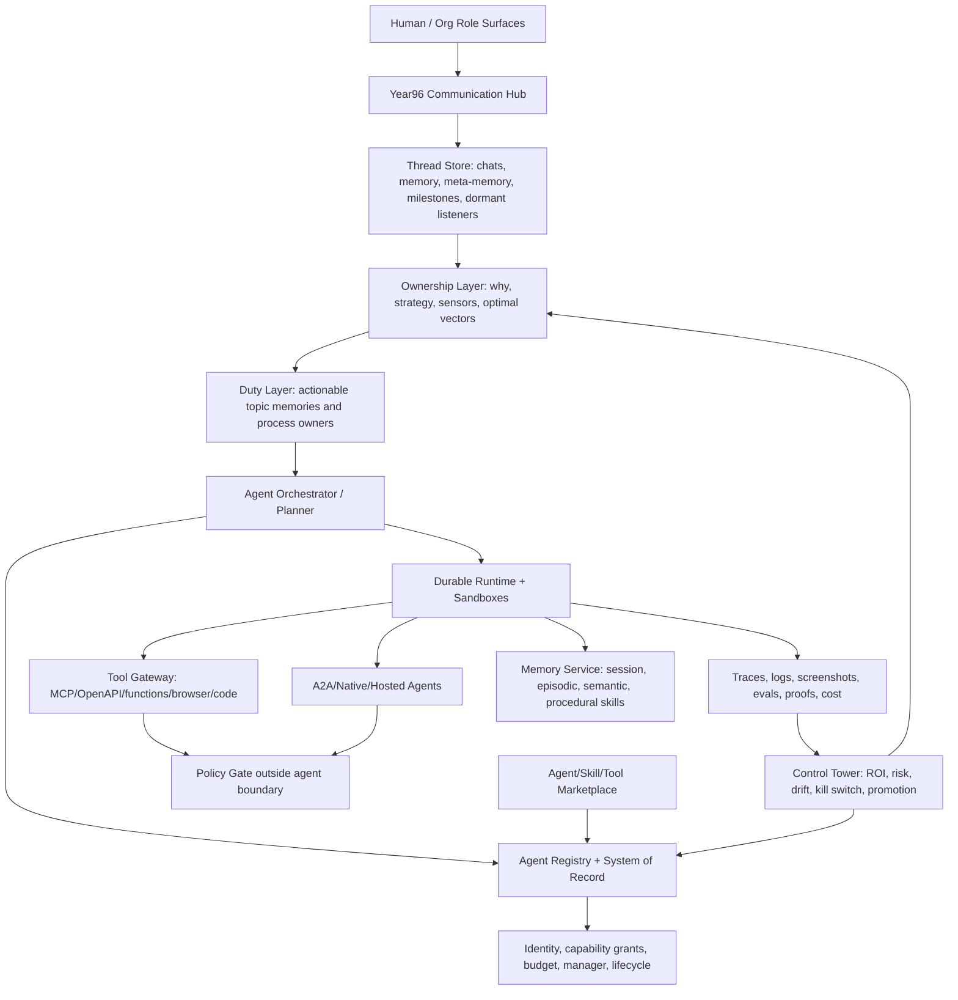

# 10 — Fortune-100 & frontier-lab agent platforms

Scope: this report maps what the largest technology companies, frontier AI labs, enterprise-software vendors, consultancies, and early Fortune-100 adopters were publicly shipping as agent platforms in 2025–2026, then distills the convergent enterprise "agentic OS" architecture and implications for Year96 in 2027. I focused on public primary sources opened during the time box; where search summaries pointed to items I could not directly open or license-verify, I mark them as unverified or omit them from the scorecard.

## TL;DR for the Year96 architect

- The market has converged on an **enterprise agent control plane**, not a magical autonomous company: registry, identity, tool gateway, policy, runtime, memory, orchestration, observability/evals, marketplace, and human work surfaces.
- Microsoft, Google, AWS, ServiceNow, Workday, Salesforce, SAP, IBM, Atlassian, and Intuit are all using the same vocabulary: **agent registry/system of record/control tower**, **MCP/A2A-style interoperability**, **managed runtime**, **memory**, **policy gates**, **OpenTelemetry traces**, **evaluation loops**, and **low-code + pro-code builders** [1][2][4][8][11][12][14][15][16].
- The strongest 2026 signal is that vendors moved from "build an agent" to **govern fleets of agents**. Workday calls this an Agent System of Record; ServiceNow calls it AI Control Tower; Microsoft uses Entra Agent Registry/Agent 365; Google uses Gemini Enterprise Agent Platform; AWS puts enforcement at AgentCore Gateway/Policy [2][4][8][9][10][11].
- **MCP is the de facto tool/data bus**; **A2A is the emerging agent-to-agent task bus**. They solve different problems and Year96 should support both through provider interfaces, not bake either into core state semantics [5][6][24][25].
- Frontier labs are productizing the harness layer: OpenAI Agents API/SDK/ChatKit and managed Codex harness; Anthropic Claude Code, MCP, and Agent Skills; Google ADK; Microsoft Agent Framework. They are useful external providers but too strategically volatile to be Year96's core [17][18][19][20][21][22][24].
- Open-source frameworks are consolidating: AutoGen and Semantic Kernel are maintenance/successor paths into Microsoft Agent Framework; Llama Stack has become OGX; ADK 2.0 and NeMo Agent Toolkit are more actively aligned with 2026 multi-agent patterns [23][26][27][28][29].
- Fortune-100 adopters are not building one universal mind. They are deploying **role-based super-agents**: JPMorgan LLM Suite, Walmart's four super agents, Morgan Stanley advisor/research assistants, Goldman developer agents, Intuit GenOS financial agents [30][31][32][33][34].
- Reality checks are severe: Gartner predicts >40% of agentic AI projects begun by 2025 will be cancelled by end-2027, and MIT NANDA's "GenAI Divide" says most enterprise pilots lack measurable ROI because they do not learn, remember, or embed into workflows [35][36].
- Year96 is ahead on **threads that never close**, **thoughts as state**, **ownership of why**, and **self-improvement with proofs**. Industry platforms mostly manage tasks, agents, and workflows; they do not yet model dormant multi-year intent or per-identity scope effect.
- Year96 is naive/risky if it assumes unlimited autonomy. The enterprise lesson is: every agent action needs identity, budget, policy, audit, eval, rollback, and human escalation before "full offload."
- The best 2027 architecture is a **provider-based agentic OS kernel**: keep Year96 concepts as core interfaces, plug Microsoft/Google/AWS/Salesforce/etc. only as optional providers behind stable interfaces.
- Use permissively licensed core pieces where possible: MCP (MIT), Microsoft Agent Framework (MIT), Google ADK (Apache-2.0), A2A (Apache-2.0), NVIDIA NeMo Agent Toolkit (Apache-2.0). Treat proprietary SaaS as integrations, never core.
- The missing component in industry is an **agent ledger that joins state, identity, thread, memory, proof, budget, and policy**. That is the most important Year96 differentiator.

## Landscape

### Hyperscalers and frontier-lab platforms

**Microsoft: Agent Framework + Foundry Agent Service + Entra/Agent registry.** Microsoft Agent Framework, announced in preview in 2025 and positioned in 2026 as the successor/convergence path for AutoGen and Semantic Kernel, is an open, multi-language framework for production-grade agents and multi-agent workflows. The official repo emphasizes Python/.NET/Go, graph workflows, checkpointing, time travel, human-in-the-loop, OpenTelemetry, declarative agents, skills, and Foundry-hosted deployment [1][23]. Foundry Agent Service is the managed runtime: prompt agents, voice agents, hosted container agents, toolboxes exposed as managed MCP endpoints, models, observability, optimization, Entra identity/RBAC, and publishing to Teams/Copilot/registry [2]. **Why it matters:** Microsoft is closest to an enterprise "agent OS" stack because it joins developer framework, runtime, identity, admin governance, productivity surfaces, and Windows/GitHub distribution.

**Google: Gemini Enterprise Agent Platform, ADK, A2A, Memory Bank.** Google Cloud's Gemini Enterprise Agent Platform documentation frames the product as "build, scale, govern, and optimize" enterprise-grade agents [4]. Its scale docs name a managed Agent Runtime, Sessions, Memory Bank, Example Store/Evaluation Service, tracing/logging/monitoring, code execution, and computer use [3]. ADK is a code-first Python framework introduced at Google Cloud Next 2025; it supports multi-agent hierarchies, model choice, MCP tools, framework integration, streaming, workflow agents, CLI/Web UI, built-in evaluation, and container deployment [5]. A2A is Google's open protocol for opaque agents to discover capabilities via Agent Cards, exchange tasks/artifacts/messages, and collaborate over long-running tasks without sharing internals [6]. **Why it matters:** Google is making the clearest split between tool-context protocol (MCP), agent collaboration protocol (A2A), managed runtime, and memory/eval services.

**AWS: Bedrock AgentCore.** AWS AgentCore focuses on production operations: Runtime, Memory, Identity, Gateway, Browser, Code Interpreter, Observability, Policy, and Evaluations. The most important source signal is policy enforcement outside the agent boundary: AgentCore Gateway intercepts every tool call, evaluates Cedar/Dogwood policies, and supports temporal policies that consider action sequences [7]. **Why it matters:** Year96 should copy the "policy outside the agent" pattern. Prompt-level guardrails are not sufficient for autonomous builders.

**OpenAI: Agents API/SDK/ChatKit.** OpenAI's developer docs now distinguish runtime choices: Agents API for long-running tasks where OpenAI manages a Codex harness and progress; Agents SDK when the application controls deployment/storage/approvals; Responses API for lower-level model calls; ChatKit for embedded chat [17]. The docs explicitly mention automatic context compaction, multi-agent orchestration, programmatic tool calling, MCP servers, and sandbox options [17]. **Why it matters:** OpenAI is commoditizing a managed agent harness, but the state and sandbox are partly provider-owned. Year96 should integrate, not depend on it.

**Anthropic: MCP, Claude Code, Agent Skills.** Anthropic open-sourced MCP in late 2024 as a universal open standard to connect assistants to systems where data lives [21]. The 2026 MCP docs describe AI apps connecting to data, tools, and workflows, with broad support from Claude, ChatGPT, VS Code/Copilot, Cursor, and others [24]. Claude Code is an agentic coding tool across terminal, IDE, desktop, and browser that can read codebases, edit files, run commands, and integrate with developer tools [18]. Agent Skills package instructions, scripts, and resources in directories with progressive disclosure and executable code; Anthropic later published Agent Skills as an open standard for cross-platform portability [19][20]. **Why it matters:** Skills are a practical pattern for Year96 DUTY/BUILDER capability loading: small metadata in context, detailed knowledge loaded on demand.

### Enterprise-software agent systems

**Salesforce Agentforce.** Salesforce positions Agentforce as always-on agents for service, sales, marketing, commerce, and CRM actions with human handoff [13]. Search results and partner materials point to Agentforce 360, Atlas reasoning, Agent Fabric, and partner agents, but only the high-level product page was directly opened; license is proprietary. **Why it matters:** Salesforce proves that agentic OS adoption will often enter through a system of record and customer-facing workflows, not through a general OS.

**ServiceNow AI Agent Orchestrator, AI Agent Fabric, AI Control Tower.** ServiceNow's January 2025 release introduced AI Agent Orchestrator, thousands of pre-built agents, and AI Agent Studio; it stresses a single platform, single data model, and one control tower for analyzing/managing/governing agents [9]. The May 2025 AI Control Tower release adds centralized governance, management, security, value realization, third-party agent/model/workflow inventory, AI Agent Fabric for agent-to-agent/multi-model communication, human managers, ROI dashboards, GRC integration, and partner integrations [8]. **Why it matters:** this is the cleanest enterprise expression of Year96 COMM HUB + governance, but it still centers workflows more than never-ending threads.

**Workday Agent System of Record.** Workday announced an Agent System of Record in February 2025 to manage AI agents from Workday and third parties in one place. It covers onboarding, roles/responsibilities, secure data access, compliance, real-time operational visibility, cost/budget forecasting, marketplace discovery, and role-based Illuminate agents [10]. **Why it matters:** Year96 should adopt "agent as workforce record" primitives: role, manager, budget, skill, access, activity, effectiveness, and deactivation lifecycle.

**SAP Joule agents and Joule Studio.** SAP's February 2025 Joule announcement emphasizes cross-functional AI agents grounded in SAP Business Data Cloud and SAP Knowledge Graph, with ready-to-use agents across finance, service, sales, and cross-functional workflows [11]. Joule Studio's architecture describes intent-based development: intent → PRD → specification → solution → testing → deployment; low-code and pro-code flows; SAP Knowledge Graph/LeanIX/domain models; Generative AI Hub; MCP-connected coding agents; managed runtime; automatic registration with Joule [12]. **Why it matters:** the intent-to-proof pipeline is close to Year96's Ownership→Duty→Builder path, but in a proprietary ERP context.

**IBM watsonx Orchestrate and BeeAI.** IBM's product page was sparse in fetched text but emphasizes grounded answers traced to SOPs/manuals/sites/repositories [14]. IBM is also an A2A partner in public ecosystem materials [6]. **Why it matters:** IBM's market angle is regulated, source-traceable work. Year96 should require citation/provenance for every significant conclusion.

**NVIDIA NeMo Agent Toolkit and AI-Q.** NeMo Agent Toolkit is framework-agnostic and supports LangChain, LlamaIndex, CrewAI, Semantic Kernel, Google ADK, and custom enterprise agents. Its docs emphasize reusable components, profiling, observability integrations, built-in evaluation, UI debugging, MCP client/server, and A2A client/server [15]. **Why it matters:** this is a good trial component for Year96's evaluation/observability layer and performance primitives, especially when running local/enterprise models.

**Cisco/AGNTCY.** AGNTCY, now under the Linux Foundation, is building an "Internet of Agents": Agent Directory Service, SLIM secure messaging, Open Agent Schema Framework, decentralized identity, SHADI hardened runtime, observability/evaluation, and continuous system integration testing [16]. **Why it matters:** this maps directly to Year96 COMM HUB, identity gates, registry, messaging, and sandbox. It is less mature than MCP/A2A but is architecturally rich.

**Intuit GenOS.** Intuit describes GenOS as its generative AI operating system for done-for-you agentic AI across TurboTax, QuickBooks, Credit Karma, and Mailchimp, with financial LLMs, an agent starter kit, GenOS evaluation service, expert-in-the-loop, and nearly 100 million users [34]. **Why it matters:** domain-specific operating systems may beat generic platforms when they own data, workflows, and human experts.

**Atlassian Rovo.** Atlassian Rovo uses the Teamwork Graph to connect work, knowledge, people, and systems; Rovo agents act as configurable AI teammates across Jira/Confluence/Service Management with support for custom agents and developer extensibility [33]. **Why it matters:** Year96 THREAD memory needs a teamwork graph equivalent, not just chat history.

### Fortune-100 adopters and operating lessons

**JPMorgan LLM Suite.** JPMorgan's LLM Suite has become a large internal GenAI platform; public reports and a JPMorgan technology blog note LLM Suite won American Banker's 2025 Innovation of the Year [30]. It is used for document analysis, drafting, presentations, research synthesis, and increasingly agentic tasks. **Lesson:** regulated firms build an internal gateway/control plane even when using frontier models.

**Walmart super agents.** Walmart Global Tech's "All in on Agents" and related 2025 posts describe a move from many tools toward four "super agents" for customers, associates, developers, and sellers/suppliers, with Sparky and Marty as public examples [31]. **Lesson:** large operators consolidate around user-role entrypoints. Year96 should expose human surfaces by role/thread, not by underlying agent.

**Morgan Stanley.** OpenAI and Morgan Stanley describe AI assistants for financial advisors and eval-driven development; Morgan Stanley Research announced AskResearchGPT to search/synthesize research [32]. **Lesson:** high-value agents are grounded in proprietary corpora and heavily evaluated before rollout.

**Goldman Sachs and coding agents.** Public reporting says Goldman is piloting Devin and framing AI agents as a hybrid workforce; I did not find a directly opened Goldman primary source in time, so treat details as unverified. **Lesson:** coding agents are becoming "digital employees," but enterprise buyers still require human supervision and QA.

**Klarna reversal and broader failure data.** Klarna's public AI-service narrative and 2025 "bring humans back" coverage is a cautionary tale: customers still need empathetic escalation [37]. Gartner predicts over 40% of agentic-AI projects started by 2025 will be cancelled by end-2027 due to cost, unclear value, inadequate risk controls, and agent washing [35]. MIT NANDA's GenAI Divide report says most pilots fail to deliver measurable return because they do not embed into workflows, adapt, remember, or improve [36]. **Lesson:** autonomy without workflow ownership, learning, and human fallback becomes cost theater.

## Component scorecard

| Name | Kind (OSS/paper/product/standard) | What it gives Year96 | License (SPDX, verified) | Maturity (stars, last release/commit, backer) | Verdict |
|---|---|---|---|---|---|
| Microsoft Agent Framework | OSS framework | Production multi-agent workflows, checkpointing, time-travel, OTel, HITL, Foundry hosting | MIT, badge verified [23] | ~14k stars via shields, Microsoft-backed, production successor to AutoGen/SK [23] | Trial |
| Microsoft Foundry Agent Service | Product | Managed runtime, toolboxes as MCP endpoints, observability, optimizer, Entra identity, publishing | Proprietary SaaS | Microsoft Azure, docs updated 2026-09-25 [2] | Trial (external provider) |
| Google ADK | OSS framework | Code-first multi-agent framework, graph workflow runtime, Task API, MCP, HITL, eval/deploy | Apache-2.0, badge verified [26] | ~22k stars via shields; Google-backed ADK 2.0 [26] | Adopt |
| A2A Protocol | Standard/OSS | Agent Cards, task lifecycle, artifacts, streaming/push, opaque agent collaboration | Apache-2.0, repo verified [6][27] | ~26k stars via shields; Linux Foundation project, Google contribution [27] | Trial |
| MCP | Standard/OSS | Tool/data/workflow connector standard; broad client/server ecosystem | MIT, repo verified [25][28] | ~9.3k stars on spec repo via shields; broad ecosystem [24][28] | Adopt |
| Amazon Bedrock AgentCore | Product | Runtime, memory, identity, gateway, browser/code sandboxes, policy, observability/evals | Proprietary SaaS; Cedar is Apache-2.0 separately (unverified here) | AWS-backed; official FAQ opened [7] | Trial (external provider) |
| ServiceNow AI Control Tower/Fabric | Product | Enterprise inventory, governance, GRC, ROI, third-party agent coordination | Proprietary SaaS | ServiceNow-backed, announced Knowledge 2025 [8][9] | Watch / integrate when customer uses ServiceNow |
| Workday Agent System of Record | Product | Workforce record for agents: roles, onboarding, access, cost, effectiveness, marketplace | Proprietary SaaS | Workday-backed, announced Feb 2025 [10] | Watch / integrate |
| SAP Joule Studio/Joule agents | Product | Intent-based development, SAP graph grounding, low-code/pro-code, testing/deployment | Proprietary SaaS | SAP-backed; 2025 architecture docs [11][12] | Watch / integrate |
| NVIDIA NeMo Agent Toolkit | OSS framework | Framework-agnostic profiling, evals, OTel integrations, MCP/A2A server/client | Apache-2.0, badge verified [15][29] | ~2.6k stars via shields; NVIDIA-backed [29] | Trial |
| AGNTCY | OSS ecosystem | Directory, SLIM messaging, OASF schema, decentralized identity, SHADI runtime, eval/CSIT | Multiple repos; license not fully verified in time | Linux Foundation/Cisco/Oracle/Google members; SLIM ~220 stars via shields [16] | Watch |
| OpenAI Agents API/SDK/ChatKit | Product/SDK | Managed harness, sessions, tools, MCP, sandboxes, embedded chat | SDK license unverified; API proprietary | OpenAI-backed docs [17] | Trial external provider |
| Anthropic Agent Skills | Standard/pattern/product | Portable skill folders, progressive disclosure, executable resources | Standard/license unverified; Anthropic docs opened [19][20] | Anthropic-backed; used across Claude/Claude Code/API [19] | Adopt pattern; Trial provider |
| OGX (formerly Llama Stack) | OSS server | OpenAI-compatible agentic API server, provider abstraction, skills, MCP/file search | License badge opened but SPDX not fully extracted; unverified [22] | ~8.4k stars via shields; name changed from Llama Stack [22] | Watch |
| Salesforce Agentforce | Product | CRM-native customer/sales/service agents with human handoff | Proprietary SaaS | Salesforce-backed; high-level page opened [13] | Integrate, not core |
| Intuit GenOS | Product | Domain-specific agent OS with financial LLMs, evals, expert-in-loop | Proprietary | Intuit-backed, ~100M users claimed in release summaries [34] | Learn from; not available |

## How I would build this part of Year96

### Convergent enterprise agentic-OS reference architecture



Industry mapping: Microsoft/Google/AWS provide Runtime + Tools + Identity + Observability; ServiceNow/Workday provide Control Tower/System of Record; Anthropic/OpenAI/Google provide Skills/Agent harnesses; MCP/A2A/AGNTCY provide interop; Salesforce/SAP/Atlassian/Intuit provide domain surfaces and data graphs.

### Provider interfaces

Year96 core should be TypeScript-first, interface-based, and stateless wherever possible. Concrete vendors sit behind providers:

```ts
type AgentId = string;
type ThreadId = string;
type IdentityId = string;
type ProviderName =
  | "local"
  | "microsoft-foundry"
  | "google-agent-platform"
  | "aws-agentcore"
  | "openai-agents"
  | "anthropic-claude"
  | "servicenow"
  | "workday"
  | "salesforce"
  | "sap"
  | "nvidia-nemo";

interface AgentRecord {
  id: AgentId;
  provider: ProviderName;
  displayName: string;
  ownerIdentityId: IdentityId;
  managerIdentityId?: IdentityId;
  purpose: string;
  capabilities: string[];
  protocols: Array<"native" | "mcp" | "a2a" | "openapi" | "slim">;
  scopes: string[];
  budgets: { moneyUsd?: number; tokens?: number; wallClockMs?: number };
  lifecycle: "draft" | "active" | "paused" | "retired" | "quarantined";
  proofLevel: "none" | "unit" | "integration" | "mocked-e2e" | "e2e" | "agentic-verified";
  riskTier: "low" | "medium" | "high" | "regulated";
}

interface AgentRegistryProvider {
  register(record: AgentRecord): Promise<AgentRecord>;
  discover(query: { capability?: string; protocol?: string; scope?: string }): Promise<AgentRecord[]>;
  updateLifecycle(id: AgentId, lifecycle: AgentRecord["lifecycle"], reason: string): Promise<void>;
}

interface ToolGatewayProvider {
  listTools(identity: IdentityId, thread: ThreadId): Promise<ToolDescriptor[]>;
  invoke(input: {
    threadId: ThreadId;
    identityId: IdentityId;
    toolId: string;
    args: unknown;
    idempotencyKey: string;
  }): Promise<ToolResult>;
}

interface PolicyProvider {
  preflight(action: ProposedAction): Promise<PolicyDecision>;
  enforceToolCall(call: ToolCallContext): Promise<PolicyDecision>;
  evaluateTemporal(sessionId: string, proposed: ProposedAction): Promise<PolicyDecision>;
}

interface AgentRuntimeProvider {
  start(task: AgentTask): Promise<RunHandle>;
  resume(handle: RunHandle, event: RuntimeEvent): Promise<RunHandle>;
  cancel(handle: RunHandle, reason: string): Promise<void>;
  snapshot(handle: RunHandle): Promise<RuntimeSnapshot>;
}

interface MemoryProvider {
  appendThreadMemory(event: ThreadEvent): Promise<void>;
  retrieveContext(query: MemoryQuery): Promise<MemoryChunk[]>;
  promoteSkill(skill: SkillBundle, proof: ProofBundle): Promise<SkillVersion>;
}

interface EvaluationProvider {
  runProofs(target: ProofTarget, levels: ProofLevel[]): Promise<ProofBundle>;
  scoreTrace(traceId: string, rubric: EvalRubric): Promise<EvalScore>;
}
```

### Data model

Use an append-only event log plus query projections:

- `state_event`: every external/internal state change, tool call, observation, generated thought, user message, runtime snapshot, policy decision.
- `thread`: immutable `thread_id`, creation date, last active, topic, parent/child links, listeners/hangers, meta-memory pointer.
- `thread_memory`: summarized episodic memory, vector pointers, citations, decay/importance, and proof references.
- `identity`: human/agent/service with org roles, capabilities, auth subjects, clone lineage, budgets, duty ownership.
- `agent_record`: the system-of-record row above.
- `scope_effect_prediction`: `(event_id, identity_id, thread_id, probability, expected_impact, horizon, rationale, model_version, feedback)`.
- `proof_bundle`: unit/integration/e2e/agentic verifier results, trace IDs, screenshots/logs, expected vs actual state.
- `action_ledger`: proposed/approved/executed/rolled-back actions with policy decisions, cost, human approvals, and output artifacts.

The key Year96-specific addition is that **thoughts are state events**. A "thought generator" can append `state_event(type="generated_thought")` to wake an Ownership/Duty when no external world event happens. Industry platforms have memory and sessions, but not this explicit universal-state fabric; coordinate with teammate #01 and #02.

### Key algorithms

1. **Agent selection:** given a thread goal, retrieve capabilities from registry, filter by identity permission/budget/risk tier, rank by historical proof scores and domain fit, then prefer local/permissive providers unless the thread explicitly needs a proprietary SaaS surface.
2. **Scope-effect routing:** when any state event arrives, compute candidate threads by semantic search, graph edges, explicit listeners, and dormant hangers; run a calibrated impact model; enqueue only events above threshold but store low-threshold "may matter later" links for learning (#02).
3. **Policy-first execution:** every proposed action goes `orchestrator -> policy.preflight -> runtime sandbox -> toolGateway.enforceToolCall -> action ledger`. Enforcement sits outside the agent, following AWS AgentCore's lesson [7].
4. **Progressive context loading:** start agents with thread meta-memory, relevant memories, capability metadata, and skill descriptions; load full skills/files only when invoked, following Anthropic's progressive disclosure [20].
5. **Proof-gated promotion:** new workflows, skills, agents, or self-improvements remain draft until unit/integration/mocked-e2e/e2e/agentic verifier proofs pass; production traces feed evals before promotion (#09).

### Typical flow

1. Human opens a thread: "start Facebook ads for my business."
2. Communicator creates thread/meta-memory and invites Ownership identity for business growth (#04, #07).
3. Ownership turns desire into why/strategy and asks Duty to define operational needs.
4. Duty discovers providers: local Builder, Salesforce/Meta ads MCP tools, analytics connectors, budget policy.
5. Registry selects a Builder; Policy grants only campaign-draft permissions, not spend permissions.
6. Builder runs in durable runtime, uses MCP tools for assets/data, maybe calls an external marketing agent over A2A.
7. All tool calls are traced; screenshots/ad previews become proof artifacts.
8. Human approves spend; action ledger records approval and execution.
9. Thread remains open. Scope-effect engine listens to campaign metrics, competitor changes, inventory, calendar, and generated thoughts.

### Scaling path

- **Laptop:** SQLite/DuckDB event log, local vector DB, local MCP servers, one durable worker, Playwright/code sandbox, OpenTelemetry to local files.
- **Team server:** Postgres event log, object store for artifacts, Temporal/Durable Functions for runtime, Redis/NATS for queues, OTel collector, policy sidecar.
- **Cluster/enterprise:** sharded event log, Kafka/Pulsar CDC, Kubernetes or serverless sandboxes, multi-tenant registry, external providers (Foundry/Gemini/AgentCore), SIEM integration, budget/risk control tower, automated canary promotion.

### Testing and proof

Adopt the Year96 70% rule by making the control plane more tested than the agents. Each provider gets contract tests with recorded fixtures; each tool gateway gets malicious-prompt and over-permission tests; each workflow has golden state transitions; each external SaaS integration has mocked E2E and live E2E; each self-improvement has A/B eval and rollback. Required proof artifacts: starting state snapshot, trace, policy decisions, tool inputs/outputs, screenshots where UI involved, final state snapshot, eval score, and human approval where applicable.

### Year96 concept-by-concept comparison

| Year96 concept | Industry has | Year96 alignment/ahead | Naive/risky |
|---|---|---|---|
| STATE | Sessions, memory banks, tool logs, enterprise graphs [3][12][33] | Universal state and thoughts-as-state are novel. | "Whole world searchable" is impossible without privacy/legal boundaries. |
| SCOPE EFFECT | Routing, alerts, agent orchestration, Graph/Knowledge Graph | Per-identity/thread scope learning is ahead. | Needs calibration to avoid infinite noise. |
| THREADS | Conversations, tasks, cases, workflows | Never-closing dormant threads are ahead. | Storage/cost/privacy retention must be governed. |
| COMM HUB/Communicators | A2A, ServiceNow Fabric, AGNTCY SLIM | Oversight-only communicators are a useful separation. | May be too passive during safety incidents unless policy can stop actions. |
| OWNERSHIP | Product owners, managers, Workday agent roles | Capturing "why" and mental models is ahead. | Mental-model capture can become surveillance. |
| DUTY | Role agents, skills, workflow modules | Good fit to Skills/Joule intent stages. | Duties need budgets and lifecycle, not endless work by default. |
| BUILDER | Codex/Claude Code/Devin/Joule Studio/ADK agents | Builder as goal+tools+permissions maps well. | Must not bypass policy for speed. |
| SELF-IMPROVEMENT | Foundry optimizer, GenOS evals, NeMo evals | Proof-gated promotion is stronger than most vendors. | Self-rearchitecture requires hard kill switches. |
| PROOFS | OTel, evals, dashboards, citations | 70% QA is ahead and necessary. | Full proof at every level can bottleneck; tier by risk. |

## What is still unsolved (late 2026)

1. **Agent security is not solved.** Tool injection, prompt injection, credential exfiltration, confused deputy problems, and temporal policy violations require gateway enforcement, not prompt promises.
2. **Memory quality is primitive.** Vendors store sessions and memories, but no one has a generally trusted way to decide what an agent should remember, forget, cite, or promote to long-term identity/thread memory.
3. **ROI measurement is weak.** ServiceNow/Workday/Intuit emphasize cost and effectiveness, but Gartner/MIT show most projects still fail to show P&L impact [35][36].
4. **Interoperability is fragmented.** MCP, A2A, OpenAPI, AGNTCY/OASF/SLIM, vendor SDKs, and proprietary marketplaces overlap. Year96 must be protocol-polyglot.
5. **Human escalation remains essential.** Klarna-style reversals show that cost-only automation damages trust [37].
6. **Agent identity and liability are immature.** Entra Agent ID, Workday ASOR, and AGNTCY identity point in the right direction, but cross-org authorization and accountability are still early.
7. **Autonomous self-improvement is unsafe without proofs.** Foundry optimizer and eval loops are promising, but Year96's self-rearchitecture must require staged rollout, canaries, and rollback.
8. **Vendor lock-in risk is high.** The most mature stacks are proprietary. Year96 core should remain permissive and provider-based; use SaaS for customer-specific integrations.

### 2027 outlook and integration stance

By 2027, it is plausible that every Fortune-100 company has an agent registry/control tower, at least one managed runtime, MCP tools, some A2A/Agent Fabric interop, and role-based agents in IT, HR, service, engineering, finance, and sales. It is not plausible that enterprises will allow unconstrained agents to own money, legal commitments, production systems, or customer communications without identity, approvals, policy, and audit.

**Optional external providers behind Year96 interfaces:** Microsoft Foundry/Agent Framework for Azure/M365 customers; Google ADK/Gemini Agent Platform for Google Cloud customers; AWS AgentCore for AWS-native runtime/policy; ServiceNow/Workday/Salesforce/SAP/Atlassian for systems-of-record; OpenAI/Anthropic for frontier coding/general agents; NVIDIA NeMo for observability/eval and local model workflows.

**Avoid as core dependencies:** proprietary memory stores, proprietary agent registries, single-vendor tool marketplaces, opaque hosted sandboxes that cannot export traces/proofs, and any use-restricted OSS for the core. Keep MCP/A2A support, but make them adapters to Year96's deeper thread/state/identity model.

## Sources

1. https://azure.microsoft.com/en-us/blog/introducing-microsoft-agent-framework/
2. https://learn.microsoft.com/en-us/azure/foundry/agents/overview
3. https://docs.cloud.google.com/gemini-enterprise-agent-platform/scale
4. https://docs.cloud.google.com/gemini-enterprise-agent-platform
5. https://developers.googleblog.com/en/agent-development-kit-easy-to-build-multi-agent-applications/
6. https://developers.googleblog.com/en/a2a-a-new-era-of-agent-interoperability/
7. https://aws.amazon.com/bedrock/agentcore/faqs/
8. https://newsroom.servicenow.com/press-releases/details/2025/ServiceNow-Launches-AI-Control-Tower-a-Centralized-Command-Center-to-Govern-Manage-Secure-and-Realize-Value-From-Any-AI-Agent-Model-and-Workflow/default.aspx
9. https://newsroom.servicenow.com/press-releases/details/2025/ServiceNow-announces-new-agentic-AI-innovations-to-autonomously-solve-the-most-complex-enterprise-challenges-01-29-2025-traffic/default.aspx
10. https://newsroom.workday.com/2025-02-11-The-Next-Generation-of-Workforce-Management-is-Here-Workday-Unveils-New-Agent-System-of-Record
11. https://news.sap.com/2025/02/joule-sap-uniquely-delivers-ai-agents/
12. https://architecture.learning.sap.com/docs/ref-arch/219c07
13. https://www.salesforce.com/agentforce/
14. https://www.ibm.com/products/watsonx-orchestrate
15. https://docs.nvidia.com/nemo/agent-toolkit/latest/
16. https://docs.agntcy.org/
17. https://developers.openai.com/api/docs/guides/agents
18. https://code.claude.com/docs/en/overview
19. https://claude.com/blog/skills
20. https://www.anthropic.com/engineering/equipping-agents-for-the-real-world-with-agent-skills
21. https://www.anthropic.com/news/model-context-protocol
22. https://github.com/ogx-ai/ogx
23. https://github.com/microsoft/agent-framework
24. https://modelcontextprotocol.io/docs/2026-07-28/getting-started/intro.md
25. https://github.com/modelcontextprotocol/modelcontextprotocol
26. https://github.com/google/adk-python
27. https://github.com/a2aproject/A2A
28. https://github.com/modelcontextprotocol/servers
29. https://github.com/NVIDIA/NeMo-Agent-Toolkit
30. https://www.jpmorganchase.com/about/technology/blog/llmsuite-ab-award
31. https://tech.walmart.com/content/walmart-global-tech/en_us/blog/post/all-in-on-agents.html
32. https://openai.com/index/morgan-stanley/
33. https://support.atlassian.com/rovo/docs/agents/
34. https://investors.intuit.com/news-events/press-releases/detail/1272/intuit-rapidly-advances-genos-to-accelerate-development-of-agentic-ai-experiences-at-scale
35. https://www.gartner.com/en/newsroom/press-releases/2025-06-25-gartner-predicts-over-40-percent-of-agentic-ai-projects-will-be-canceled-by-end-of-2027
36. https://mlq.ai/media/quarterly_decks/v0.1_State_of_AI_in_Business_2025_Report.pdf
37. https://www.entrepreneur.com/business-news/klarna-ceo-reverses-course-by-hiring-more-humans-not-ai/491396
